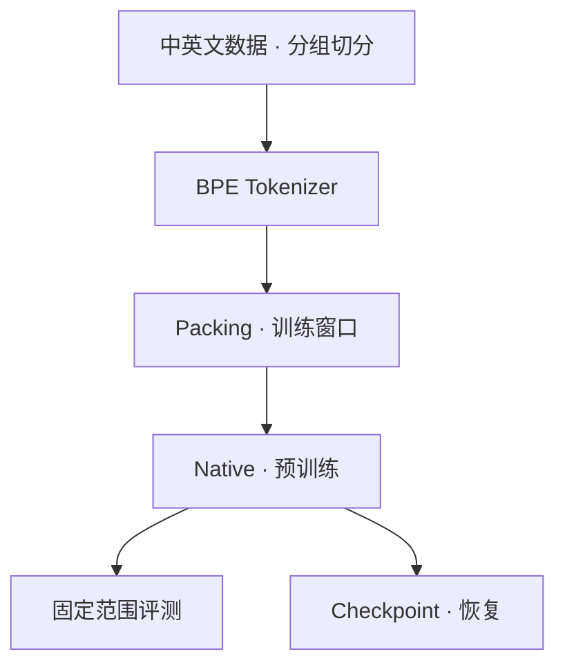

<div align="center">

# LLM Lifecycle Lab

**从一次参数更新开始，亲手理解语言模型的训练过程**

原生 PyTorch 小模型 · 中英文数据 · 十篇实践教程 · 可复现的训练实验

[在线阅读](https://wang-tj-20.github.io/llm-lifecycle-lab/) · [教程目录](#教程目录) · [快速开始](#快速开始) · [项目进展](#项目进展) · [参与贡献](#参与贡献)

</div>

---

## 项目介绍

一个随机初始化的模型，怎样逐步学会预测下一个 token？训练时，参数为什么会改变？
loss 下降能说明什么？进程中断后，怎样继续同一次实验？

**LLM Lifecycle Lab 是一个面向中文读者的 LLM 学习与实验项目。**
我们把可读的代码、连续的教程和最小对照实验放在同一个仓库，
从自有小模型出发，串起数据准备、Tokenizer、Transformer、预训练、评测、
SFT、DPO、GRPO 与恢复。
读者可以先在 CPU 上观察机制，再进入真实双语数据与 60M 教学训练。

适合能阅读基础 Python、希望进一步理解模型训练的学习者。
不要求先掌握全部 Transformer 公式；每篇沿着
**问题 → 例子与图解 → 原理与代码 → 实验 → 结果与边界** 展开。

### 在这里可以学到什么

- **看懂一次更新**：从张量形状进入 forward、loss、backward 和 optimizer step。
- **把文本变成训练样本**：准备中英文数据，按原文分组切分，训练 BPE 并生成 Packing。
- **理解模型内部**：沿代码验证 RMSNorm、RoPE、GQA、SwiGLU、因果注意力与 KV Cache。
- **读懂训练结果**：区分 step、监督 token 和预算，结合双语指标与生成解释模型表现。
- **做可比较的实验**：固定输入和配置，检查 checkpoint、数据位置与中断恢复。
- **理解后训练目标**：从 assistant-only SFT 进入偏好对和可验证奖励。

> 当前已完成十篇生命周期主线及配套实现。第一次 60M CUDA Reference 已跑完并被接受；
> 自动验收保留一项已记录的 dirty-Git provenance 例外。
> 仓库不附带训练好的权重；微型实验和两步 Smoke 不代表语言能力。

## 选择你的起点

| 路径 | 运行条件 | 适合做什么 |
| --- | --- | --- |
| 离线机制实验 | CPU；安装依赖后无需下载语料 | 观察参数更新，验证微型训练、评测和恢复 |
| 10M 双语 Smoke | CPU / Apple Silicon MPS / CUDA；需准备公共语料 | 跑通真实数据上的两步训练与评测 |
| 60M 教学与 Reference | 目标为 Linux + 单张 24GB NVIDIA GPU；需配套数据 | 正式训练、结构对照与固定基线验收 |

**第一次接触，先看第一篇并运行离线实验。**
10M 用于快速验证，60M 是效果研究的主基线；无需先购买 GPU 才开始学习。
Reference 比普通教学训练有更严格的输入、环境和结果要求。

## 教程目录

十篇主线均已完成，可在 [文档站](https://wang-tj-20.github.io/llm-lifecycle-lab/#/tutorials/)
连续阅读，也可直接打开仓库 Markdown。

| 章节 | 核心问题与实验 |
| --- | --- |
| [01 从一次参数更新开始](./docs/tutorials/01-first-parameter-update.md) | 参数怎样改变？用单变量实验观察梯度、更新与一致性。 |
| [02 准备中英文训练数据](./docs/tutorials/02-bilingual-training-data.md) | 数据从哪里来？通过原文分组对照检查评测泄漏。 |
| [03 让模型读懂文本的表示](./docs/tutorials/03-tokenizer-and-packing.md) | 文本怎样变成 ID？比较词表预算、规范化和窗口组织。 |
| [04 搭建自己的小型 Transformer](./docs/tutorials/04-small-transformer.md) | 各组件怎样连接？验证 Attention、RoPE、因果性与 Cache。 |
| [05 跑通一次预训练](./docs/tutorials/05-first-pretraining.md) | batch、累积、学习率和预算怎样共同决定训练过程？ |
| [06 判断模型到底学到了什么](./docs/tutorials/06-evaluating-a-model.md) | 总体 loss 变好是否足够？核对双语覆盖、指标与生成。 |
| [07 让实验可以恢复和比较](./docs/tutorials/07-resume-and-compare.md) | 保存权重为什么不够？比较连续训练与中断恢复的状态。 |
| [08 让 Base 模型学习回答](./docs/tutorials/08-supervised-fine-tuning.md) | chat template 与 assistant-only SFT 怎样改变监督范围？ |
| [09 用偏好对比较回答](./docs/tutorials/09-direct-preference-optimization.md) | DPO 如何用 frozen reference 学习 chosen/rejected？ |
| [10 用可验证奖励改进采样](./docs/tutorials/10-verifiable-reward-grpo.md) | GRPO 如何从程序奖励、组内优势和 rollout 更新策略？ |

阅读顺序与实验约定见 [实践系列导读](./docs/tutorials/README.md)。
教程解释“为什么”，操作指南维护完整参数与排错步骤。

## 快速开始

### 1. 准备环境

新机器上克隆仓库并创建环境；已有仓库或同名环境时直接进入、激活即可。
后续命令均从仓库根目录执行。

```bash
git clone https://github.com/wang-TJ-20/llm-lifecycle-lab.git
cd llm-lifecycle-lab
conda create -n llm-lifecycle-lab python=3.11 pip -y
conda activate llm-lifecycle-lab
```

macOS Apple Silicon 可直接安装下面的依赖；Linux CPU/CUDA 请先按
[环境准备](./docs/NATIVE_PRETRAIN_GUIDE.md#2-环境准备) 选择对应的 PyTorch wheel。

```bash
python -m pip install -r requirements.txt
python -m pip check
python scripts/doctor.py
```

Python 要求为 3.11 或更高。脚本直接加载仓库中的 `src/`，
**不需要 `pip install -e .` 或手动设置 `PYTHONPATH`**。
基础 Doctor 不替代真实训练前的配置化检查。

### 2. 不下载数据，先观察一次参数更新

```bash
python scripts/model_experiment.py
```

默认在 CPU 上运行随机初始化的 10M 模型，完成前向、loss、反向和一次参数更新，
再检查 KV Cache 与模型保存加载的一致性。
输入为 `[2, 16]`，logits 为 `[2, 16, 16384]`，有效预测目标为 30 个。

重点检查 `weight_update_max > 0`、`cache_matches_full=True` 和
`checkpoint_matches_full=True`。随机 token 的 loss 不用于判断语言能力。
逐步解释见 [第一篇](./docs/tutorials/01-first-parameter-update.md)。

### 3. 跑通微型训练、评测与恢复

```bash
python scripts/pretrain_experiment.py --mode train
python scripts/pretrain_experiment.py --mode evaluate
python scripts/pretrain_experiment.py --mode resume
```

三个模式各自在临时目录生成双语模板数据、训练 Tokenizer，并运行配套微型模型。
`train` 检查三步训练与产物；`evaluate` 核对双语指标和生成；
`resume` 比较连续训练与受控中断恢复的状态。

**这些命令不修改已有 `data/` 或 `runs/`，退出后自动清理临时产物。**
这里的微型模型不是正式 10M/60M 配方，模板数据也不用于证明语言能力。
预训练实验的完整解读见 [第五至七篇](./docs/tutorials/05-first-pretraining.md)。

### 4. 在真实双语数据上运行 Smoke

先按 [数据指南](./docs/DATA_GUIDE.md#4-第一次实践10m-双语-smoke)
确认许可，完成下载、混合、切分、Tokenizer 训练和 Packing，再执行：

```bash
python scripts/doctor.py --config configs/pipelines/native-smoke.yaml
python scripts/train_pretrain.py \
  --config configs/pipelines/native-smoke.yaml \
  --run-id native-smoke-001
python scripts/eval_pretrain.py \
  --config configs/pipelines/native-smoke.yaml \
  --checkpoint runs/native-smoke-001/checkpoints/step-00000002 \
  --split dev
```

结果保存在 `runs/native-smoke-001/`，包括配置、预算、环境、指标和 checkpoint。
已有同名 run 时换新 ID，不要删除旧记录来绕开覆盖保护。
恢复只用于完成原预算，不能给已经结束的两步 Smoke 直接追加训练。

60M 的数据规模、CUDA/BF16 环境和训练入口见
[60M 正式实践](./docs/NATIVE_PRETRAIN_GUIDE.md#6-60m-正式实践)。
第一次完整 CUDA 结果见
[60M CUDA Reference v1](./docs/experiments/native-60m-baseline-v1.md)。

## 模型与数据

### 两档模型，同一份实现

Native 是自有的 decoder-only Transformer，从随机权重训练，不是裁剪或微调 Qwen。
结构采用 RMSNorm、RoPE、SwiGLU、GQA 和权重绑定，支持因果前向与 KV Cache 生成。
模型和训练循环基于 PyTorch，BPE 使用 Hugging Face `tokenizers`。

| 配置 | 参数量 | 层数 × Hidden | Q / KV 头 | 最大长度 |
| --- | ---: | --- | --- | ---: |
| [smoke-10m](./configs/models/smoke-10m.yaml) | 9,915,200 | 4 × 320 | 5 / 1 | 256 |
| [tiny-60m](./configs/models/tiny-60m.yaml) | 62,927,616 | 8 × 768 | 12 / 4 | 512 |

两档默认词表均为 16,384，QK-Norm 关闭，但各自 Tokenizer 的 ID 映射不能互换。
模型长度上限不等于训练长度：10M Smoke 默认训练 seq128，60M 为 seq512。
两者共用 `model_route: native`，具体结构由模型配置选择，
实践级别由 `run_profile` 区分。

### 默认覆盖中文与英文

| 语言 | 数据来源 | 内容与来源许可 |
| --- | --- | --- |
| 英文 | [SimpleStories](https://huggingface.co/datasets/SimpleStories/SimpleStories) | 合成故事；MIT |
| 中文 | [Wikimedia Wikipedia](https://huggingface.co/datasets/wikimedia/wikipedia) | 中文百科；CC-BY-SA-3.0 |

Recipe 固定来源、版本与选取方式，Manifest 记录实际产物和 hash。
默认流程显式按 `source_id` 切分，Tokenizer 只在 train 上学习，
dev/test 使用同一词表独立编码。单语配置用于对照，不是默认学习路线。
使用数据前需自行核对来源许可，格式校验和 hash 不能代替内容质量、隐私与去重检查。



各阶段的完整代码、张量形状与校验边界见 [模型指南](./docs/NATIVE_MODEL_GUIDE.md)
和 [数据指南](./docs/DATA_GUIDE.md)。

## 项目进展

| 状态 | 内容 |
| --- | --- |
| 已完成 | 十篇中文教程、Docsify 在线阅读站与 CPU 离线实验 |
| 已实现 | Native 10M/60M、双语 BPE、磁盘 Packing、Pretrain、评测与 checkpoint 恢复 |
| 已实现 | 版本化双语能力探针、规则与随机基线、记忆/重合检查、纵向成绩单 |
| CPU 微型验证通过 | SFT assistant-only 监督、Base 权重初始化、同协议前后评测与精确恢复 |
| CPU 微型验证通过 | HF 导出、CLI、Qwen3 LoRA、Native DPO、GRPO/RLVR 与精确恢复 |
| CPU 实测完成 | Native-60M HF 导出的 FP32/dynamic INT8 状态、吞吐、RSS 与 greedy 对照 |
| 已实现 | Native/HF 本地非流式 OpenAI-compatible API 与同源聊天界面 |
| 已完成 | 60M 单卡 RTX 4090 Reference、1 epoch；dev loss 9.8523 → 3.1032 |
| 已记录例外 | 自动检查 10 pass / 1 provenance fail；项目接受该固定 run，不要求重跑 |
| 已实现 | 固定公开数据的 SFT/DPO/GRPO 配方、许可门禁、跨阶段隔离与 CPU 加载验证 |
| 已完成 | 公开数据路线的 SFT/DPO CUDA 训练与同协议验收；GRPO 记为预注册零结果 |
| 后续方向 | GRPO 难度分层或 `kl_beta` 对照，以及 Instruct 权重发布 |

第一份冻结基线为
[`native-60m-baseline-v1`](./configs/reference/native-60m-baseline-v1.yaml)：
62.93M、QK-Norm 关闭、1 epoch、46,184,530 个目标监督 token。
**固定了规范，不等于已经获得通过验收的模型权重。**
正式训练前的输入与环境门控、训练后验收见
[固定 60M 基线](./docs/NATIVE_PRETRAIN_GUIDE.md#92-固定-60m-基线)。
该运行完成了 5,649 steps 和 46,186,063 个监督 token，
指标与原始日志见 [实验记录](./docs/experiments/native-60m-baseline-v1.md)。

当前精确恢复对照覆盖 CPU；不承诺所有设备和精度逐位一致。
评测受配置中的样本预算限制，不默认代表全量 dev/test。
这些边界与实验结论一起记录，不用 Smoke 指标代替正式模型效果。

后训练之前先建立测量基线，见[统一能力评测](./docs/CAPABILITY_EVALUATION_GUIDE.md)。
无需 GPU 或语料下载即可验证微型 Base → SFT → 同协议评测：

```bash
python scripts/sft_experiment.py --mode train
python scripts/sft_experiment.py --mode resume
```

操作边界见 [Native SFT 最小闭环](./docs/NATIVE_SFT_GUIDE.md)。
微型实验只验证机制，不代表已获得可用的 60M Instruct 模型。

新的正式后训练默认使用 OASST1、HelpSteer3 和 MSVAMP 公开数据，不再使用旧的
模板合成数据。固定 revision、许可、输出 hash、准备命令和三阶段 CUDA 顺序见
[公开数据 SFT、DPO 与 GRPO 路线](./docs/PUBLIC_POSTTRAINING_GUIDE.md)。
不带 `public` 的 60M 后训练配置只保留用于复现历史实验。

## 文档与代码

| 入口 | 用途 |
| --- | --- |
| [数据介绍与准备](./docs/DATA_GUIDE.md) | 来源、许可、公开/自有数据、切分、Tokenizer、Packing 与迁移 |
| [公开数据后训练](./docs/PUBLIC_POSTTRAINING_GUIDE.md) | OASST1/HelpSteer3/MSVAMP 固定配方、隔离、CUDA 顺序与验收 |
| [自有模型介绍](./docs/NATIVE_MODEL_GUIDE.md) | 模型结构、参数预算、前向、生成与结构消融 |
| [Pretrain 训练文档](./docs/NATIVE_PRETRAIN_GUIDE.md) | 环境、训练、评测、恢复、Reference 验收与排错 |
| [统一能力评测](./docs/CAPABILITY_EVALUATION_GUIDE.md) | 固定探针、显式基线、语料重合检查与纵向比较 |
| [Native SFT 最小闭环](./docs/NATIVE_SFT_GUIDE.md) | 对话掩码、Base 初始化、CPU 验证及恢复 |
| [HF 导出与 Qwen 迁移](./docs/TRANSFER_GUIDE.md) | 标准权重、CLI、固定 Qwen 快照与 PEFT LoRA |
| [Native DPO 最小闭环](./docs/NATIVE_DPO_GUIDE.md) | 偏好对、冻结 reference、pair loss 与恢复 |
| [Native GRPO / RLVR](./docs/NATIVE_GRPO_GUIDE.md) | 程序化奖励、组内优势、KL 与恢复 |
| [HF 模型 CPU 推理与量化](./docs/CPU_INFERENCE_GUIDE.md) | FP32/INT8 状态、吞吐、RSS、稳定性与解释边界 |
| [最小 OpenAI-compatible API](./docs/OPENAI_API_GUIDE.md) | Native/HF 本地 completion、chat、错误协议与服务边界 |
| [项目实施路线](./docs/test.md) | 五条主线的完成状态、GPU 边界与下一步 |
| [Native 模型发布](./docs/MODEL_RELEASE_GUIDE.md) | 构建发布包、ModelScope 上传、hash 与回下载验收 |
| [脚本阅读指南](./scripts/README.md) | 从每个脚本的 `main()` 进入核心实现 |
| [文档站维护](./docs/SITE_GUIDE.md) | 本地预览、GitHub Pages 发布与新增章节 |

```text
configs/       模型、Pipeline 与 Reference 配置
docs/          十篇教程、操作指南与阅读站
scripts/       可直接运行的实践入口
src/           模型、数据与训练共享实现
tests/         单元、集成与文档站检查
.github/       CI
data/          本地语料与数据产物，Git 忽略
runs/          本地训练记录与权重，Git 忽略
```

从脚本进入实现，从教程理解实验；权重、数据和历史 run 不是可以随意清理的缓存。
严格锁环境使用 `uv.lock`，具体安装方式见 [环境准备](./docs/NATIVE_PRETRAIN_GUIDE.md#2-环境准备)。

## 参与贡献

欢迎通过 [Issue](https://github.com/wang-TJ-20/llm-lifecycle-lab/issues)
报告问题、讨论学习中的疑问，或提交
[Pull Request](https://github.com/wang-TJ-20/llm-lifecycle-lab/pulls)
改进代码、教程与实验。

- 报错请附命令、配置、Python/PyTorch 版本、设备和脱敏日志。
- 修改行为时补充对应测试，并同步受影响的教程与示例输出。
- 提交实验结果时记录数据版本、预算和对照条件，区分观察与推测。
- 不提交训练语料、模型权重、凭据或本地运行产物。

<details>
<summary>开发验证命令</summary>

```bash
python -m pip install -r requirements-dev.txt
python -m pytest -q
python -m ruff check src scripts tests
python -m ruff format --check src scripts tests
```

[CI](./.github/workflows/ci.yml) 在 Python 3.11 CPU 环境检查
requirements 与锁环境两条安装路径。
文档站浏览器检查另见 [文档站维护](./docs/SITE_GUIDE.md#浏览器检查)。

</details>

## 参考与致谢

- [Happy-LLM](https://github.com/datawhalechina/happy-llm)：从基础概念到 LLM 训练实践的系统性教程。
- [MiniMind](https://github.com/jingyaogong/minimind)：小语言模型的结构、训练与实验实践。

感谢这些项目公开分享教学与实践资料。本 README 借鉴其课程导航与实践入口的组织方式；
本项目的能力、命令和验证状态以本仓库实现为准。

## 开源许可

本仓库采用 [Apache License 2.0](./LICENSE)。
所使用的公开数据与第三方资源各自遵循原有许可，不因本仓库许可而自动改变。
