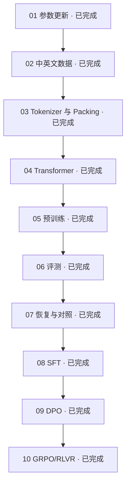

# LLM Lifecycle Lab

从一次参数更新开始，亲手理解一个语言模型的训练过程。

这是一套围绕自有小模型展开的中文实践教程。我们不从调用现成模型开始，
而是从随机初始化的权重出发，把文本、Tokenizer、Transformer 和训练循环接在一起，
再用实验判断模型是否真的学到了东西。

## 从前四篇开始

**第一篇 · [从一次参数更新开始](./tutorials/01-first-parameter-update.md)**

不下载语料，在 CPU 上观察一次前向、loss、梯度和参数更新。
弄清楚为什么 32 个输入 token 只有 30 个预测目标，以及怎样确认参数真的改变了。

**第二篇 · [准备中英文训练数据](./tutorials/02-bilingual-training-data.md)**

从两段文本出发，理解双语数据的分布和训练量。
再用同一文章的两个片段，解释为什么按记录切分可能让评测失真。

**第三篇 · [让模型读懂文本的表示](./tutorials/03-tokenizer-and-packing.md)**

从字节与 BPE 合并出发，把文本变成 token ID 和训练窗口。
用自写双语小语料，分别观察词表预算与窗口长度怎样改变结果。

**第四篇 · [搭建自己的小型 Transformer](./tutorials/04-small-transformer.md)**

沿张量流动理解归一化、Attention、RoPE、GQA 和 SwiGLU。
用公式对照和微型模型实验，检查未来信息隔离与 KV Cache 等价性。

## 接下来会走到哪里

**第五篇 · [跑通一次预训练](./tutorials/05-first-pretraining.md)**

把数据、模型和训练循环接起来，核对 batch、梯度累积、学习率与监督 token 预算。

**第六篇 · [判断模型到底学到了什么](./tutorials/06-evaluating-a-model.md)**

从加权 loss、双语覆盖和生成结果，区分链路通过、指标改善与语言能力。

**第七篇 · [让实验可以恢复和比较](./tutorials/07-resume-and-compare.md)**

用受控中断比较完整训练状态，理解 checkpoint、日志重放和实验条件的边界。

**第八篇 · [让 Base 模型学习回答](./tutorials/08-supervised-fine-tuning.md)**

用 chat template 和 assistant-only labels 理解 SFT 的监督边界与阶段初始化。

**第九篇 · [用偏好对比较回答](./tutorials/09-direct-preference-optimization.md)**

从回答序列概率出发，理解 frozen reference、DPO margin 和 pair 计权。

**第十篇 · [用可验证奖励改进采样](./tutorials/10-verifiable-reward-grpo.md)**

用严格程序奖励连接 rollout、组内 advantage、单次 policy-gradient 和 reference KL。

十篇主线已完整。当前代码已经实现 Native 模型、BPE Tokenizer、磁盘 Packing、
Pretrain、SFT、DPO、GRPO、恢复和评测，可以先沿操作指南进行实践。
新的正式后训练默认使用固定 revision 的 OASST1、HelpSteer3 和 MSVAMP，
见[公开数据 SFT、DPO 与 GRPO 路线](./PUBLIC_POSTTRAINING_GUIDE.md)。
此外已接入[统一能力评测](./CAPABILITY_EVALUATION_GUIDE.md)和
[SFT 最小闭环](./NATIVE_SFT_GUIDE.md)，后者完成 CPU 微型训练、阶段前后对照与恢复验证。
Native → HF 导出、Qwen3 LoRA、Native DPO、可验证奖励 GRPO 和
Native-60M FP32/INT8 基准也已完成 CPU 验证；本地 Native/HF 模型可通过
非流式 OpenAI-compatible API 或同源聊天界面调用。
正式 GPU 效果验证和 Qwen LoRA 实跑仍属后续工作。

## 开始前

你需要基本的 Python 阅读能力，以及 Python 3.11 或更高版本。
十篇的离线微型实验不要求 GPU；真实数据与 60M 训练另有前提。首次安装参考
[环境准备](./NATIVE_PRETRAIN_GUIDE.md#2-环境准备)。

10M Smoke 用来验证链路，不代表语言能力。
60M 教学训练的目标环境为 Linux 和单张 24GB NVIDIA GPU；
第一次完整 CUDA [Reference 运行](./experiments/native-60m-baseline-v1.md) 已完成。
自动验收保留一项 dirty-Git provenance 失败，项目已记录例外并接受该结果。
仓库不附带训练好的权重。

## 按需查阅

| 当前问题 | 对应指南 |
| --- | --- |
| 数据从哪里来，怎样下载、切分和打包？ | [数据介绍与准备](./DATA_GUIDE.md) |
| 怎样用公开数据顺序训练 SFT、DPO、GRPO？ | [公开数据后训练](./PUBLIC_POSTTRAINING_GUIDE.md) |
| 模型各层怎样连接，张量形状是什么？ | [自有模型介绍](./NATIVE_MODEL_GUIDE.md) |
| 怎样训练、恢复、评测与排错？ | [Pretrain 训练文档](./NATIVE_PRETRAIN_GUIDE.md) |
| 如何比较 Base、SFT 和对齐后的能力？ | [统一能力评测](./CAPABILITY_EVALUATION_GUIDE.md) |
| 如何只监督 assistant 并开始 SFT？ | [Native SFT 最小闭环](./NATIVE_SFT_GUIDE.md) |
| 如何导出 HF 模型并接入 Qwen/LoRA？ | [HF 导出与 Qwen 迁移](./TRANSFER_GUIDE.md) |
| 如何固定 reference 并运行 DPO？ | [Native DPO 最小闭环](./NATIVE_DPO_GUIDE.md) |
| 如何使用程序化奖励运行 GRPO？ | [Native GRPO / RLVR](./NATIVE_GRPO_GUIDE.md) |
| 如何比较 HF 模型的 CPU FP32 与 INT8？ | [HF 模型 CPU 推理与量化](./CPU_INFERENCE_GUIDE.md) |
| 如何通过本地 OpenAI-compatible API 调用？ | [最小 OpenAI-compatible API](./OPENAI_API_GUIDE.md) |
| 当前路线做到哪里、下一步是什么？ | [项目实施路线](./test.md) |
| 60M CUDA 实际表现怎样？ | [Reference 实验记录](./experiments/native-60m-baseline-v1.md) |

完整的章节安排与写作约定见 [实践系列导读](./tutorials/README.md)。
