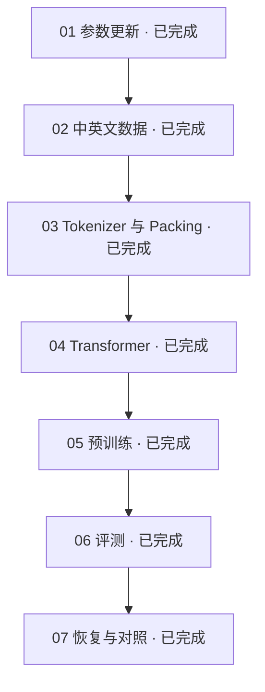

# LLM Lifecycle Lab

从一次参数更新开始，亲手理解一个语言模型的训练过程。

这是一套围绕自有小模型展开的中文实践教程。我们不从调用现成模型开始，
而是从随机初始化的权重出发，把文本、Tokenizer、Transformer 和训练循环接在一起，
再用实验判断模型是否真的学到了东西。

## 从前四篇开始

**第一篇 · [从一次参数更新开始](./tutorials/01-first-parameter-update.md)**

不下载语料，在 CPU 上观察一次前向、loss、梯度和参数更新。
弄清楚为什么 32 个输入 token 只有 30 个预测目标，以及怎样确认参数真的改变了。

**第二篇 · [准备中英文训练数据](./tutorials/02-bilingual-training-data.md)**

从两段文本出发，理解双语数据的分布和训练量。
再用同一文章的两个片段，解释为什么按记录切分可能让评测失真。

**第三篇 · [让模型读懂文本的表示](./tutorials/03-tokenizer-and-packing.md)**

从字节与 BPE 合并出发，把文本变成 token ID 和训练窗口。
用自写双语小语料，分别观察词表预算与窗口长度怎样改变结果。

**第四篇 · [搭建自己的小型 Transformer](./tutorials/04-small-transformer.md)**

沿张量流动理解归一化、Attention、RoPE、GQA 和 SwiGLU。
用公式对照和微型模型实验，检查未来信息隔离与 KV Cache 等价性。

## 接下来会走到哪里

**第五篇 · [跑通一次预训练](./tutorials/05-first-pretraining.md)**

把数据、模型和训练循环接起来，核对 batch、梯度累积、学习率与监督 token 预算。

**第六篇 · [判断模型到底学到了什么](./tutorials/06-evaluating-a-model.md)**

从加权 loss、双语覆盖和生成结果，区分链路通过、指标改善与语言能力。

**第七篇 · [让实验可以恢复和比较](./tutorials/07-resume-and-compare.md)**

用受控中断比较完整训练状态，理解 checkpoint、日志重放和实验条件的边界。

七篇主线已完整。当前代码已经实现 Native 模型、BPE Tokenizer、磁盘 Packing、
Pretrain、恢复和评测，可以先沿操作指南进行实践。
SFT、DPO、GRPO 等后续训练阶段尚未实现。

## 开始前

你需要基本的 Python 阅读能力，以及 Python 3.11 或更高版本。
七篇的离线微型实验不要求 GPU；真实数据与 60M 训练另有前提。首次安装参考
[环境准备](./NATIVE_PRETRAIN_GUIDE.md#2-环境准备)。

10M Smoke 用来验证链路，不代表语言能力。
60M 教学训练的目标环境为 Linux 和单张 24GB NVIDIA GPU；
完整 CUDA 参考实验尚未完成，仓库不附带训练好的权重。

## 按需查阅

| 当前问题 | 对应指南 |
| --- | --- |
| 数据从哪里来，怎样下载、切分和打包？ | [数据介绍与准备](./DATA_GUIDE.md) |
| 模型各层怎样连接，张量形状是什么？ | [自有模型介绍](./NATIVE_MODEL_GUIDE.md) |
| 怎样训练、恢复、评测与排错？ | [Pretrain 训练文档](./NATIVE_PRETRAIN_GUIDE.md) |

完整的章节安排与写作约定见 [实践系列导读](./tutorials/README.md)。
