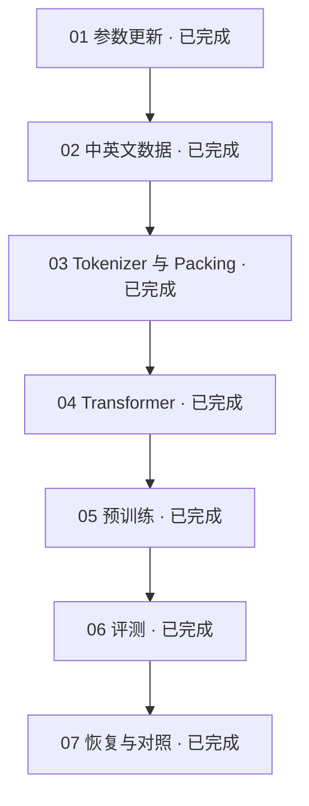

# LLM Lifecycle Lab

从一次参数更新开始，亲手理解一个语言模型的训练过程。

这是一套围绕自有小模型展开的中文实践教程。我们不从调用现成模型开始，
而是从随机初始化的权重出发，把文本、Tokenizer、Transformer 和训练循环接在一起，
再用实验判断模型是否真的学到了东西。

## 从前四篇开始

**第一篇 · [从一次参数更新开始](./tutorials/01-first-parameter-update.md)**

不下载语料，在 CPU 上观察一次前向、loss、梯度和参数更新。
弄清楚为什么 32 个输入 token 只有 30 个预测目标，以及怎样确认参数真的改变了。

**第二篇 · [准备中英文训练数据](./tutorials/02-bilingual-training-data.md)**

从两段文本出发，理解双语数据的分布和训练量。
再用同一文章的两个片段，解释为什么按记录切分可能让评测失真。

**第三篇 · [让模型读懂文本的表示](./tutorials/03-tokenizer-and-packing.md)**

从字节与 BPE 合并出发，把文本变成 token ID 和训练窗口。
用自写双语小语料，分别观察词表预算与窗口长度怎样改变结果。

**第四篇 · [搭建自己的小型 Transformer](./tutorials/04-small-transformer.md)**

沿张量流动理解归一化、Attention、RoPE、GQA 和 SwiGLU。
用公式对照和微型模型实验，检查未来信息隔离与 KV Cache 等价性。

## 接下来会走到哪里

**第五篇 · [跑通一次预训练](./tutorials/05-first-pretraining.md)**

把数据、模型和训练循环接起来，核对 batch、梯度累积、学习率与监督 token 预算。

**第六篇 · [判断模型到底学到了什么](./tutorials/06-evaluating-a-model.md)**

从加权 loss、双语覆盖和生成结果，区分链路通过、指标改善与语言能力。

**第七篇 · [让实验可以恢复和比较](./tutorials/07-resume-and-compare.md)**

用受控中断比较完整训练状态，理解 checkpoint、日志重放和实验条件的边界。

```mermaid
flowchart TD
  A["01 参数更新 · 已完成"] --> B["02 中英文数据 · 已完成"]
  B --> C["03 Tokenizer 与 Packing · 已完成"]
  C --> D["04 Transformer · 已完成"]
  D --> E["05 预训练 · 已完成"]
  E --> F["06 评测 · 已完成"] --> G["07 恢复与对照 · 已完成"]
```

七篇主线已完整。当前代码已经实现 Native 模型、BPE Tokenizer、磁盘 Packing、
Pretrain、恢复和评测，可以先沿操作指南进行实践。
Native-60M Base-v1 也已完成 8-epoch CUDA 训练并公开发布；
SFT、DPO、GRPO 等后续训练阶段尚未实现。

## 已发布 Base-v1

[`wzt777/native-60m-base-v1`](https://modelscope.cn/models/wzt777/native-60m-base-v1)
包含 62,927,616 参数的 Native Base 权重、16,384 词表 Tokenizer、模型配置、
provenance 和 SHA-256 清单。它从随机初始化训练 45,191 steps，共处理
369,480,328 个监督 token。

固定 1,024-window test 评测结果为：总体 loss 2.731877、英文 loss 1.955555、
中文 loss 3.419416。中文仍明显弱于英文；该版本是可复现实验基线，不是经过
指令微调或安全对齐的聊天模型。

- 下载、校验和加载：[发布模型卡](../models/base-v1-final/README.md)
- 从零训练配方：[Base 从零训练手册](./BASE_TRAINING_GUIDE.md)
- 完整结果与偏离记录：[Base-v1 执行结果](./BASE_TRAINING_RESULTS.md)
- 评测方法与实测解读：[第六篇](./tutorials/06-evaluating-a-model.md)

## 开始前

你需要基本的 Python 阅读能力，以及 Python 3.11 或更高版本。
七篇的离线微型实验不要求 GPU；真实数据与 60M 训练另有前提。首次安装参考
[环境准备](./NATIVE_PRETRAIN_GUIDE.md#2-环境准备)。

10M Smoke 用来验证链路，不代表语言能力。
60M 教学训练的目标环境为 Linux 和单张 24GB NVIDIA GPU；
Base-v1 已在 RTX 4090 上完成并发布。复现训练仍需准备冻结数据与对应硬件；
只想检查权重时可直接下载发布包并在 CPU 上加载。

## 按需查阅

| 当前问题 | 对应指南 |
| --- | --- |
| 数据从哪里来，怎样下载、切分和打包？ | [数据介绍与准备](./DATA_GUIDE.md) |
| 模型各层怎样连接，张量形状是什么？ | [自有模型介绍](./NATIVE_MODEL_GUIDE.md) |
| 怎样下载和加载已发布的 Base？ | [Native-60M Base-v1 模型卡](../models/base-v1-final/README.md) |
| 怎样从随机初始化复现 Base？ | [Native-60M Base 从零训练手册](./BASE_TRAINING_GUIDE.md) |
| Base-v1 最终结果和证据在哪里？ | [Base-v1 执行结果](./BASE_TRAINING_RESULTS.md) |
| 怎样训练、恢复、评测与排错？ | [Pretrain 训练文档](./NATIVE_PRETRAIN_GUIDE.md) |

完整的章节安排与写作约定见 [实践系列导读](./tutorials/README.md)。
