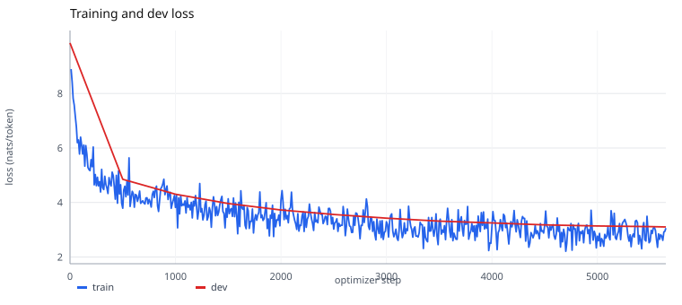
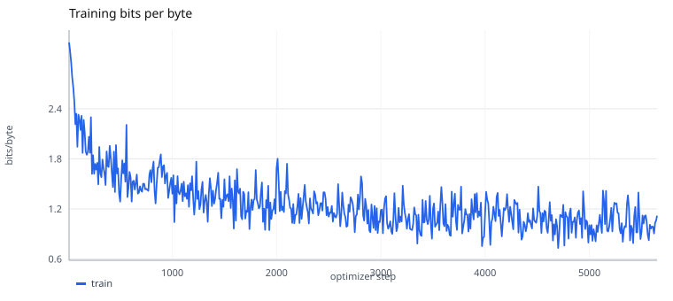
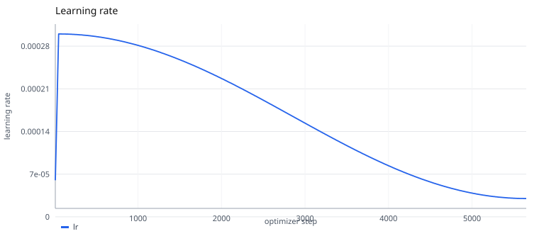
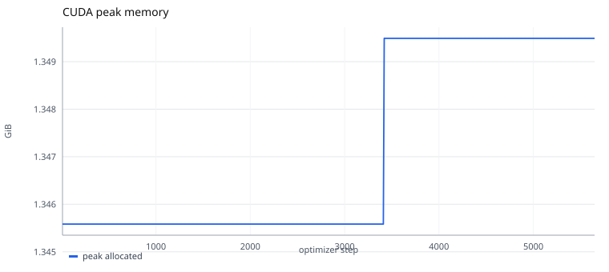
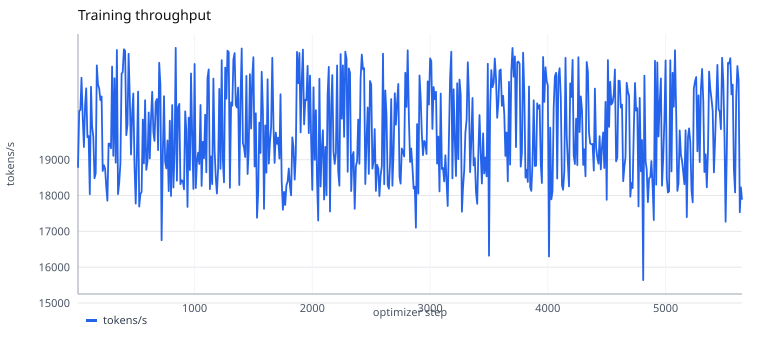

# 60M CUDA Reference · native-60m-baseline-v1

[项目首页](../README.md) | [Pretrain 训练文档](../NATIVE_PRETRAIN_GUIDE.md)

本文记录第一次使用固定 60M 配方完成的全程 CUDA 预训练。
运行对应 [`native-60m-baseline-v1.yaml`](../../configs/reference/native-60m-baseline-v1.yaml)
和 [`native-60m-reference.yaml`](../../configs/pipelines/native-60m-reference.yaml)。

> **状态：正式 Reference，带一项已记录的 provenance 例外。**
> 训练是在包含 5 个未提交改动的 dirty 工作区启动，
> 因此自动验收保留 `runtime-provenance` 失败。项目已确认其余结果符合预期，
> 并基于固定源码 hash 接受本次 run，不要求从干净提交重跑。

仓库只发布曲线和约 300 KiB 的结果证据，不发布训练数据、Tokenizer 或 checkpoint。
这些结果可以审计训练过程，但不能仅凭本仓库重新生成文中的续写。

## 1. 结论

| 项目 | 结果 |
| --- | --- |
| Run ID | `native-60m-baseline-v1` |
| 参数量 | 62,927,616 |
| 训练量 | 5,649 optimizer steps / 46,186,063 监督 token |
| 目标覆盖 | 100.0033%（目标为 46,184,530 token） |
| 设备 | 单张 NVIDIA GeForce RTX 4090，CUDA BF16 |
| 训练耗时 | 2,407.0 s，约 40.1 min |
| CUDA 峰值显存 | 1,449,004,544 B，约 1.349 GiB |
| 日志采样吞吐 | 均值 19,775 tokens/s，范围 15,639 到 22,121 |
| dev（64 个窗口） | loss 3.1032 / PPL 22.27 / BPB 1.0970 |
| test（64 个窗口） | loss 3.0387 / PPL 20.88 / BPB 1.0499 |
| 相对 step 0 | 总体、英文、中文 dev loss 均下降 |

结果证明该配置能在目标 CUDA 环境完成一轮训练，
数据、预算、双语评测和 checkpoint 链路能够工作。
它没有证明模型已经具备通用双语能力：
英文续写出现可读但模板化的故事结构，中文仍明显退化和重复。

## 2. 固定条件

| 固定项 | 取值 |
| --- | --- |
| 模型 | `tiny-60m`：8 层、hidden 768、12 Q heads / 4 KV heads、MLP 2048 |
| 词表与上下文 | 16,384；训练长度 512；embedding/head 权重绑定 |
| 结构 | RMSNorm、RoPE、SwiGLU、GQA；QK-Norm 关闭 |
| 数据 | SimpleStories 100,000 条 + 中文 Wikipedia 126,000 条 |
| Packed 样本 | train 90,381 / dev 11,432 / test 11,055 |
| 预算 | seed 42；1 epoch；5,649 steps |
| Batch | micro batch 1 × 梯度累积 16 |
| 优化器 | AdamW；LR 3e-4；betas 0.9/0.95；weight decay 0.1；clip 1.0 |
| 调度 | warmup 50 steps；cosine；最低 LR 比例 0.1 |
| 评测与保存 | 每 500 steps，最终 step 额外执行 |
| 环境 | Linux x86_64；Python 3.11.15；PyTorch 2.14.0+cu130 |

输入身份仍由 Reference 规范中的 data、Tokenizer、模型和九个 packed 数组 hash 固定。
本次运行前，服务器上的大文件根据已有配方重新生成，并逐项匹配冻结 hash；
不是修改 manifest 来迁就新产物。

## 3. 训练前修复

训练前发现并修复了三个会影响训练正确性或恢复完整性的行为：

1. **梯度累积按有效监督 token 加权。**
   原实现平均各 micro-batch 的平均 loss；当有效 token 数不同时，
   这不等于整个 optimizer step 的 token 平均。
2. **保存和恢复 FP16 GradScaler。**
   FP16 中断恢复不再重新开始 loss scale。
3. **保存和恢复 MPS RNG。**
   MPS 可用时，checkpoint 包含其随机状态；CPU/CUDA 路径不受影响。

修复位于
[`training/engine.py`](../../src/llm_lifecycle_lab/training/engine.py) 和
[`training/checkpoint.py`](../../src/llm_lifecycle_lab/training/checkpoint.py)，
并有不等长 micro-batch、scaler 和 MPS RNG 单元测试。

本次绝大多数 micro-batch 有 511 个监督 token，但 train Packing 总计含 161 个 PAD；
因此第一项修复会作用于包含尾部 padding 的那个 optimizer step。
它也会覆盖未来尾批或 SFT masking 造成的有效 token 数差异。
Reference 的 `execution_sha256` 未变，源码锁更新为：

```text
142361e52641c2dcd5ea7de3f55030bd3e2434a5132fb39abd1303c2bc597729
```

## 4. 曲线与观察







| step | train loss | dev loss | dev 英文 | dev 中文 | dev BPB |
| ---: | ---: | ---: | ---: | ---: | ---: |
| 0 | - | 9.8523 | 9.8509 | 9.8536 | 3.4829 |
| 500 | 3.7909 | 4.8507 | 3.4112 | 6.2681 | 1.7148 |
| 1000 | 3.8195 | 4.3037 | 2.9541 | 5.6326 | 1.5214 |
| 2000 | 4.0909 | 3.7248 | 2.5407 | 4.8909 | 1.3168 |
| 3000 | 3.2919 | 3.4253 | 2.3272 | 4.5067 | 1.2109 |
| 4000 | 3.1248 | 3.2506 | 2.2139 | 4.2714 | 1.1491 |
| 5000 | 2.7651 | 3.1399 | 2.1416 | 4.1230 | 1.1100 |
| 5649 | 3.0608 | 3.1032 | 2.1178 | 4.0735 | 1.0970 |

train loss 是当前 step 抽取窗口的值，随内容变化而抖动。
固定 dev 样本上的 loss 持续下降，最终 step 也是本次记录的 best。
中文最终 loss 约为英文的 1.92 倍；总体改善不能掩盖明显的语言差距。

吞吐数字来自 `metrics.jsonl` 每 10 step 的采样，不是所有 5,649 step 的逐步均值。
同一 GPU 上有其它进程，因此它适合记录本次环境，不应直接当作硬件极限。

## 5. 最终 dev/test

最终 checkpoint 为 `step-00005649`，两个 suite 各固定选择 64 个 packed 窗口。

| 指标 | dev | test |
| --- | ---: | ---: |
| loss | 3.103191 | 3.038732 |
| perplexity | 22.2689 | 20.8787 |
| bits/byte | 1.097026 | 1.049883 |
| 监督 token | 32,704 | 32,704 |
| 英文 loss | 2.117833 | 2.151958 |
| 英文 token | 16,226 | 16,472 |
| 中文 loss | 4.073479 | 3.938617 |
| 中文 token | 16,478 | 16,232 |

总体 loss 与中英文分桶的 token 加权结果在 `1e-6` 容差内一致。
这两个 suite 不是全量 dev/test；它们只支持固定 64 个窗口范围内的结论。

## 6. 固定提示生成

使用 [`generate_pretrain.py`](../../scripts/generate_pretrain.py)，
贪心解码、`max_new_tokens=48`、seed 42：

| 提示 | 观察 |
| --- | --- |
| `Once upon a time` | 生成 boy、map、attic 等连贯但模板化的故事片段 |
| `The little girl` | 生成 Mia、shiny stone、magic stone 等故事片段 |
| `One day, a boy` | 继续生成 Leo 与 treasure 的模板叙事 |
| `There was a dragon` | 角色和事件可读，但内容重复训练域模式 |
| `从前` | 高频“线”片段重复 |
| `在中国` | “香港人/臺灣”等片段循环 |
| `这个故事` | 出现短模板后重复 |
| `北京是` | “香港人”等高频片段重复 |

英文结果说明模型学习了 SimpleStories 的局部形式，
不能据此推断通用知识或指令能力。
中文结果与较高的中文 loss 一致，当前数据配比、领域和一轮预算不足以得到稳定中文生成。

原始 checkpoint 没有迁入 Git，因此上表是训练机器上的已记录结果，
不是当前仓库可独立重放的生成测试。

## 7. 验收与例外

训练机器上保留完整 run 时，`verify_reference.py --run` 的结果是：

```text
10 pass / 1 fail / 0 warn
```

唯一失败项为：

```text
runtime-provenance: git_dirty=true
```

输入 hash、预算、完成状态、最终双语改善、dev/test 报告、CUDA 环境和 checkpoint
在该次检查中通过。唯一未满足的是启动时 Git 工作区非干净。

项目接受该结果作为 v1 正式 Reference，理由是：

1. 实际训练源码由 `source_sha256=142361e5…` 固定，并已原样迁入。
2. Pipeline、模型、数据、Tokenizer、Packing 和依赖均有独立 hash 或版本约束。
3. 训练预算完成，总体、英文和中文最终 dev loss 均优于 step 0。
4. 原始 `dirty=true` 仍保留在环境证据中，没有修改历史快照伪造全绿。

该决定只豁免这次固定 run 的 `runtime-provenance`，详见
[acceptance.json](./results/native-60m-baseline-v1/acceptance.json)。
规范继续保持 `require_clean_git: true`；未来 Reference 运行仍应从干净提交启动。

## 8. 已迁入的原始证据

- [完整 metrics.jsonl](./results/native-60m-baseline-v1/metrics.jsonl)
- [Reference 接受记录](./results/native-60m-baseline-v1/acceptance.json)
- [Run 状态](./results/native-60m-baseline-v1/run_manifest.json)
- [训练预算](./results/native-60m-baseline-v1/training_budget.json)
- [训练结果](./results/native-60m-baseline-v1/training_result.json)
- [运行环境](./results/native-60m-baseline-v1/runtime_environment.json)
- [resolved config](./results/native-60m-baseline-v1/resolved_config.yaml)
- [dev 报告](./results/native-60m-baseline-v1/evaluations/pretrain-dev-step-00005649.json)
- [test 报告](./results/native-60m-baseline-v1/evaluations/pretrain-test-step-00005649.json)

曲线可从仓库根目录重新生成：

```bash
python scripts/plot_training_curves.py \
  --run docs/experiments/results/native-60m-baseline-v1 \
  --output docs/experiments/assets/native-60m-baseline-v1
```

`training_result.json` 中的 `final_checkpoint` 保留训练服务器原始绝对路径，
它只是历史记录；迁移包本身不包含该目录。

[返回项目首页](../README.md) | [Pretrain 训练文档](../NATIVE_PRETRAIN_GUIDE.md)
