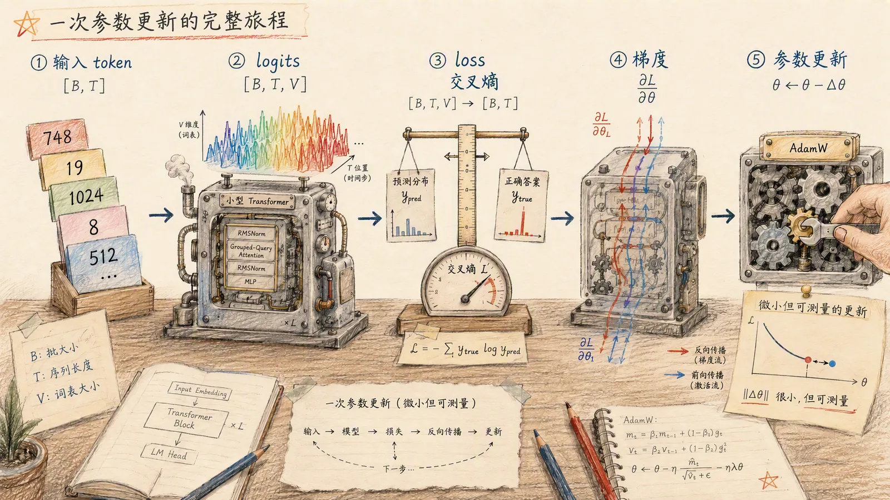
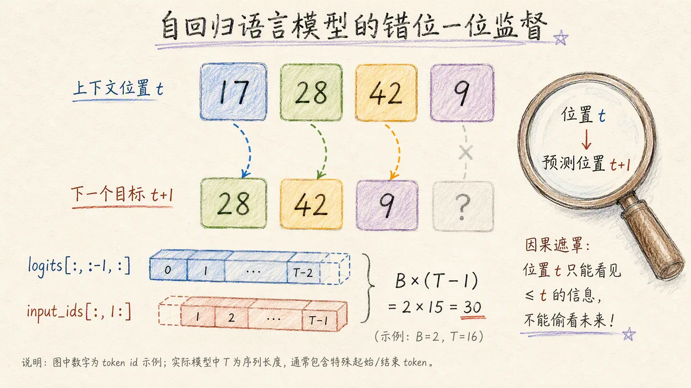
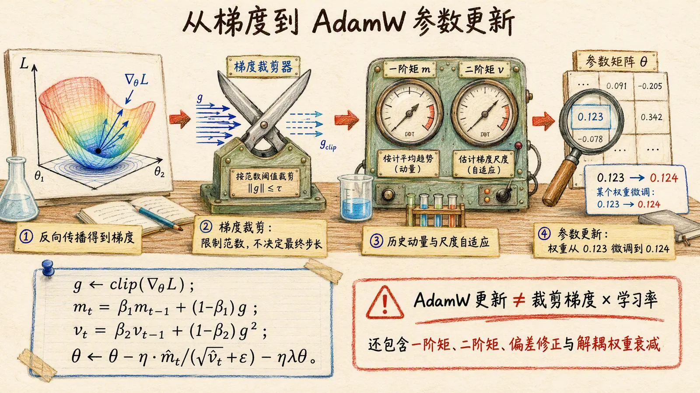
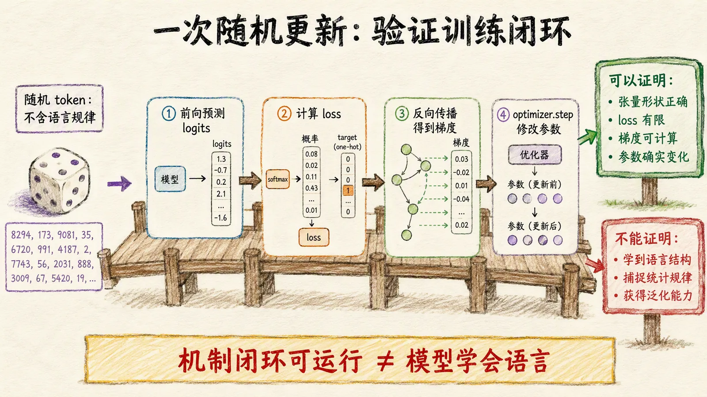

# 01 从一次参数更新开始

[系列目录](./README.md) | [下一篇：准备中英文训练数据](./02-bilingual-training-data.md)

看到“训练一个语言模型”，很容易先想到下载数据、准备 GPU，再运行一条训练命令。
但命令启动之后，**数据怎样变成误差，误差又怎样推动参数变化**？

第一篇先把问题放到“显微镜”下：不下载语料，不处理真实文本，只让一个随机初始化的
小模型完成一次预测、计算一次误差，再根据这个误差更新参数。我们会沿着同一批张量，
把一次学习拆成六个可以观察的动作：

```text
input_ids -> model -> logits -> loss -> backward -> optimizer.step
```

读完之后，你应该能够：

- 根据 `[B, T]` 推导 logits 与监督目标的形状；
- 解释为什么位置 `t` 的输出要与位置 `t+1` 的 token 对齐；
- 区分“算出梯度”和“改变参数”发生在哪一步；
- 用数值证据判断一次参数更新是否真的执行。

> **实验边界**：这里验证的是训练机制，不是语言能力。随机 token 没有真实语料中的
> 语言规律，一次参数更新也不能把模型变成聊天助手。

<figure class="tutorial-figure">



<figcaption>图 1｜一次训练步的全景。图中先保留全长张量表示流程；实际进入 loss 的是错位后的 T-1 个位置，见图 2。</figcaption>
</figure>

## 1. 先运行，再认识输出

先按 [环境准备](../NATIVE_PRETRAIN_GUIDE.md#2-环境准备) 安装第三方依赖，
然后从仓库根目录运行：

```bash
python scripts/model_experiment.py
```

这个脚本默认使用 CPU 和 float32，不会因为机器有 MPS 或 CUDA 就自动切换设备。
它不需要数据文件或 Tokenizer，不创建训练 run；保存加载检查使用临时目录，
结束后自动清理。我们暂时不会产生需要长期保存的训练成果。

下面是一次实际运行的输出。

```text
model_id: smoke-10m
parameters: 9915200
input_shape: [2, 16]
logits_shape: [2, 16, 16384]
supervised_tokens: 30
loss: 9.774947166442871
grad_norm: 9.861780166625977
weight_update_max: 0.0010004788637161255
cache_key_shape: [2, 1, 16, 64]
cache_matches_full: True
checkpoint_matches_full: True
generated_shape: [2, 20]
```

先不用理解每个字段，只抓住三个事实：

1. 模型接收形状为 `[2, 16]` 的整数输入，输出 `[2, 16, 16384]` 的分数。
2. 这次实验计算了 30 个预测目标的 loss，并得到梯度。
3. `weight_update_max > 0`，说明被观察的那一行参数确实发生了变化。

你本地的浮点数不必与示例逐位相同。相同 seed 不保证跨 PyTorch 版本、
硬件和计算后端完全一致；形状与计数应符合配置，数值应有限，一致性检查应通过。

完整代码在 [model_experiment.py](../../scripts/model_experiment.py)。
下文代码片段均摘自它的 `main()`，沿用前面已经创建的变量，不是独立脚本。

## 2. 模型吃进去的不是文字，而是整数

真实训练时，Tokenizer 会把文本转换成 token ID。一个 token 不一定对应一个汉字
或一个英文单词；如何划分和编号，我们在第三篇讨论。
本篇绕过文本转换，直接构造合法范围内的整数：

```python
torch.manual_seed(args.seed)
model = NativeTransformer(config)
input_ids = torch.randint(
    0, config.vocab_size, (args.batch_size, args.sequence_length)
)
optimizer = torch.optim.AdamW(model.parameters(), lr=args.learning_rate)
```

默认 `seed=42`、`batch_size=2`、`sequence_length=16`。
`torch.manual_seed()` 固定后续随机过程的起点，包括模型初始化和输入采样，
不是赋予模型任何知识。

模型结构来自 [smoke-10m.yaml](../../configs/models/smoke-10m.yaml)：
词表大小为 16,384，隐藏维度为 320，共 4 层，总参数量为 9,915,200。
`smoke-10m` 是约数命名，不表示恰好有一千万个参数。

`input_ids` 的形状 `[2, 16]` 表示两条序列，每条 16 个 token。
ID 的范围是 `0` 到 `16383`；它只是索引，ID 更大不代表含义更强。
脚本没有加载 Tokenizer，因此不能把这些整数解释成某段确定的中文或英文。

本实验也没有 padding 或特殊 token 的处理逻辑。即使随机抽到真实 Tokenizer
会用作特殊 token 的编号，这里也只是普通整数，不自动获得“忽略 loss”等语义。

现在有了两样东西：一组待学习的模型参数，以及一批输入。优化器则负责在梯度算出后
执行更新；创建优化器本身不会开始训练。

## 3. 前向传播：给每个位置的下一 token 打分

执行这一行，模型完成一次前向传播：

```python
output = model(input_ids=input_ids)
```

这里的 `model(...)` 会调用
[NativeTransformer.forward()](../../src/llm_lifecycle_lab/model/native/transformer.py)。
先把内部结构当作一条数据处理路径：

```text
整数 ID       [B, T]
  -> Embedding
向量序列      [B, T, D]
  -> 4 层 Transformer Block
上下文表示    [B, T, D]
  -> 最终归一化和词表投影
logits        [B, T, V]
```

`B` 是一次处理的序列数，`T` 是序列长度，`D` 是隐藏维度，`V` 是词表大小。
默认值下，输出形状就是 `[2, 16, 16384]`。

例如，`output.logits[0, 3, :]` 是第一条序列在第 4 个位置输出的
16,384 个候选分数。训练时，我们希望它给“下一个真实 token”更高的概率。

**logits 是未经归一化的分数，不是概率，也不是生成好的文字。**
通过 softmax 可以把一组 logits 转成概率，但计算交叉熵时不需要手动做这一步，
后面使用的 `F.cross_entropy()` 会在内部完成相应计算。

模型虽然一次接收整条序列，但因果注意力会限制信息流：
位置 `t` 只能使用当前位置及之前的信息，不能读取 `t+1` 的内容。
否则模型可以直接看答案，loss 再低也没有训练意义。
因果掩码怎样实现，留到模型结构一篇展开。

此时只发生了预测。模型权重还没有更新。

## 4. 为什么 32 个输入 token 只有 30 个预测目标

训练目标是“用前面的 token 预测紧接着的 token”，而不是复制当前位置的输入。
这一步常被称为 **next-token prediction（下一 token 预测）**。关键不是把输入和标签
准备成两份不同文本，而是把同一条序列沿时间轴错开一位。

<figure class="tutorial-figure">



<figcaption>图 2｜监督信号来自“错开一位”：每个位置回答一道 16,384 分类题，最后一个位置因没有后继 token 而不计入 loss。</figcaption>
</figure>

可以把每个有效位置看成一道共享同一套模型参数的分类题：输入是截至位置 `t` 的上下文，
类别是词表中的 16,384 个 token，正确答案是位置 `t+1` 的 token ID。
假设一条输入序列是：

```text
位置              0       1       2       3
输入 ID          17      28      42       9
该位置的预测目标   28      42       9       ?
```

这些整数只是示意，不代表实际分词结果。最后一个位置之后没有提供真实 token，
因此它的 logits 不参加本次 loss 计算。
第一个输入 token 也没有序列内的前驱位置来预测它。

脚本用两个切片把预测和答案对齐：

```python
predictions = output.logits[:, :-1, :].reshape(-1, config.vocab_size)
targets = input_ids[:, 1:].reshape(-1)
loss = F.cross_entropy(predictions, targets)
```

`logits[:, :-1, :]` 去掉每条序列最后一组预测分数；
`input_ids[:, 1:]` 去掉每条序列第一个 token。
这样，位置 `t` 的分数恰好与位置 `t+1` 的真实 ID 配对。

| 步骤 | 默认形状 | 含义 |
| --- | --- | --- |
| 原始 logits | `[2, 16, 16384]` | 每个输入位置都有词表分数 |
| 去掉最后一个预测位置 | `[2, 15, 16384]` | 每条序列留下 15 个有效预测 |
| `predictions` 展平 | `[30, 16384]` | 30 道分类题，每题 16,384 个候选 |
| `targets` 展平 | `[30]` | 每道题的正确 token ID |

因此，本实验的监督 token 数是：

```text
supervised_tokens = B * (T - 1) = 2 * 15 = 30
```

这是当前无 padding、无忽略标签实验的计数方式。
真实数据的 padding、标签掩码和 Packing 边界还需要单独处理，不能直接套用到所有训练任务。
“错开一位”也只能做一次；如果准备数据时已经错位，这里再错位，就会变成预测下下个 token。

### 交叉熵在衡量什么

对某个位置，如果模型分给正确 token 的概率是 `p`，它的损失就是 `-ln(p)`。
概率越低，损失越大；本实验的 loss 是 30 个目标的平均损失。

```text
单个目标的损失 = -ln(正确 token 的预测概率)
loss = 所有有效目标的损失之和 / 有效目标数
```

一个有用的参照是：假如模型对 16,384 个候选完全平均分配概率，
那么每个目标的损失都是 `ln(16384)`，约为 `9.704`。
示例里的初始 loss 约为 `9.775`，处在与均匀预测相近的量级。
随机初始化的输出并不严格均匀，所以这不是必须相等的验收值，
更不是跨词表、跨数据比较模型能力的通用基线。

模型只负责返回 logits，如何把 logits 和目标变成 loss，由外部训练代码决定。
这也是我们能在一个短脚本里直接观察训练目标的原因。

## 5. 从 loss 到真正的参数更新

一个标量 loss 只能告诉我们当前误差有多大。
要调整成千上万个参数，还需要知道 loss 对每个参数的变化有多敏感。
这就是梯度提供的信息。若把全部参数记作 `θ`、loss 记作 `L(θ)`，梯度
`∇θL` 就是在当前位置让 loss 增长最快的方向；优化器通常沿相反方向迈一小步。

```math
\theta_{k+1} = \theta_k - \Delta\theta_k
```

这里的 `Δθ` 由 AdamW 根据当前梯度、历史一阶/二阶矩估计、学习率与权重衰减共同决定，
因此不能简单理解为某一个梯度乘以学习率。

<figure class="tutorial-figure">



<figcaption>图 3｜梯度提供局部方向信息，AdamW 结合历史矩估计、学习率与解耦权重衰减形成实际更新；它不等于“裁剪梯度乘学习率”。</figcaption>
</figure>

```python
optimizer.zero_grad(set_to_none=True)
loss.backward()
grad_norm = torch.nn.utils.clip_grad_norm_(
    model.parameters(), max_norm=1.0, error_if_nonfinite=True
)
```

这三步的职责不同：

1. `zero_grad()` 清除之前留下的梯度。PyTorch 默认会累加梯度，不会每次自动替换。
2. `backward()` 沿计算图求导，把结果写入参数的 `.grad`，此时还不更新参数。
3. `clip_grad_norm_()` 限制全局梯度范数，梯度过大时按统一比例缩小。
   遇到非有限梯度就报错，不带着无效数值继续更新。

这里的一个容易误读之处是：`clip_grad_norm_()` 返回的是**裁剪前**的总范数。
所以输出 `grad_norm: 9.861...` 与设置 `max_norm=1.0` 并不矛盾。

接着，脚本记录输入里第一个 token 对应的 Embedding 行，然后执行更新：

```python
observed_token = int(input_ids[0, 0])
before = model.token_embedding.weight[observed_token].detach().clone()
optimizer.step()
with torch.no_grad():
    update = (model.token_embedding.weight[observed_token] - before).abs().max()
```

`detach().clone()` 留下更新前的独立副本，避免比较时两边都指向更新后的值。
真正改变权重的是 `optimizer.step()`。

最简单的梯度下降可以写成“新参数 = 旧参数 - 学习率 * 梯度”，
但本实验实际使用 AdamW，它还结合梯度的历史统计量和权重衰减，
不能把上面的简单公式当成这里的完整实现。

`weight_update_max` 对应 `update`，表示**被观察的这一行**里，
各元素更新前后绝对差的最大值，不是整个模型的最大更新量。
默认模型还让 Embedding 和输出词表投影共享权重。
这里观察一行，是为了获得“参数确实改变”的直接证据，不是证明所有参数都改变了。

还有一个重要边界：输出的 `loss` 是**更新前那次前向**算出的值。
脚本没有再次计算更新后的 loss，也没有验证它一定下降。
一次更新非零，不等于这次更新改善了泛化，更不等于模型已经学会语言。

## 6. 更新之后，再做三个检查

训练机制跑通之后，脚本切到 `eval()` 并在相应检查中使用 `torch.inference_mode()`。
前者切换训练/评估行为，后者关闭这些前向计算的梯度记录；
单独调用 `eval()` 不等于关闭自动求导。

### 完整前向与 KV Cache 是否一致

脚本用**更新后的同一个模型**对比两条路径：

- 一次输入完整的 16 个 token。
- 先输入前 8 个 token 并保留 KV Cache，再带着缓存输入后 8 个 token。

比较的是后半段对应位置的 logits，绝对与相对容差均为 `1e-5`。
通过后才输出 `cache_matches_full: True`，不是没有检查就直接声明成功。

KV Cache 保存之前 token 的 Key/Value，避免续写时重复计算这些内容，
它不是训练数据或模型知识的存储。
`cache_key_shape: [2, 1, 16, 64]` 对应一个层的 Key：
2 条序列、1 个 KV head、16 个已处理位置、每个 head 64 维。
这里的长度来自上述完整输入检查，不是后面生成后的总长度。
这个例子验证了特定输入下的一致性，不是全部 Cache 边界条件的证明。

### 保存再加载，输出是否保持一致

脚本在临时目录保存模型配置和权重，重新构造模型并加载，
再比较相同输入的 logits。这里要求完全一致，成功后输出
`checkpoint_matches_full: True`。

**这不是完整的训练恢复实验。**
模型保存加载不包含 AdamW 状态、数据位置和全部训练随机状态；
恢复一次中断训练还需要这些信息，第七篇再讨论。

### 能否走完生成循环

最后，模型接收原来的输入并继续生成。默认情况下：

```text
输入长度 16 + 新生成 4 = 输出长度 20
generated_shape = [2, 20]
```

返回结果包含原始输入，不是新生成了 20 个 token。
本次使用默认贪心选择，每步取分数最高的 token，且未设置 EOS 提前停止条件。
脚本最多生成 4 个新 token，接近模型长度上限时会相应减少。

这里没有 Tokenizer 解码，也没有输出可读文本。
能生成整数序列，只说明生成循环能运行，不能评价续写质量。

## 7. 自己动手：一次只改变一个变量

先保留默认运行作为基线，再分别执行以下命令。
`--json` 只改变输出格式，不改变实验逻辑；
JSON 中布尔值写成 `true`，对应普通输出中的 `True`。

### 实验一：只改 batch size

```bash
python scripts/model_experiment.py --batch-size 1 --json
```

模型参数量不变，输入变成 `[1, 16]`。
先按公式预测：监督目标应该是 `1 * (16 - 1) = 15`，
生成结果形状应该是 `[1, 20]`。再检查输出是否符合预期。

### 实验二：只改输入长度

```bash
python scripts/model_experiment.py --sequence-length 8 --json
```

此时输入为 `[2, 8]`，监督目标为 `2 * 7 = 14`，
logits 为 `[2, 8, 16384]`，生成结果为 `[2, 12]`。
模型参数量仍然不变：输入变短，不等于创建了一个更小的模型。

本脚本要求 `2 <= sequence_length < max_sequence_length`，
既保证有 next-token 目标，也为生成保留空间。默认配置允许的输入长度是 2 到 255。

前两个实验改变了样本数或上下文，不是在相同预测任务上比较模型。
即使其中一个 loss 更低，也不能据此说更小的 batch 或更短的输入提升了模型能力。

### 实验三：只改学习率

```bash
python scripts/model_experiment.py --learning-rate 1e-4 --json
```

默认学习率是 `1e-3`。在同一环境、同一份代码、相同 seed 下，
只改学习率不会改变本次初始化、输入和更新前的前向计算，
因此输出的 loss 与裁剪前梯度范数应与基线一致。
学习率开始影响的是后面的参数更新。

本次验证中，两次 `weight_update_max` 分别约为 `0.00100048` 和 `0.00010005`。
这说明更新尺度变了，不说明更大的更新更好；
精确小数不是跨环境的验收条件。

三个实验的稳定预期汇总如下：

| 设置 | 输入形状 | 监督目标数 | 生成结果形状 |
| --- | --- | ---: | --- |
| 默认 | `[2, 16]` | 30 | `[2, 20]` |
| 仅 `--batch-size 1` | `[1, 16]` | 15 | `[1, 20]` |
| 仅 `--sequence-length 8` | `[2, 8]` | 14 | `[2, 12]` |
| 仅 `--learning-rate 1e-4` | `[2, 16]` | 30 | `[2, 20]` |

这四次运行的参数量都应为 9,915,200，两个一致性检查都应通过，
loss、梯度范数和更新量应有限，观察到的更新量应大于零。
如果出现 `error:`，先处理错误，不把不完整运行当作成功实验。

## 8. 本篇到这里，下一步换成真实数据

<figure class="tutorial-figure">



<figcaption>图 4｜随机 token 上的一次更新只能证明预测、求导和参数更新能够闭环运行，不能据此推断模型已经学到结构、统计规律或语言能力。</figcaption>
</figure>

现在，我们可以把开头那条路径读成一个完整的机制闭环：

| 阶段 | 代码中的证据 | 回答的问题 |
| --- | --- | --- |
| 输入 | `input_ids.shape == [B, T]` | 模型一次看到了多少条、多长的序列？ |
| 预测 | `logits.shape == [B, T, V]` | 每个位置对多少个候选 token 打分？ |
| 监督 | `targets.numel() == B * (T - 1)` | 有多少个位置真正参与 loss？ |
| 求导 | `grad_norm` 为有限值 | 误差是否成功传回参数？ |
| 更新 | `weight_update_max > 0` | 优化器是否真的改变了权重？ |
| 回归检查 | 两个 `*_matches_full` 为 `True` | 更新后关键执行路径是否仍保持一致？ |

把它压缩成四个动作就是：

1. 准备整数 token ID，作为模型输入。
2. 前向计算每个位置的词表分数。
3. 将位置 `t` 的预测与 `t+1` 的真实 token 对齐，用交叉熵衡量误差。
4. 通过反向传播求梯度，再由优化器更新参数。

> **请记住三个“不等于”**：参数发生变化不等于 loss 必然下降；单步 loss 下降不等于
> 泛化能力提高；生成循环能运行不等于模型会说话。严谨实验需要把“机制正确”和“效果良好”
> 分开验证。

本篇最重要的结果不是某个 loss 数字，而是你知道了预测、求导和更新分别发生在哪里，
也知道如何用张量形状、有限梯度和非零参数差为它们提供证据。
这个脚本仍然不是正式预训练：没有真实语料、多步数据遍历、学习率调度或持久训练状态。

下一篇将把随机整数换成真实中英文文本，先回答：
数据来自哪里，为什么要记录来源，以及怎样划分训练集和评测集，
避免模型在评测时遇到已经训练过的内容。

继续实践可先看 [数据介绍与准备](../DATA_GUIDE.md)；
查结构细节可看 [自有模型介绍](../NATIVE_MODEL_GUIDE.md)。

[返回系列目录](./README.md) | [下一篇：准备中英文训练数据](./02-bilingual-training-data.md)
