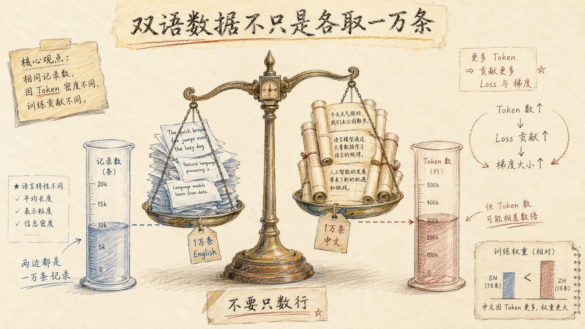
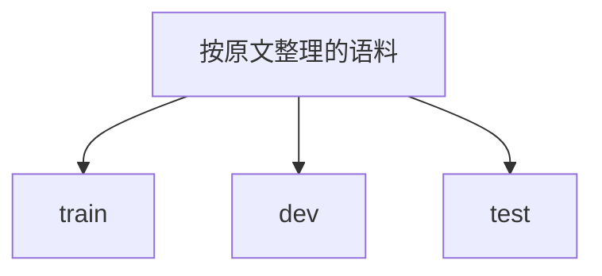
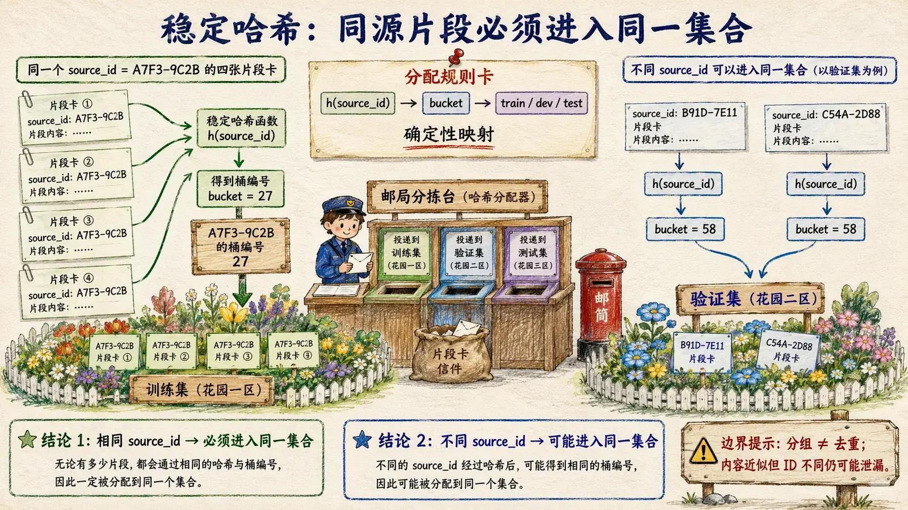
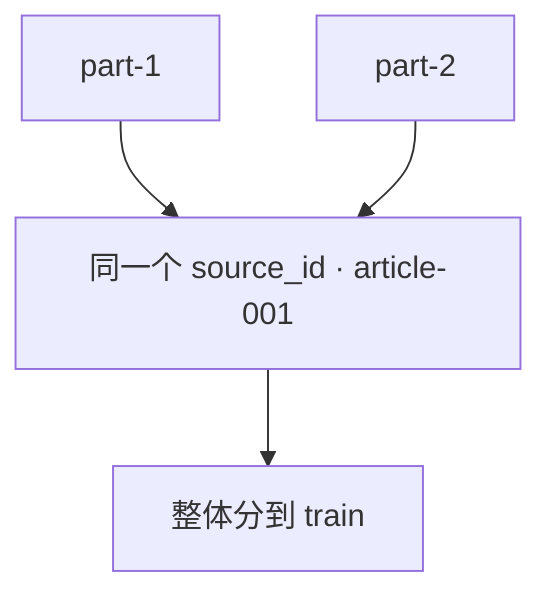
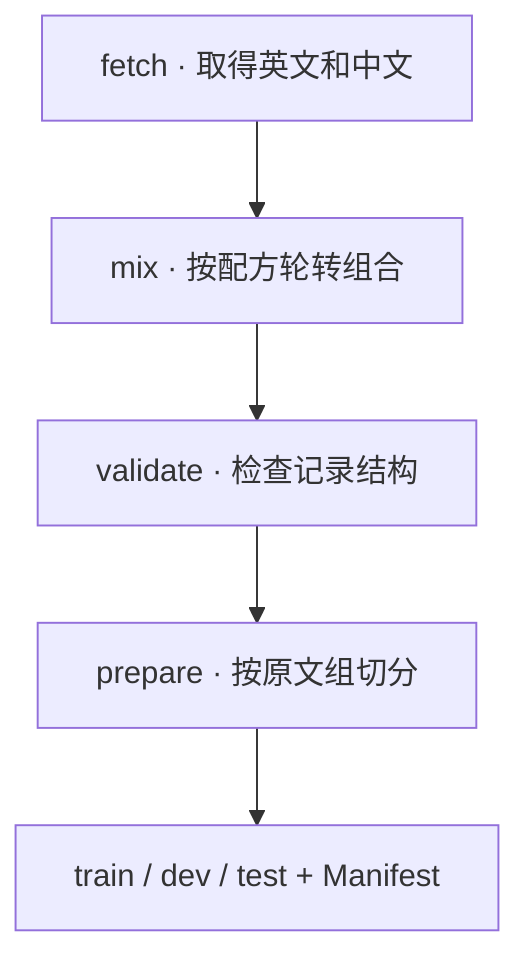

# 02 准备中英文训练数据

[系列目录](./README.md) | [上一篇：从一次参数更新开始](./01-first-parameter-update.md)
| [下一篇：让模型读懂文本的表示](./03-tokenizer-and-packing.md)

上一篇，模型已经完成了一次参数更新。但随机 token 中没有语言规律。
这一次，我们把问题从“参数怎样改变”推进到“模型应该从什么内容里学习”。

先不用下载数据。看两段文字：

<div class="sample-pair">
  <div><small>ZH · 中文</small><p>夜里下了一场雨，清晨的街道还湿着。</p></div>
  <div class="en"><small>EN · ENGLISH</small><p>Rain fell overnight. The streets were still wet in the morning.</p></div>
</div>

这是两段自写示例，不是数据集中抽出的记录。人能看出它们表达了相近的事情；
模型看到的，则会是两串不同的 token。反复预测这些序列中的下一个 token，
才有机会从文字中学到规律。

**本篇先把真实文本准备好，并留出模型没有训练过的评测材料。**
我们暂时不训练 Tokenizer，也不更新模型权重；完成后得到的还是文本文件。

## 1. 两种语言，各取一万条就够了吗

“各一万条”听起来很均衡。但一条可以是两句话，也可以是一篇长文章。
更进一步，同样长度的中英文文本，分词后也不一定产生同样多的 token。

回想上一篇，loss 是对预测目标求平均。训练时，一个语言贡献多少监督目标，
比文件里有多少行更直接地影响它在损失中的份量。

举一个**只用于算术演示**的例子：两种语言各一万条，
英文平均每条贡献 400 个监督 token，中文平均每条贡献 100 个。
那么英文占全部监督目标的比例是：

```math
\begin{aligned}
p_{\mathrm{en}} &=
\frac{N_{\mathrm{en}}\bar{t}_{\mathrm{en}}}
{N_{\mathrm{en}}\bar{t}_{\mathrm{en}} + N_{\mathrm{zh}}\bar{t}_{\mathrm{zh}}} \\[6pt]
&= \frac{4\,000\,000}{4\,000\,000 + 1\,000\,000} \\[6pt]
&= 80\%
\end{aligned}
```

其中 `N` 是记录数，平均值 `t` 指每条记录实际贡献的监督 token。
这不是项目语料的实测比例，只是说明：**记录数 1:1，训练量可能并不是 1:1。**

<figure class="tutorial-figure">



<figcaption>图 1｜“各一万条”只平衡了记录数。真正进入 loss 的是监督 token，文本长度和分词密度都会改变一种语言的训练份量。</figcaption>
</figure>

换句话说，语料混合比例会通过监督 token 占比影响**梯度混合比例**：哪种语言贡献的有效目标更多，
它对一次参数更新的影响通常也更大。记录数、字符数和 token 数回答的是三个不同问题，
设计配比时不能互相替代。这里比较的是各语言目标项在平均 loss 中的统计权重，
不保证某种语言产生的实际梯度范数一定更大。

因此，准备双语语料至少要观察三个层次：

| 层次 | 要问的问题 |
| --- | --- |
| 内容 | 两边分别是什么领域？质量怎样？ |
| 数量 | 各有多少原文、记录和字符？ |
| 训练量 | 分词、打包后，各贡献多少监督 token？ |

项目的 Smoke 用英文、中文各 10,000 条来检查链路。
60M 配方使用 100,000 条英文和 126,000 条中文，是参考当前 Tokenizer 的 token
统计校准后的配额。它不是通用比例，更换语料或 Tokenizer 后还要重新统计。

## 2. 给评测留一份没见过的材料

假设模型已经训练过“清晨的街道还湿着”，评测时又让它补全这句话。
预测对了，能否说明它对没见过的文本也有同样好的表现？

不能。模型可能学到了可迁移的规律，也可能记住了这段内容。
只在已经见过的材料上检查，无法区分这两种情况。

所以，我们在训练之前就划分数据：



训练集 train 用于更新模型参数，也用于本项目 Tokenizer 的词表训练。
验证集 dev 可以反复观察，用来选择训练配置。
测试集 test 留作最终检查；如果总根据它的结果修改方法，它也就逐渐变成了调参集。

这里的“没见过”，指没有参与相应训练，<strong>不是只把文件名换成 <code>test.jsonl</code></strong>。
评测数据与训练数据之间的内容关系，才是重点。

## 3. 为什么要按原文分组，而不是按行切分

再看一篇文章，被切成了两个有重叠内容的片段：

| 片段 | 正文示意 | 按行切分可能出现的结果 |
| --- | --- | --- |
| `part-1` | 夜里下了一场雨。**清晨的街道还湿着。** | train |
| `part-2` | **清晨的街道还湿着。** 行人撑着伞走过。 | test |

两行的 ID 不同，但评测材料里已经包含训练时出现过的句子。
这就是一种数据泄漏：评测看似独立，实际上借用了训练中的信息。

解决办法是让这两个片段保留同一个原文身份，一起被分到同一个集合：

<figure class="tutorial-figure">



<figcaption>图 2｜稳定哈希保证同一 `source_id` 的片段具有相同分配结果；它不要求不同 ID 进入不同集合，也不能替代内容去重。</figcaption>
</figure>

> **边界提醒：分组不是去重。** `source_id` 解决的是已知来源关系，不能发现被复制、改名或
> 轻微改写后获得新 ID 的内容。正式数据管线仍应在切分前做全局精确去重与近似去重，
> 并把去重规则和版本写入可审计的产物记录。



因此，一条记录需要两种身份：
`id` 区分当前记录，`source_id` 说明它来自哪篇原文。
同篇文章的片段应有不同的 `id`，但共享 `source_id`。

下面是一条自有数据的结构示例。JSONL 文件中，每行保存一个这样的 JSON 对象：

```json
{"id":"notes:001:part-1","text":"夜里下了一场雨。清晨的街道还湿着。","source":"my-notes","source_id":"notes:001","language":"zh"}
```

`text` 是真正的正文，`source` 记录来源，`language` 供后续按语言统计。
这里的元数据不是多余装饰：没有原文身份，就很难可靠地把相关片段留在一起。

> 在本项目中，必须显式使用 `--group-by source_id`。
> 默认参数是 `--group-by id`，程序不会自动猜测哪些片段属于同一篇原文。

这个办法依赖正确的原文身份。转载文章、换了 ID 的重复文本仍然可能跨集合，
所以近重复识别应在切分前完成。分组切分不能替代文本去重。

## 4. 怎样让分组结果稳定下来

我们不仅希望同篇原文不跨集合，还希望下次重新整理输入顺序时，
它仍然属于原来的集合，否则两次训练的评测条件也跟着变了。

项目为每个“seed + 原文组 ID”计算一个稳定的哈希分数。
在比例固定时，相同原文总是得到相同分数，也就得到相同归属。
默认的三个区间分别对应约 80%、10%、10% 的组。

这与“数出前 80% 的行作为 train”不同：
**哈希分组稳定的是归属，不是精确的记录数比例。**
一个原文组可能包含很多片段，小数据也可能恰好没有组落入 dev 或 test。
它还没有按语言分层，切完后需要检查每个集合的语言覆盖。

<details>
<summary>查阅：实际哈希代码与分组字段约束</summary>

实现见 [split.py](../../src/llm_lifecycle_lab/data/split.py)。
以下是 `_assign_group()` 的核心部分，`group` 是选定字段的规范化值：

```python
digest = hashlib.sha256(f"{seed}\0{group}".encode()).digest()
score = int.from_bytes(digest[:8], byteorder="big") / 2**64
if score < ratios.train:
    return "train"
if score < ratios.train + ratios.dev:
    return "dev"
return "test"
```

同 seed、同组 ID、同比例得到相同归属。改动其中任何一个，都可能改变评测成员。
输入重排不会改变归属，但会改变集合内的行顺序及文件 hash。

分组字段必须在所有记录中存在。代码只比较字段值，不会自动附加 `source`：
多个来源都叫 `001` 时，宜用 `corpus-a:001` 这样的完整身份。
不要按 `source` 分组，否则整个来源可能被视为一个组；
每行确实是一篇独立原文时，才可考虑按 `id` 分组。

</details>

## 5. 项目实际使用什么语料

有了训练量和评测隔离的概念，再看项目的具体选择就容易理解了：

| 语言 | 来源 | 内容 | 配方记录的许可 |
| --- | --- | --- | --- |
| 英文 | [SimpleStories](https://huggingface.co/datasets/SimpleStories/SimpleStories) | GPT-4o-mini 生成的故事 | MIT |
| 中文 | [Wikimedia Wikipedia](https://huggingface.co/datasets/wikimedia/wikipedia)，`20231101.zh` | 中文百科，含简体和繁体 | CC-BY-SA-3.0 |

它们构成一份来源明确、规模可控的教学基线，而不是通用高质量语料全集。
英文偏故事，中文偏百科，所以即使中文 loss 更高，也不能直接推断“中文更难学”：
语言、领域和分词方式在这里并没有被分别控制。

项目从固定上游 train 文件中，按原顺序取前 N 条去掉首尾空白后至少 64 字符的合格文本，
再创建自己的三个集合。这叫 `source-prefix`，不是全量随机抽样。
Smoke 是同语言 60M 来源配方的子集，两种规模也不是互不相交的语料。

为了让下一次实验还能使用相同内容，项目用 **recipe 固定获取计划**，
用 **Manifest 记录实际产物**。先记住这个区别即可，完整字段不必现在背下来。

<details>
<summary>查阅：Recipe、Manifest、记录字段与校验边界</summary>

Source recipe 固定一个来源的版本、文件、字段映射、筛选、数量、许可和 hash。
Mixture recipe 固定参与混合的来源，以及它们的顺序和策略。
可以通过以下只读命令查看，不会触发下载：

```bash
python scripts/data.py recipes --json
```

[英文 Smoke 配方](../../src/llm_lifecycle_lab/data/recipes/simplestories-smoke-v1.yaml)
中的筛选定义是：

```yaml
selection:
  strategy: source-prefix
  max_records: 10000
  min_characters: 64
  output_sha256: 861ca23380e0d6a718350038e74fedd4f7d824bf9e18c3d907bd01fa88be346e
```

64 是 Python 字符串长度，不是 token 或字节数。
非字符串文本、过短文本被跳过；到文件结束还不够规定数量时，代码会报错。
上游版本由 revision 固定，原文件与转换后 JSONL 都有 SHA-256 检查。

`fetch` 把不同来源统一为 `id/text/source/source_id`，来源语言保存在 Manifest；
到 `mix` 时才将它写入每条记录。不会自动逐篇识别语言。
公共 `id` 由仓库、revision、上游 split、上游 ID 和文本共同计算，
并不等于按正文去重；`source_id` 来自上游 ID，缺失时以行号构造。

Pretrain 的 `validate` 检查 JSON 对象、非空字符串 `id/text/source` 和重复 ID。
它不检查授权、隐私、事实、近重复，也不会识别被误填为正文的非空文件路径。
`PASS` 只能说明结构通过；校验有错时，`prepare` 停止，不静默丢弃坏行继续训练。

Manifest 记录来源、数量、处理参数、hash 等实际结果。
hash 用于发现内容变更或产物错配，不能证明文本质量或合法授权。
使用者需自行阅读并确认许可，`--accept-license` 不会自动赋予授权。

实现对应 [public.py](../../src/llm_lifecycle_lab/data/public.py)、
[mix.py](../../src/llm_lifecycle_lab/data/mix.py)；完整数据规模见
[数据指南](../DATA_GUIDE.md#22-选择规模)。

</details>

## 6. 把这些选择接成数据流程

环境沿用 [环境准备](../NATIVE_PRETRAIN_GUIDE.md#2-环境准备)，不要求 GPU。
从仓库根目录运行 [scripts/data.py](../../scripts/data.py)，数据依次经过：



`mix` 的轮转是先一条英文，再一条中文；一种来源耗尽后继续写入另一方剩下的记录。
它不会为了数量一致而截断或重复采样，也不会自动计算 token 平衡。

**这条链在本篇结束时停在文本切分。** Tokenizer 和 Packing 是下一篇的工作。

<details>
<summary>动手：获取、混合和切分 Smoke 数据的完整命令</summary>

完整操作指南见 [第一次实践：10M 双语 Smoke](../DATA_GUIDE.md#4-第一次实践10m-双语-smoke)。
这里保留本篇所需的命令，重点观察每一步产生的结果。

以下生成命令只在对应输出目录不存在时执行。
如果已经有完整 prepared 数据，先运行第 8 节的只读检查，不必为了跟文章再生成一套。
不要删除旧产物来避开“目录已存在”的错误，也不要手改 hash 放行。

### 获取固定来源

先阅读并确认两个数据源的许可，再执行：

```bash
python scripts/data.py fetch \
  --recipe simplestories-smoke-v1 \
  --output data/raw/simplestories-smoke-v1 \
  --accept-license MIT

python scripts/data.py fetch \
  --recipe wikipedia-zh-smoke-v1 \
  --output data/raw/wikipedia-zh-smoke-v1 \
  --accept-license CC-BY-SA-3.0
```

每个来源应输出 `records: 10000`，目录里同时有 JSONL 和来源 Manifest。
尽管只保留一万条，首次获取仍需要下载配方指定的整个 Parquet shard：
英文约 238 MB，中文约 127 MB；还要为转换后的文件和后续产物留空间。
hash 不匹配或下载失败时停止，不继续拼接不完整的数据。

### 按配方轮转混合

```bash
python scripts/data.py mix \
  --mixture bilingual-smoke-v1 \
  --input data/raw/simplestories-smoke-v1/source.jsonl \
  --input data/raw/wikipedia-zh-smoke-v1/source.jsonl \
  --output data/raw/bilingual-smoke-v1
```

[混合配方](../../src/llm_lifecycle_lab/data/mixtures/bilingual-smoke-v1.yaml)
指定英文在前、中文在后，策略为 `round-robin`：
先取一条英文，再取一条中文，持续轮转。
顺序由 recipe 决定，不取决于两个 `--input` 参数在命令里谁先出现。

这个实现保留所有组件记录，一种来源读完后继续写入另一种来源的剩余记录，
不会把长的一方截断，也不会为了补齐数量而重复采样。
因此 `round-robin` 是组合顺序，不是“自动保证 token 均衡”的算法。
实现可对照 [mix.py](../../src/llm_lifecycle_lab/data/mix.py)。

本配方应得到 20,000 条记录，以及混合许可标识 `CC-BY-SA-3.0 AND MIT`。
这个字符串保留两种许可信息，不表示合并成了一个新的统一授权。

### 校验格式，再按来源组切分

```bash
python scripts/data.py validate \
  --input data/raw/bilingual-smoke-v1/source.jsonl \
  --kind pretrain

python scripts/data.py prepare \
  --input data/raw/bilingual-smoke-v1/source.jsonl \
  --output data/prepared/bilingual-smoke-v1 \
  --dataset-id bilingual-smoke-v1 \
  --kind pretrain \
  --license "CC-BY-SA-3.0 AND MIT" \
  --seed 42 \
  --group-by source_id
```

先查看 `validate` 是否通过，再运行 `prepare`。
`prepare` 自己也会重新进行 schema 校验；
对于按上述路径保存的公共来源，还会加载旁边的 Manifest，
检查 recipe、文件 hash 和许可是否匹配。
不要把 `source.jsonl` 单独改名或移走，以免脱离这条来源检查路径。

</details>

在当前 Smoke 配方、默认比例和 seed 42 下，已有产物的只读核对结果是：

| Split | 记录数 | 英文 | 中文 |
| --- | ---: | ---: | ---: |
| train | 15,948 | 7,944 | 8,004 |
| dev | 2,009 | 1,029 | 980 |
| test | 2,043 | 1,027 | 1,016 |
| 合计 | 20,000 | 10,000 | 10,000 |

这张表说明全部记录被分配，两个语言桶均有覆盖；
它不证明去重已经完成，也不代表两个语言桶质量相同。
自有数据或不同配方不应照抄这些数量作为验收标准。

## 7. 离线实验：只换分组方式，会发生什么

下面不下载、不读写数据文件，只构造 30 篇原文、每篇两个片段的身份信息。
调用的就是项目实际使用的 `split_records()`，不是另一套演示算法。
这些字典没有正文，只用于研究分组，不是正式训练记录。

先预测一下：只把分组字段从 `source_id` 改成 `id`，还能保证原文不跨集合吗？
再运行实验核对。这里不需要前面的下载步骤。

<details>
<summary>运行实验：比较原文分组、按行切分、输入重排与 seed 变化</summary>

```bash
python - <<'PY'
from scripts._project_path import add_project_src_to_path

add_project_src_to_path()

from llm_lifecycle_lab.data.split import (
    SplitRatios,
    find_split_leakage,
    split_records,
)

records = [
    {"id": f"part-{index}", "source_id": f"article-{index // 2}"}
    for index in range(60)
]

def split(rows, group_by="source_id", seed=42):
    return split_records(rows, ratios=SplitRatios(), seed=seed, group_by=group_by)

def assignments(splits):
    return {
        row["id"]: name
        for name, rows in splits.items()
        for row in rows
    }

baseline = split(records)
by_id = split(records, group_by="id")
reversed_order = split(list(reversed(records)))
changed_seed = split(records, seed=43)

print("grouped_counts:", {name: len(rows) for name, rows in baseline.items()})
print("grouped_leakage:", find_split_leakage(baseline, group_by="source_id"))
print("id_split_leaked_groups:", len(find_split_leakage(by_id, group_by="source_id")))
print("reorder_same_membership:", assignments(baseline) == assignments(reversed_order))
print("reorder_same_row_order:", baseline == reversed_order)
print("seed_change_same_membership:", assignments(baseline) == assignments(changed_seed))
PY
```

开头两行导入并调用仓库现有的路径辅助函数，让这段独立实验能找到 `src/`；
与已有脚本一样，不需要 `pip install -e .`。

</details>

实际输出：

```text
grouped_counts: {'train': 48, 'dev': 6, 'test': 6}
grouped_leakage: []
id_split_leaked_groups: 11
reorder_same_membership: True
reorder_same_row_order: False
seed_change_same_membership: False
```

基线按 `source_id` 分组，没有来源组跨集合。
第一组对照只改成按片段 `id` 分组，同样 60 条记录中，有 11 个原文组跨集合，
不是只有 11 条记录有问题。
注意检查时仍然按 `source_id` 查泄漏；按唯一的片段 ID 自查，当然发现不了原文重叠。

第二组对照只反转输入顺序，归属不变，但各集合里的行顺序变了。
保存成文件后，这通常也会改变文件 hash。
“同样的数据成员”和“逐字节相同的产物”不是同一个复现条件。

第三组对照只把 seed 改成 43，归属发生变化。
因此不要为了得到更好看的评测指标反复挑 seed；
比较两种训练方法时，应先固定评测集。
这里恰好得到 48/6/6，也不表示哈希分组对所有输入都能精确满足 8:1:1。

## 8. 怎样确认已经准备好下一步的数据

成功执行 `prepare` 后，会得到：

```text
data/prepared/bilingual-smoke-v1/
  train.jsonl
  dev.jsonl
  test.jsonl
  data_manifest.json
```

`data_manifest.json` 保存源文件指纹、分组字段、seed、处理比例、
每个 split 的记录数、组数和 hash，以及传入的公共来源信息。
它将来会成为 Tokenizer 和 Packing 的输入依据，不能把它当作可随意删除的日志。

下面的检查只读取已有产物，不重新下载或生成数据。
它使用项目的 Manifest 校验函数，再统计语言覆盖并检查来源组是否跨集合：

<details>
<summary>查阅：校验 Manifest、双语覆盖和组间隔离的完整代码</summary>

```bash
python - <<'PY'
from collections import Counter
import json
from pathlib import Path

from scripts._project_path import add_project_src_to_path

add_project_src_to_path()

from llm_lifecycle_lab.data.prepare import load_data_manifest, verify_data_manifest
from llm_lifecycle_lab.data.split import find_split_leakage

path = Path("data/prepared/bilingual-smoke-v1/data_manifest.json")
manifest = load_data_manifest(path)
failures = verify_data_manifest(path)
if failures:
    raise SystemExit("\n".join(failures))
if manifest.group_by != "source_id":
    raise SystemExit("expected group_by=source_id")

splits = {}
for item in manifest.splits:
    with (path.parent / item.path).open(encoding="utf-8") as handle:
        rows = [json.loads(line) for line in handle if line.strip()]
    languages = Counter(row.get("language", "unlabeled") for row in rows)
    print(item.name, len(rows), dict(sorted(languages.items())))
    if not rows or languages["en"] == 0 or languages["zh"] == 0:
        raise SystemExit(f"{item.name}: missing records or language coverage")
    splits[item.name] = rows

leakage = find_split_leakage(splits, group_by="source_id")
if leakage:
    raise SystemExit(f"source groups cross splits: {leakage[:5]}")
print("manifest_and_group_checks: PASS")
PY
```

对应当前 Smoke 产物，输出应为：

```text
train 15948 {'en': 7944, 'zh': 8004}
dev 2009 {'en': 1029, 'zh': 980}
test 2043 {'en': 1027, 'zh': 1016}
manifest_and_group_checks: PASS
```

</details>

这段检查针对本篇的双语数据，不是通用的数据质量审计。
Manifest 校验检查文件 hash 和记录数；语言统计相信已有标签，
分组检查相信已有来源组，因此内容抽查和近重复检查仍不能省略。

同样也不要因为已经有三份 JSONL，就认为可以立即运行训练：
下一步还需要训练 Tokenizer，再生成 token Packing。
项目的 [Tokenizer 训练实现](../../src/llm_lifecycle_lab/tokenizer/native.py)
只读取 **train** 的正文学习词表；dev/test 使用同一个 Tokenizer 编码，
不能为了让词表“更全面”而把它们也加入 Tokenizer 训练。

准备好的产物可以校验后复用。
重新运行 `prepare` 即使文本不变，也会产生新的创建时间等 Manifest 信息，
下游绑定的 Manifest 文件 hash 可能随之改变，需要按新版本重建，
不能把旧 Tokenizer 随意接到新的 Data Manifest 上。

## 9. 带走三个判断

到这里，不妨先不用代码回答：

1. 中英文各一万条，为什么仍然可能有不同的训练量？
2. 两条记录的 ID 不同，为什么仍然可能发生评测泄漏？
3. 同 seed、同组 ID、同比例重排输入后，什么不变，什么可能改变？

现在，我们把“准备一些训练文本”拆成了可以检查的过程：

1. 明确中英文来源与分布限制，用 recipe 固定获取方式。
2. 统一记录结构，保留记录 ID、原文组和语言信息。
3. 校验格式，按原文组切分，再检查数量、覆盖与组间隔离。
4. 用 Manifest 保存这次数据处理的来源和结果。

模型还没有开始学习。我们先确定的是：它将从哪里学习，
以及之后用什么数据判断它是否真的有所改善。

下一篇会使用这份 train 数据训练 BPE Tokenizer，
再解释词表大小、文本规范化和 Packing 怎样影响实际的监督 token。
届时，才会把这里的文本接回第一篇中的 `input_ids`。

[返回系列目录](./README.md) | [上一篇：从一次参数更新开始](./01-first-parameter-update.md)
| [下一篇：让模型读懂文本的表示](./03-tokenizer-and-packing.md)
