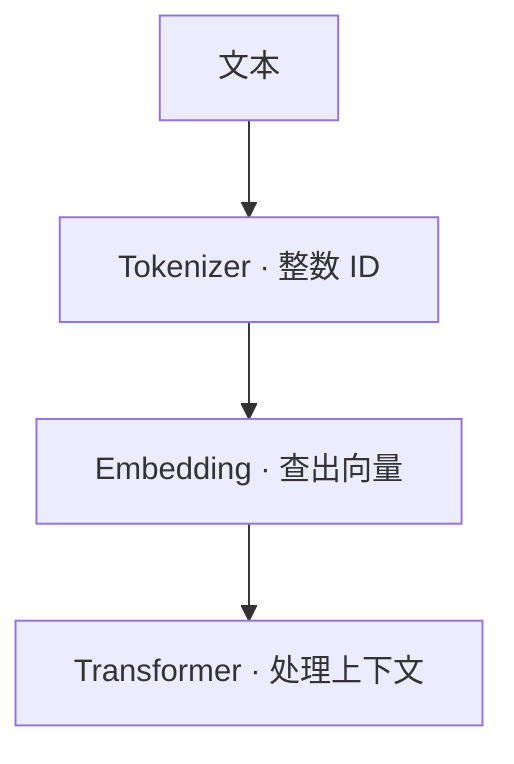
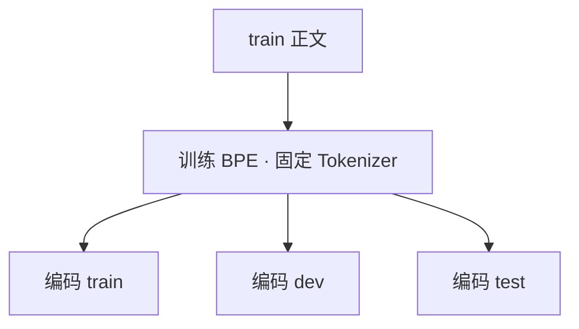

# 03 让模型读懂文本的表示

[系列目录](./README.md) | [上一篇：准备中英文训练数据](./02-bilingual-training-data.md)
| [下一篇：搭建自己的小型 Transformer](./04-small-transformer.md)

第一篇中，模型接收的是随机整数；第二篇中，我们准备的是中英文文本。
这两者还没有接起来。一段文字怎样变成 `input_ids`，并提供可用于学习的预测目标？

继续看两段自写文本：

<div class="sample-pair">
  <div><small>ZH · 中文</small><p>夜里下了一场雨。</p></div>
  <div class="en"><small>EN · ENGLISH</small><p>Rain fell overnight.</p></div>
</div>

按空格拆，英文似乎可以分成几个词，中文却没有这样的边界。
按字符拆，两边都能处理，但长文章会变成很长的序列。
有没有一种办法，既能覆盖不同语言，又能把常见片段表示得紧凑一些？

本项目的答案是 **字节级 BPE Tokenizer**。
本篇先理解它如何形成词表，再把编码后的文档打包成固定长度的训练窗口。
“读懂”在这里仅指建立模型可接收的表示，不是说分词器已经理解了句子。
文末实验不下载语料、不训练 Transformer，也不要求 GPU。

## 1. Token 不是词，ID 也不是含义

Tokenizer 把文本分成 token，并为每个 token 查出一个整数 ID。
token 可能对应一个词、词的一部分、空格、标点，甚至一个汉字的部分 UTF-8 字节。
所以中文常把 token 译为“词元”，但不能据此理解成“一 token 就是一个词”。

先区分四种计数：

| 单位 | 在数什么 | 例子 |
| --- | --- | --- |
| 字符 | Python 字符串中的 Unicode 码点 | `len("雨") == 1` |
| UTF-8 字节 | 文本编码后占用的字节 | `len("雨".encode("utf-8")) == 3` |
| token | 当前 Tokenizer 划出的单位 | 取决于词表和合并规则 |
| token ID | token 在当前词表中的编号 | 模型输入使用这些整数 |

一个中文字符占几个字节，并不意味着训练好的 Tokenizer 必然用几个 token 表示它。
同一个文本，换了词表也可能变成不同数量、不同编号的 token。
ID 大小没有语义上的远近关系，编号相邻不代表含义相似。

模型还需要把 ID 转成向量。这里才轮到第一篇见过的 Embedding：



若词表大小为 `V`、模型隐藏维度为 `d`，Embedding 表就是一个 `V × d` 的参数矩阵：

```math
\begin{aligned}
W_{\mathrm{embed}} &\in \mathbb{R}^{V \times d} \\
x_i &= W_{\mathrm{embed}}[\mathrm{id}_i]
\end{aligned}
```

Tokenizer 的词表训练主要统计文本片段，确定编码规则；
Embedding 则在语言模型训练中通过梯度更新。
它们是两个阶段，训练好 Tokenizer 不等于训练好了模型。

## 2. BPE 怎样把常见片段合在一起

BPE，全称 Byte Pair Encoding，可以先理解为：
**反复把训练语料中常见的相邻符号对合成一个新符号。**

为了看清这件事，暂时不用中文和完整字节表。假设语料只有：

| 文本 | 出现次数 | 初始拆分 |
| --- | ---: | --- |
| `run` | 10 | `r u n` |
| `runs` | 5 | `r u n s` |
| `sun` | 1 | `s u n` |

统计相邻对时，必须带上文本的出现次数：

- `u n` 出现 `10 + 5 + 1 = 16` 次。
- `r u` 出现 `10 + 5 = 15` 次。
- `n s` 出现 5 次，`s u` 出现 1 次。

第一次合并 `u + n -> un`。重新统计后，`r un` 出现 15 次，
第二次合并 `r + un -> run`：

```text
         初始        合并 u+n    合并 r+un
run      r u n       r un        run
runs     r u n s     r un s      run s
sun      s u n       s un        s un
```

常见片段因此可以用更少的 token 表示。
训练保存的不只是“有哪些 token”，还有合并规则及其顺序。
编码新文本时应用已经学到的规则，不会每输入一句话就重新统计训练一次。

这是两次合并的教学示意，不是项目 Tokenizer 的真实词表输出。
实际实现还有规范化、预切分、频次门槛和词表预算，
也不会任意跨过预切分边界进行合并。

### 为什么从字节开始

只从训练时出现的汉字或英文单词建表，遇到未收录字符怎么办？
字节级方法先保留全部 256 种字节值对应的基础符号，再学习更长的组合。
有效 Unicode 文本可以先编码成 UTF-8 字节，因此普通中英文及训练中没见过的字符
仍然有基础表示，不必都退化成同一个“未知词”。

它保证的是覆盖能力，不是压缩效率。
少见字符可能仍需多个 token；频繁出现的片段则可能被合并。
字节级 BPE 的内部 token 字符串也未必像正常文字，
不能把内部显示符号当成文本已经乱码。
单独解码一个只包含部分多字节字符的 token，也可能出现替代字符；
应检查完整序列的解码结果。

## 3. 编码再解码，为什么可能不是原文

本项目在 BPE 之前使用 **NFKC 规范化**。看一个具体例子：

```text
原始输入：ＡＢＣ １２３
规范化后：ABC 123
```

全角字母和数字被转成兼容形式。这样，一些外观不同但兼容的写法可以共享表示。
代价是原来的字符形式不再保留；NFKC 不是无损压缩，
也不只是“去空格”或“转小写”，更不会把中文翻译成英文。

对于不含保留控制字符串的普通文本，本篇检查的是：

```python
decoded == unicodedata.normalize("NFKC", text)
```

不是无条件要求 `decoded == text`。
如果任务需要保留全角形式等原始差异，应重新评估规范化选择，
不能把这里的策略当成适合所有场景的规则。

<details>
<summary>查阅：项目怎样配置字节级 BPE</summary>

实现位于 [tokenizer/native.py](../../src/llm_lifecycle_lab/tokenizer/native.py)。
`_new_tokenizer()` 的核心代码是：

```python
tokenizer = Tokenizer(models.BPE(unk_token=UNK_TOKEN))
tokenizer.normalizer = normalizers.NFKC()
tokenizer.pre_tokenizer = pre_tokenizers.ByteLevel(
    add_prefix_space=False,
    use_regex=True,
)
tokenizer.decoder = decoders.ByteLevel()
```

`add_prefix_space=False` 表示不会自动在文本开头补一个空格；
`use_regex=True` 先按规则划出片段，BPE 在这些边界内进行合并。
ByteLevel 将字节映射为内部符号，Decoder 再把它们还原为文本。

`train_native_tokenizer()` 使用 Hugging Face `tokenizers` 的 `BpeTrainer`：

```python
trainer = BpeTrainer(
    vocab_size=vocab_size,
    min_frequency=min_frequency,
    show_progress=False,
    special_tokens=list(SPECIAL_TOKENS),
    initial_alphabet=pre_tokenizers.ByteLevel.alphabet(),
)
```

完整字节字母表让普通有效 Unicode 文本有基础覆盖；
`<|unk|>` 仍是模型协议中保留的 token，不是正常输入应普遍依赖的表示。

</details>

### 正文 token 与控制 token

项目还保留一些不属于普通正文的 token：

| token | 本篇中的职责 |
| --- | --- |
| `<\|bos\|>` | 标记一篇文档的开头 |
| `<\|eos\|>` | 标记一篇文档的结束 |
| `<\|pad\|>` | 为不足长度的窗口占位 |
| `<\|unk\|>` | 保留的未知 token |
| `<\|im_start\|>`、`<\|im_end\|>` | 对话格式的边界，本篇预训练不使用 |
| 8 个 `<\|reserved_…\|>` | 保留给协议扩展 |

在正文说明中会把前三个简称为 BOS、EOS、PAD。
控制 token 是独立的词表项，不是把它的可见拼写拆成一串普通字母。
预留对话格式也不代表项目已经实现 SFT。

`NativeTokenizer.encode(text)` 默认不加 BOS/EOS；
显式传入 `add_bos=True, add_eos=True` 才会添加。
`decode()` 默认跳过控制 token，所以完整往返检查要说明是否保留这些标记。
原文中恰好含有控制 token 的保留拼写时，也不能按普通文本来推断往返结果。

## 4. 词表越大，模型就越好吗

增加词表预算，通常能容纳更多常见片段，让同一段文字变成更短的序列。
在固定上下文长度下，模型因此可能看到更多文本。
但这不是免费的收益。

回到 `V × d` 的 Embedding 表：增加词表也会增加参数。
以 10M 配置的 `d=320` 为例，将 `V` 从 16,384 扩到 32,768，
仅这张表就增加 `16,384 × 320 = 5,242,880` 个参数。
本项目输入 Embedding 与输出 LM head 权重绑定，因此共享参数只算一次；
但输出仍需对整个词表计算 logits，词表投影和概率计算的成本也会变化。

所以，需要同时观察：

| 观察项 | 它能说明什么 |
| --- | --- |
| 同一批文本的 token 数 | 表示是否更紧凑 |
| 分语言的 token 数与文本量 | 收益是否主要集中在一种语言 |
| 实际词表大小 | 训练是否形成了预期数量的词表项 |
| 模型参数与运行成本 | 压缩收益付出了什么代价 |
| 后续模型评测 | 更紧凑的表示是否真的改善了学习 |

`--vocab-size` 是训练目标预算，不是一定能填满的承诺。
数据很少、可合并片段不足，或 `min_frequency` 门槛太高，
实际词表可能小于请求值。应读取实际产物，不能只看命令行参数。

当前协议共有 14 个控制 token，加上 256 个基础字节符号，
最小词表是 **270**。文末用它作为“尚无 BPE 合并空间”的对照，
再与请求 512 的词表比较。它们只用于机制实验，不替代项目的 16,384 词表基线。

### 只在 train 上学习规则

Tokenizer 也是从数据学习出来的产物，不能为了提高 dev/test 的覆盖率，
把评测正文加进词表训练。本项目先校验完整 Data Manifest，
然后只迭代 train 文件学习 BPE；dev/test 只使用已经固定的规则编码。



Tokenizer 和模型也必须配套。两个词表就算大小相同，
同一 ID 仍可能代表不同片段；直接换 Tokenizer 会让原 Embedding 的行对应错含义。
项目用 hash 绑定实际词表，而不是仅靠词表大小判断兼容。

## 5. 怎样把长短不一的文档变成训练窗口

现在，文本已经能编码为整数序列。下一步是 **Packing**：
将同一 split 的文档串成 token 流，再按固定长度取训练样本。

每篇文档先变成：

```text
BOS + 正文 token + EOS
```

两篇连接后就是：

```text
BOS A1 A2 EOS BOS B1 B2 B3 EOS
```

其中 `A1/B1` 等只是 token 的示意名字，不是实际整数 ID。
train、dev、test 各有独立的流，绝不会为了凑长度而跨集合连接。
短文可以共享窗口，长文则延续到后面的窗口，不会简单丢掉超过长度的尾部。

### 为什么步长是 L-1，而不是 L

第一篇已经知道，长度为 `L` 的完整序列只提供 `L-1` 个 next-token 目标。
若把 `a b c d e f g h` 直接切成两个互不重叠的四 token 窗口：

```text
窗口 1：a b c d    目标：b c d
窗口 2：e f g h    目标：f g h
```

`e` 没有成为任何窗口的预测目标，`d -> e` 这一步丢了。
项目改为让下一个窗口从上一个窗口的最后一个 token 开始：

```text
窗口 1：a b c d       目标：b c d
窗口 2：d e f g       目标：e f g
窗口 3：g h PAD PAD   目标：h
```

重叠的 `d` 在第一个窗口是目标，在第二个窗口提供起始上下文；
它没有作为目标被算两次。除整个流的第一个 token 外，
每个位置在完整遍历这些窗口时都被监督一次。
这里按流中的位置计数，同一个词表 ID 可以在很多位置出现。

设流长为 `S`、窗口长度为 `L`，当前实现的计数关系是：

```math
\begin{aligned}
T_{\mathrm{supervised}} &= S - 1 \\
N_{\mathrm{windows}} &= \left\lceil
  \frac{S - 1}{L - 1}
  \right\rceil
\end{aligned}
```

这里 `S` 包含每篇文档的 BOS/EOS。
例如上面的 `S=8, L=4`，有 7 个监督目标、3 个窗口、2 个 PAD。
增大窗口会改变窗口数和上下文，但不会凭空增加这条流的监督目标。

### BOS/EOS 不等于注意力隔离

当前 Packing 只用 BOS/EOS 标出文档边界，**不做文档之间的 attention 隔离**。
一篇文档的 token 可以看到同窗口中前一篇文档的内容，
`EOS -> 下一篇 BOS` 也属于当前训练目标。
这是一种明确的实现选择，不能把边界标记误读为模型会自动清空上下文。

反过来，相邻窗口虽重叠一个 token，也不会把上一窗口的 KV Cache 带入下一窗口。
因此“不丢目标”不等于“每个目标都能看到完整原文”；
窗口开头的目标可用上下文更短，最长上下文仍受窗口长度限制。

## 6. PAD 为什么不能当作普通答案

最后一个窗口可能不满。为了让 batch 中样本形状一致，程序用 PAD 补齐，
但不能因此要求模型学习预测这些占位符。

对上面的最后一个窗口，数据集返回：

```text
input_ids:       [g, h, PAD, PAD]
attention_mask:  [1, 1,   0,   0]
labels:          [g, h, -100, -100]
```

两种 mask 的职责不同：

- `attention_mask` 告诉模型哪些位置是真实输入，哪些是补齐。
- `labels` 中的 `-100` 告诉损失计算哪些目标不参与监督。

`-100` 是忽略标记，不是词表中的 token ID，也不能送进 Embedding 查表。
有效位置的 `labels` 与 `input_ids` 相同，
因为 **Packing 没有提前错位标签**；损失函数随后只错位一次：

```python
shifted_logits = logits[:, :-1, :].to(dtype=torch.float32)
shifted_labels = labels[:, 1:]
mask = shifted_labels != ignore_index
```

完整实现见 [training/logprobs.py](../../src/llm_lifecycle_lab/training/logprobs.py)。
不能先把 `labels` 手动移一格，再让这里继续移，否则会变成预测下下个 token。

第一篇没有 PAD，监督目标数直接是 `B × (L-1)`；
有 PAD 后应数错位标签中不等于 `-100` 的位置。
本项目组 batch 时，如果全部位置都有效，会省略冗余的 `attention_mask`，
但这不会关闭模型内部的因果注意力。

<details>
<summary>查阅：磁盘上保存的不是一堆补齐后的窗口</summary>

实现见 [data/packing.py](../../src/llm_lifecycle_lab/data/packing.py)。
磁盘上每个 split 有三条等长数组：

| 文件后缀 | 内容 |
| --- | --- |
| `.tokens.i32` | 原始连续流的 token ID，含 BOS/EOS |
| `.languages.i8` | 对应文档的语言，en=0、zh=1、未标记=-1 |
| `.byte_weights.f32` | 规范化正文的字节统计权重 |

`byte_weights` 将解码后正文的 UTF-8 字节数均摊到内容 token，
BOS/EOS 权重为 0。它供 bits-per-byte 等统计使用，
不是每个 token 的精确字节跨度，也不是给训练 loss 加的权重。
具体指标留到评测篇。

`DiskPackedPretrainingDataset` 使用只读 `numpy.memmap` 访问这些数组，
按下面的范围读取第 `index` 个样本：

```python
stride = self.sequence_length - 1
start = index * stride
stop = min(start + self.sequence_length, self.split.source_tokens)
```

重叠和尾部补齐在取样时完成，磁盘数组并没有为每个窗口复制重叠 token 或 PAD。
Packing Manifest 同时绑定 Data Manifest hash、Tokenizer 内容 hash、
窗口长度和数组 hash；读取时会核对，避免换了词表还继续使用旧整数数据。

</details>

## 7. 离线实验：分开改变词表和窗口

现在把两件事拆成两个对照：

1. 固定自写语料、来源组切分和 `min_frequency=1`，只将词表预算从 270 改成 512。
2. 固定上一步请求 512 得到的 Tokenizer，只将窗口长度从 8 改成 16。

先预测结果：哪组实验会改变文本的 token 数？哪组只改变窗口的组织？
有没有一种情况，请求 512 却得不到 512 个词表项？

语料由 12 对自写中英文句子构成。每对翻译共享 `source_id`，
避免相关的两条文本被拆到不同集合。
它们仅供观察算法和产物，既不代表真实语料分布，也不用于评价语言能力。
程序检查三个 split 非空；哈希切分的小样本数量不必接近 8:1:1。

环境沿用 [环境准备](../NATIVE_PRETRAIN_GUIDE.md#2-环境准备)，从仓库根目录运行。
全部产物位于自动清理的临时目录，不读写 `data/` 中已有产物。

<details>
<summary>动手：运行词表与 Packing 的完整对照实验</summary>

```bash
python - <<'PY'
import json
from pathlib import Path
from tempfile import TemporaryDirectory
import unicodedata

from scripts._project_path import add_project_src_to_path

add_project_src_to_path()

from llm_lifecycle_lab.data import prepare_dataset
from llm_lifecycle_lab.data.fingerprint import sha256_file
from llm_lifecycle_lab.data.packing import (
    DiskPackedPretrainingDataset,
    materialize_packed_pretraining_dataset,
)
from llm_lifecycle_lab.tokenizer import NativeTokenizer, train_native_tokenizer

pairs = [
    ("Rain fell overnight.", "夜里下了一场雨。"),
    ("The streets were wet in the morning.", "清晨的街道还湿着。"),
    ("A reader opened a book.", "读者打开了一本书。"),
    ("The book was on the desk.", "书放在桌上。"),
    ("We learn from text.", "我们从文本中学习。"),
    ("A model predicts the next token.", "模型预测下一个词元。"),
    ("The library closes at night.", "图书馆在夜间闭馆。"),
    ("She reads by the window.", "她在窗边读书。"),
    ("Water freezes at low temperatures.", "水在低温下结冰。"),
    ("The train reached the station.", "列车抵达了车站。"),
    ("Numbers can describe a pattern.", "数字可以描述规律。"),
    ("We compare two experiments.", "我们比较两次实验。"),
]
probes = {"en": pairs[0][0], "zh": pairs[0][1]}
rows = [
    {
        "id": f"{language}-{index}",
        "source_id": f"lesson-3:{index}",
        "source": "tutorial-self-written",
        "language": language,
        "text": text,
    }
    for index, pair in enumerate(pairs)
    for language, text in zip(("en", "zh"), pair)
]

with TemporaryDirectory(prefix="llmlab-tokenizer-") as temporary:
    root = Path(temporary)
    source = root / "source.jsonl"
    source.write_text(
        "".join(json.dumps(row, ensure_ascii=False) + "\n" for row in rows),
        encoding="utf-8",
    )
    prepared = root / "prepared"
    data = prepare_dataset(
        source, prepared, dataset_id="tutorial-tokenizer",
        record_kind="pretrain", license_name="self-written-example",
        seed=42, group_by="source_id",
    )
    assert all(split.records > 0 for split in data.splits)
    print("split_records:", {split.name: split.records for split in data.splits})
    manifest_path = prepared / "data_manifest.json"

    for requested in (270, 512):
        output = root / f"tokenizer-{requested}"
        train_native_tokenizer(
            manifest_path, output, tokenizer_id=f"toy-{requested}",
            vocab_size=requested, min_frequency=1,
        )
        tokenizer = NativeTokenizer.from_directory(output)
        counts = {}
        for language, text in probes.items():
            ids = tokenizer.encode(text)
            assert tokenizer.unk_token_id not in ids
            assert tokenizer.decode(ids) == unicodedata.normalize("NFKC", text)
            counts[language] = len(ids)
        print(
            f"requested={requested} actual={tokenizer.vocab_size} "
            f"en_tokens={counts['en']} zh_tokens={counts['zh']}"
        )

    tokenizer_path = root / "tokenizer-512"
    tokenizer = NativeTokenizer.from_directory(tokenizer_path)
    raw = "ＡＢＣ １２３"
    restored = tokenizer.decode(tokenizer.encode(raw))
    assert restored == unicodedata.normalize("NFKC", raw)
    print("normalized:", restored)
    print("same_as_raw:", restored == raw)
    ids = tokenizer.encode(probes["zh"], add_bos=True, add_eos=True)
    assert ids[0] == tokenizer.bos_token_id and ids[-1] == tokenizer.eos_token_id
    print("boundary_tokens_added:", len(ids) - len(tokenizer.encode(probes["zh"])))

    train = next(split for split in data.splits if split.name == "train")
    train_rows = [
        json.loads(line)
        for line in (prepared / train.path).read_text(encoding="utf-8").splitlines()
    ]
    stream = [
        token
        for row in train_rows
        for token in tokenizer.encode(row["text"], add_bos=True, add_eos=True)
    ]
    for length in (8, 16):
        packed = root / f"packed-{length}"
        materialize_packed_pretraining_dataset(
            manifest_path, tokenizer_path, packed, sequence_length=length,
        )
        dataset = DiskPackedPretrainingDataset.from_manifest(
            packed / "packed_manifest.json", split="train",
            data_manifest_sha256=sha256_file(manifest_path),
            tokenizer_sha256=tokenizer.manifest.content_sha256,
            sequence_length=length,
        )
        targets = []
        padding = 0
        for index in range(len(dataset)):
            example = dataset[index]
            mask = example["attention_mask"]
            assert example["input_ids"][mask].tolist() == example["labels"][mask].tolist()
            assert bool((example["labels"][~mask] == -100).all())
            shifted = example["labels"][1:]
            targets.extend(shifted[shifted != -100].tolist())
            padding += int((~mask).sum())
        assert targets == stream[1:]
        assert len(stream) == dataset.stats.source_tokens
        assert len(targets) == dataset.stats.supervised_tokens
        assert padding == dataset.stats.padding_tokens
        print(
            f"L={length} source={len(stream)} supervised={len(targets)} "
            f"windows={len(dataset)} padding={padding}"
        )
    print("round_trip_and_packing_checks: PASS")
PY
```

</details>

使用项目固定的 `tokenizers==0.21.4`，下面是一次实际运行的输出：

```text
split_records: {'train': 12, 'dev': 4, 'test': 8}
requested=270 actual=270 en_tokens=20 zh_tokens=24
requested=512 actual=462 en_tokens=4 zh_tokens=2
normalized: ABC 123
same_as_raw: False
boundary_tokens_added: 2
L=8 source=69 supervised=68 windows=10 padding=2
L=16 source=69 supervised=68 windows=5 padding=7
round_trip_and_packing_checks: PASS
```

实验分为两组输出。第一组观察固定中英文探针句的正文 token 数，
不把 BOS/EOS 算进去；探针句来自小语料的 train，只验证规则与压缩，
不是泛化测试。第二组逐个读取真实磁盘 Packing 的 train 窗口，
将所有非忽略目标连接起来，与原流去掉第一个 token 后的序列逐项比较。
它不只是检查“总数恰好相等”。

270 的对照没有额外合并空间，英文探针的 20 个 UTF-8 字节对应 20 个 token，
中文探针的 24 个字节对应 24 个 token。
增加预算后，这些已见过的短句明显缩短；中文只有两个 token，
也不意味着一般中文句子都有这样的压缩率。
请求 512 实际得到 462，则说明在这些训练文本和预切分边界下，
可用的合并没有填满预算。

固定这个 Tokenizer 后，流长始终是 69，监督目标始终是 68。
`L=16` 的窗口更少，最后一个窗口却恰好需要更多 PAD：
这说明窗口数下降不等于尾部浪费一定下降，更不等于实测吞吐必然提高。
这里只验证组织方式，没有测模型速度。

**先看结构性判断：** NFKC 往返一致，显式添加边界增加两个 token，
并且不同窗口长度都没有漏掉或重复监督目标。
更少的探针 token 只能说明这些句子的表示更紧凑，
不能说明分词器理解了它们，更不能据此决定真实双语模型应该用多大的词表。

## 8. 把第二篇的真实数据接到这里

理解机制之后，再对第二篇得到的 `bilingual-smoke-v1` 产物操作。
不要将上面的微型 Tokenizer 接到默认 10M/60M 模型上；
项目配置使用 16,384 词表，临时实验的实际词表大小并不匹配。

已经有 prepared、Tokenizer 或 Packing 时，按
[产物复用说明](../DATA_GUIDE.md#8-产物校验复用与迁移) 从缺少的步骤继续，
不要删除旧目录来避开覆盖保护。

<details>
<summary>动手：真实 Smoke 数据的训练、检查与打包命令</summary>

先完成第二篇的 prepared 数据校验。只有对应输出目录不存在时才执行生成命令：

```bash
python scripts/train_tokenizer.py \
  --manifest data/prepared/bilingual-smoke-v1/data_manifest.json \
  --output data/tokenizers/bilingual-smoke-v1 \
  --tokenizer-id bilingual-smoke-v1 \
  --vocab-size 16384 \
  --min-frequency 1
```

目录应包含 `tokenizer.json` 和 `tokenizer_manifest.json`。
读取实际 `vocab_size`，核对是否与模型配置匹配。
CLI 默认 `min_frequency=2`，这里显式使用 Smoke 配方的 1，不要遗漏这个条件。

已有 Tokenizer 时，下面的检查不会修改它：

```bash
python scripts/inspect_tokenizer.py \
  data/tokenizers/bilingual-smoke-v1 \
  --text "语言模型 learns from text."
```

这个脚本显式添加 BOS/EOS，所以显示的 `tokens` 比不带边界的正文编码多 2。
解码默认跳过控制 token，输出应是规范化后的正文，而不是带标记的字符串。
不要直接把这个数量与实验中不含边界的 `en_tokens/zh_tokens` 混为一谈。

随后生成 seq128 Packing：

```bash
python scripts/data.py pack \
  --manifest data/prepared/bilingual-smoke-v1/data_manifest.json \
  --tokenizer data/tokenizers/bilingual-smoke-v1 \
  --output data/packed/bilingual-smoke-v1-seq128 \
  --sequence-length 128
```

完整产物字段、Smoke 各 split 计数见
[Packing 到底保存了什么](../DATA_GUIDE.md#7-packing-到底保存了什么)。
最后执行配置化检查：

```bash
python scripts/doctor.py --config configs/pipelines/native-smoke.yaml
```

Doctor 会检查数据、Tokenizer、Packing 和模型配置是否配套；
它不等同于完成预训练，也不证明模型已有语言能力。

</details>

Tokenizer Manifest 记录训练参数、实际词表、内容 hash、train 文件 hash，
以及源 Data Manifest 的 hash。Packing 再绑定这些产物与窗口长度。
因此重建数据、改词表、改窗口时，应生成配套的新产物，
而不是手动修改 Manifest 来让检查放行。

在真实数据上比较词表预算时，还需固定训练文本、数据顺序、依赖版本和评测文本，
分语言统计。若继续比较模型效果，要说明是否固定参数预算、监督 token 预算
或原始文本量，因为更换词表会同时影响这些量。
第二篇“相同记录数不等于相同训练量”的问题，到这里终于有了可计算的原因。

## 9. 带走四个判断

1. 为什么一个汉字不一定是一个 token，而 token ID 也不代表语义？
2. 为什么编码解码成功，仍然可能无法还原原始全角字符？
3. 为什么词表变大可能减少 token 数，却不能直接推出模型更好？
4. 为什么相邻窗口重叠一个 token，却没有把同一个目标监督两次？

现在，第二篇的文本已经能变成第一篇的 `input_ids`，
同时带着正确的边界、忽略标签和可核对的监督目标。
我们完成的是输入表示与样本组织，Transformer 权重还没有因此学到语言。

下一篇沿着这些整数查出的向量，进入模型内部：
Attention 怎样使用上下文，RMSNorm、RoPE、SwiGLU 和 GQA 分别做什么，
以及怎样用张量形状和小实验检查实现。

[返回系列目录](./README.md) | [上一篇：准备中英文训练数据](./02-bilingual-training-data.md)
| [下一篇：搭建自己的小型 Transformer](./04-small-transformer.md)
