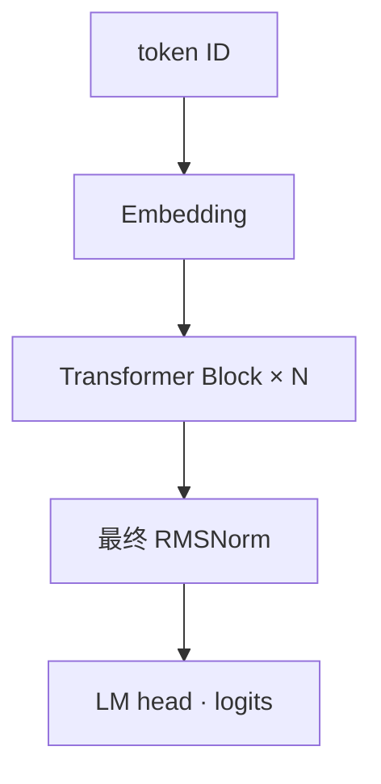
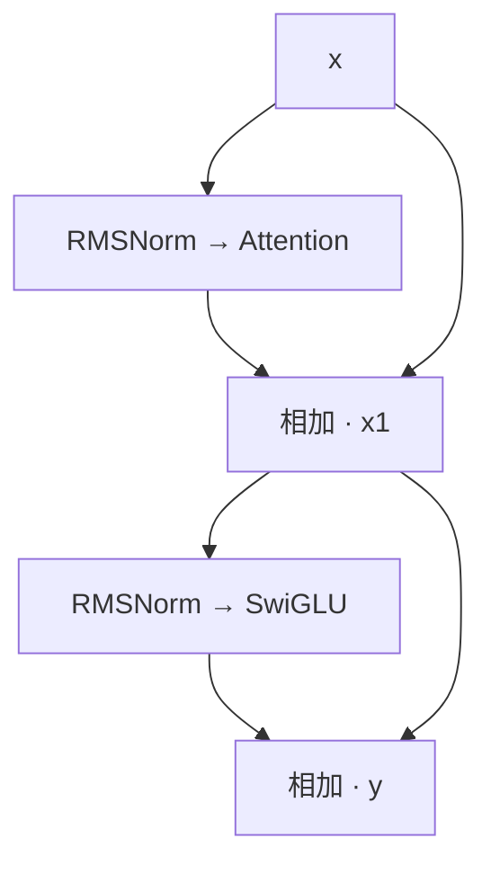
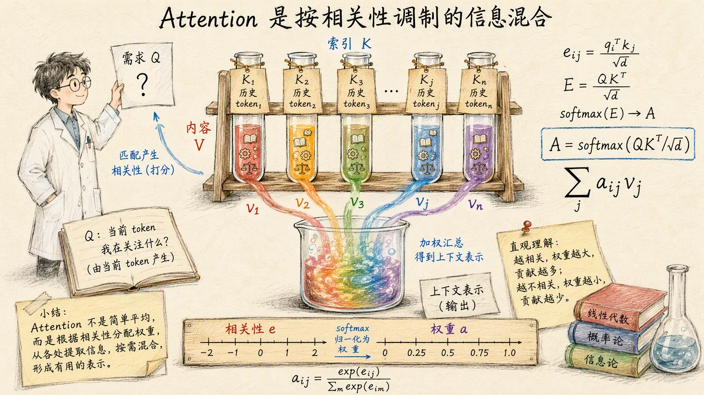
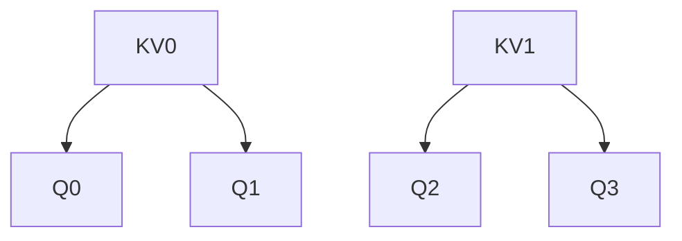

# 04 搭建自己的小型 Transformer

[系列目录](./README.md) | [上一篇：让模型读懂文本的表示](./03-tokenizer-and-packing.md)
| [下一篇：跑通一次预训练](./05-first-pretraining.md)

第三篇把文本变成了 token ID，再通过 Embedding 查出向量。
但查表本身不看上下文：同一个 ID，无论前面写了什么，最初取出的都是同一行参数。
模型怎样让后面的预测受到前文影响？

先读两个自写的句子开头：

<div class="sample-pair">
  <div><small>上下文 A</small><p>昨晚下了一场雨，今天路面很</p></div>
  <div class="en"><small>上下文 B</small><p>太阳晒了很久，今天路面很</p></div>
</div>

人会对后续内容作出不同判断。模型也需要一种机制，
让“同样的结尾”能结合不同前文形成不同表示。
这正是我们要进入 Transformer 内部的原因。

这两段话用于说明问题，不是实际分词结果，也不是随机模型的生成展示。
**本篇搭建的是计算结构，再检查结构是否按预期工作；语言规律仍需训练来学习。**
我们沿用项目现有模块，不另写一套模型来替代它。

## 1. 先看输入和输出之间的路线

项目使用 **decoder-only Transformer**：
只沿已经给出的前文预测后续 token，没有另一套 Encoder，
也没有原始 Encoder-Decoder 架构中的交叉注意力。



记住四个维度即可：`B` 是 batch 中的序列数，`T` 是本次输入长度，
`D` 是每个位置的隐藏维度，`V` 是词表大小。

| 位置 | 张量形状 | 表示什么 |
| --- | --- | --- |
| `input_ids` | `[B, T]` | 整数编号 |
| Embedding 输出 | `[B, T, D]` | 查表得到的向量 |
| 每个 Block 输出 | `[B, T, D]` | 融合前文后的表示 |
| 最终 RMSNorm 输出 | `[B, T, D]` | 投影前的表示 |
| `logits` | `[B, T, V]` | 每个位置对词表的分数 |

Block 不改变这三个外部维度，但内部会分头、扩大中间维度，再投影回来。
`logits` 不是已经选好的文字，也不是概率。
训练时，由外部 loss 将位置 `t` 的分数对齐位置 `t+1` 的标签；
生成时，才从末尾位置的分数选择下一个 token。

主线对应 [transformer.py](../../src/llm_lifecycle_lab/model/native/transformer.py)
中的 `NativeTransformer.__init__()` 和 `forward()`。
模型不持有 Tokenizer、优化器，也不在 `forward()` 中计算训练损失。

## 2. 一个 Block 为什么要加回原来的输入

如果每层都必须从头重写输入表示，信息和梯度都要穿过所有变换。
残差连接改为保留原输入，让一个分支计算要加上的变化：

```math
\begin{aligned}
x_1 &= x + A(R(x)) \\
y &= x_1 + F(R(x_1))
\end{aligned}
```

其中 `R` 是 RMSNorm，`A` 是 Attention，`F` 是使用 SwiGLU 的前馈网络。
两个分支都先归一化、再变换，所以叫 **pre-norm**。
第二次归一化使用的是已经加过 Attention 输出的 `x_1`，不是最初的 `x`。
两处 RMSNorm 各有自己的缩放参数，公式用同一个 `R` 表示运算类型，并非参数共享。



相加要求形状相同，因此两个分支最终都回到 `[B, T, D]`。
残差提供额外的恒等路径，有助于训练深层网络，
但不保证梯度永不异常，也不能代替合理的初始化、学习率和数值检查。

### RMSNorm 调整的是向量尺度

假设一个位置的向量是 `[3, 4]`。它的均方根是
`sqrt((3² + 4²) / 2) ≈ 3.536`。
忽略很小的 epsilon、且可学习缩放初始为 1 时，归一化后约为 `[0.849, 1.131]`。

一般形式是：

```math
\begin{aligned}
s &= \sqrt{\frac{1}{D}\sum_{j=1}^{D}x_j^2+\epsilon} \\
y_j &= g_j \frac{x_j}{s}
\end{aligned}
```

`g` 是可学习的逐维缩放，初始化为 1；epsilon 防止分母为零。
统计沿最后一维进行，每个 token 各算各的，
不是把整个 batch 或整篇文章混在一起归一化。

与 LayerNorm 的关键区别是：**RMSNorm 不减均值**。
上面的结果均值并不是 0；学到不同的 `g` 后，也不应要求输出均方根恒为 1。
项目在 float32 中计算均方和缩放，再恢复输入 dtype，
避免直接用低精度累计平方带来的部分数值风险。

<details>
<summary>查阅：Block 与 RMSNorm 的关键代码</summary>

[layers.py](../../src/llm_lifecycle_lab/model/native/layers.py)
中的 `TransformerBlock.forward()` 保留了完整的残差路径：

```python
residual = hidden_states
attention_output, present = self.attention(
    self.input_norm(hidden_states),
    position_embeddings=position_embeddings,
    attention_mask=attention_mask,
    is_causal=is_causal,
    past_key_value=past_key_value,
    use_cache=use_cache,
)
hidden_states = residual + attention_output
hidden_states = hidden_states + self.mlp(
    self.post_attention_norm(hidden_states)
)
```

[normalization.py](../../src/llm_lifecycle_lab/model/native/normalization.py)
中的 RMSNorm 核心计算是：

```python
input_dtype = hidden_states.dtype
normalized = hidden_states.to(dtype=torch.float32)
variance = normalized.pow(2).mean(dim=-1, keepdim=True)
normalized = normalized * torch.rsqrt(variance + self.eps)
return (self.weight.to(dtype=torch.float32) * normalized).to(dtype=input_dtype)
```

变量名虽然叫 `variance`，这里实际是均方，不是减过均值后的方差。
模块只有缩放参数，没有额外的 bias。

</details>

## 3. Attention 怎样从前文取信息

现在看 Attention 分支。每个位置的输入经过三组不同的线性投影，
得到 Query、Key、Value，通常简写为 Q、K、V：

| 向量 | 可以怎样理解 | 实际角色 |
| --- | --- | --- |
| Query | 当前要找什么信息 | 与可见位置的 Key 计算匹配分数 |
| Key | 这个位置可怎样被找到 | 参与匹配，不直接作为加权输出 |
| Value | 找到后取回什么信息 | 按注意力权重加权求和 |

这是理解计算的类比，不是人工给每个向量写了含义。
三个投影矩阵都需要训练；Q/K/V 来自同一段隐藏状态，因此是 **self-attention**。

<figure class="tutorial-figure">



<figcaption>图 1｜Query 决定当前需要什么，Key 参与计算“去哪里找”，Value 才是按权重取回并混合的内容。</figcaption>
</figure>

从线性代数角度看，Attention 不是从历史位置中挑出唯一答案，而是先得到一组归一化权重，
再对可见 Value 做加权和。因此输出通常融合了多个位置的信息；某个权重最大，
也不意味着其它位置完全没有贡献。

先只看一个头。设当前 Query 为 `q_i`，可见位置 `j` 的 Key、Value 为 `k_j/v_j`，
每头维度为 `d_h`：

```math
\begin{aligned}
s_{ij} &= \frac{q_i^\top k_j}{\sqrt{d_h}} + M_{ij} \\
a_{ij} &= \operatorname{softmax}_{j}(s_{ij}) \\
o_i &= \sum_j a_{ij}v_j
\end{aligned}
```

三步分别是：计算分数、沿 Key 位置归一化、加权汇总 Value。
`1/sqrt(d_h)` 用来控制点积随维度增大而扩张的尺度；
`M` 是下一节的遮罩，不允许访问的位置在数学上加负无穷。

例如两个可见位置的分数都为 0，softmax 就是 `[0.5, 0.5]`。
若 Value 为 `[2, 0]` 和 `[0, 4]`，汇总结果就是 `[1, 2]`。
注意，取回的是 Value，不是 Key，也不是直接选中一个原始 token。

多个注意力头使用不同的投影，共同构造表示；
它们的输出拼接后再经过 `o_proj` 回到隐藏维度 `D`。
不能仅凭头的编号断言“这个头负责语法、那个头负责事实”，
注意力权重也不能单独作为完整的因果解释。

代码没有手写完整的 softmax 内核，而是调用 PyTorch 的
`scaled_dot_product_attention`，简称 **SDPA**。
它完成上述核心运算，具体内核随设备、dtype 和输入条件变化；
使用这个 API 不等于在所有设备上都启用了 FlashAttention。

## 4. 训练时已经给出整句，怎样防止偷看答案

第一篇把整段 `input_ids` 一次送进模型，多个位置同时计算 loss。
但位置 `t` 预测 `t+1`，如果它能直接看到 `t+1` 的输入，就等于把答案放在眼前。

因果遮罩只允许 Query 访问当前位置和之前的位置。
三个位置的允许关系如下，行是 Query，列是 Key：

```text
        k0 k1 k2
q0       1  0  0
q1       1  1  0
q2       1  1  1
```

对角线是允许的：位置 `t` 的输入不是它要预测的答案，`t+1` 才是。
有了这个限制，训练可以并行计算各位置，
而每个位置仍然只能依赖自己的前缀。
生成则需要逐步选择新 token，再将它接到上下文里。

第三篇的 padding mask 解决的是“哪些位置是占位符”，
这里的 causal mask 解决的是“哪些位置还在未来”。两者不能互相替代。
本项目的内部布尔 mask 中，**True 表示允许访问**，这是 SDPA 的约定，
不要套用别的 API 中“True 表示遮掉”的含义。

### 小实验：公式和库函数是不是同一件事

下面固定 Q/K/V，先显式算公式，再与 SDPA 比较。
随后只改变最后一个位置的 Value：
加因果遮罩时，前两个位置应不变；去掉遮罩时，它们应改变。
后者是一个对照，确认实验确实有能力检测未来信息的影响。

<details>
<summary>动手：Attention 公式与因果遮罩对照</summary>

从仓库根目录运行，环境沿用
[环境准备](../NATIVE_PRETRAIN_GUIDE.md#2-环境准备)：

```bash
python - <<'PY'
import torch
import torch.nn.functional as F

from scripts._project_path import add_project_src_to_path

add_project_src_to_path()

from llm_lifecycle_lab.model.native.attention import build_attention_mask

q = torch.tensor([[[[1., 0.], [1., 1.], [0., 1.]]]])
k = torch.tensor([[[[1., 0.], [0., 1.], [1., 1.]]]])
v = torch.tensor([[[[10., 0.], [0., 20.], [30., 30.]]]])
allowed = build_attention_mask(
    None, query_length=3, key_length=3, past_length=0,
    device=torch.device("cpu"),
)
scores = q @ k.transpose(-2, -1) / q.shape[-1] ** 0.5
weights = scores.masked_fill(~allowed, float("-inf")).softmax(dim=-1)
manual = weights @ v
actual = F.scaled_dot_product_attention(q, k, v, attn_mask=allowed)
torch.testing.assert_close(actual, manual, atol=1e-6, rtol=1e-5)

changed_v = v.clone()
changed_v[:, :, -1] += 100
masked = F.scaled_dot_product_attention(q, k, changed_v, attn_mask=allowed)
torch.testing.assert_close(actual[:, :, :2], masked[:, :, :2], atol=0, rtol=0)
unmasked = F.scaled_dot_product_attention(q, k, v)
unmasked_changed = F.scaled_dot_product_attention(q, k, changed_v)
assert not torch.allclose(unmasked[:, :, :2], unmasked_changed[:, :, :2])

print("allowed:", allowed[0, 0].int().tolist())
print("last_row_weights:", [round(x, 4) for x in weights[0, 0, -1].tolist()])
print("manual_matches_sdpa: True")
print("masked_prefix_unchanged: True")
print("unmasked_prefix_changed: True")
PY
```

</details>

一次实际运行的输出如下：

```text
allowed: [[1, 0, 0], [1, 1, 0], [1, 1, 1]]
last_row_weights: [0.1978, 0.4011, 0.4011]
manual_matches_sdpa: True
masked_prefix_unchanged: True
unmasked_prefix_changed: True
```

最后一行权重对应三个可见 Key，和约为 1，都是非负值。
后两个 Key 的点积分数相同，因此权重也相同；
这不是简单平均，也不是只选择得分最高的那个位置。

这是局部 Attention 计算的对照，不是独立验证整个 Transformer。
数值来自人为构造的向量，没有自然语言含义；
真实模型的 Q/K 还要经过分头和位置旋转。

<details>
<summary>查阅：CPU、加速设备和 padding 的 mask 路径</summary>

实现见 [attention.py](../../src/llm_lifecycle_lab/model/native/attention.py)。

无 padding、无历史 cache 的完整前缀，在 CUDA/MPS 上可使用
`is_causal=True`，不传显式 mask。
CPU 路径构造一次显式的三角布尔 mask，并让各层共享。
两条路径表达相同的因果约束，不是不同的模型结构。

有 padding 时，内部 mask 再与 `[B, 1, 1, Tk]` 的 Key 有效标记求交。
这阻止有效 Query 读取 PAD 位置；不会自动保证 PAD Query 的输出为零，
所以 padding 标签仍需要按第三篇设成 `-100`，从 loss 中排除。

有 cache 时，Query 的位置从 `past_length` 起算。
例如过去已有 4 个 token，本次又输入 2 个，则 mask 是 `[1, 1, 2, 6]`
或带 batch 维的对应形状，而不是简单取一个没有偏移的 `2 × 6` 下三角矩阵。

</details>

## 5. GQA 为什么让多个 Query 共享 KV

传统多头注意力 MHA 中，Query 头和 KV 头数量相同。
本项目使用分组查询注意力 **GQA**：保留更多 Query 头，
让一组 Query 共享一组 Key/Value。

用 4 个 Query 头、2 个 KV 头的小例子看：



共享的是 K/V 投影结果，不是 Query 或最终的注意力权重。
两个 Query 即使用同一组 K/V，也可以得到不同的匹配分数和输出。

设 Query 头数为 `Hq`、KV 头数为 `Hkv`，`d_h = D/Hq`：

| 阶段 | 形状 |
| --- | --- |
| Q 投影后 | `[B, T, Hq × d_h]` |
| K/V 投影后，各一份 | `[B, T, Hkv × d_h]` |
| Q 分头后 | `[B, Hq, T, d_h]` |
| K/V 分头后，各一份 | `[B, Hkv, T, d_h]` |
| SDPA 输出 | `[B, Hq, T, d_h]` |
| 拼接、输出投影后 | `[B, T, D]` |

项目要求 `D` 能被 `Hq` 整除，`Hq` 能被 `Hkv` 整除。
`Hkv=Hq` 是 MHA，`Hkv=1` 是多查询注意力 MQA；
当前实现通过同一条代码路径处理这些情况。

GQA 减少 K/V 投影参数和持久 KV Cache 元素数，但要注意本项目的实现边界：
**cache 保存较少的 KV 头，送入 SDPA 前却会用 `repeat_interleave` 展开。**
因此不能把缓存缩小的比例当成总显存或速度提升比例，
也不能声称当前使用了无需复制的原生 GQA 内核。

60M 基线的 `D=768, Hq=12, Hkv=4`，所以 `d_h=64`，
每 3 个 Query 共享一组 KV。
10M 的 5 个 Query 共享 1 组 KV，它用于快速验证，不是效果研究的主基线。

## 6. RoPE 怎样把位置带进匹配分数

Q/K 的投影本身逐位置共享相同权重，没有显式写入“这是第几个 token”。
因果遮罩规定了能看谁，但并没有直接给匹配分数提供具体的距离编码。
RoPE，也就是 Rotary Position Embedding，用随位置变化的旋转解决后一件事。

先看二维向量的一对分量 `u/v`，旋转角度为 `φ`：

```math
\begin{aligned}
u' &= u\cos\varphi-v\sin\varphi \\
v' &= u\sin\varphi+v\cos\varphi
\end{aligned}
```

位置越往后，旋转角度按对应频率继续推进。
不同分量对使用不同频率；旋转不会在数学上改变这一对分量的长度。

关键不是“把向量转一下”本身，而是同时旋转 Q 和 K 后，
它们的点积带上了相对位置差：

```math
(R_m q)^\top(R_n k)=q^\top R_{n-m}k
```

这里先固定未旋转的 `q/k`，`m/n` 是位置。
两个位置一起平移、保持距离不变时，旋转引入的点积关系不变。
真实网络的 Q/K 还依赖内容和上下文，
所以不能把这个性质说成“模型输出只取决于相对距离”。

### 对照代码时，注意分量如何配对

本项目采用 **split-half** 排列：最后一维 `[a, b, c, d]`
按 `(a, c)`、`(b, d)` 配对，不是相邻的 `(a, b)`、`(c, d)`。
因此 `head_dim` 必须是偶数。

`rotate_half()` 返回 `[-c, -d, a, b]`，再计算：

```python
return (tensor * cosine) + (rotate_half(tensor) * sine)
```

结合重复到两半的频率，正好得到上面的二维旋转。
核对其它实现时，不能只看公式相似就混用不同的分量排列和权重布局。

RoPE **只旋转 Q/K，不旋转 V**。
本项目把各位置的 cos/sin 预先算好，所有层共享，
它们不是训练参数，也不是后面要讲的历史 KV Cache。
这种三角函数表不会让模型自动具备训练长度之外的推理能力。

`qk_norm=true` 时，还会在 RoPE 前对每个 Q/K 头做 RMSNorm，
V 不受影响。当前基线关闭这个选项；
开关会改变模型行为，不应混在“只优化缓存”的实验中。

## 7. SwiGLU 怎样加工每个位置的信息

Attention 负责跨位置混合信息。它之后的前馈网络则在每个位置上，
对已经融合上下文的向量做非线性变换。

本项目的 SwiGLU 用两条线性分支扩展到中间维度 `I`，
一条经过 SiLU，再与另一条逐元素相乘，最后投影回 `D`：

```math
\begin{aligned}
g &= \operatorname{SiLU}(W_g x) \\
u &= W_u x \\
F(x) &= W_d(g\odot u)
\end{aligned}
```

`⊙` 是逐元素乘法，不是矩阵乘法。
SiLU 定义为 `z × sigmoid(z)`，所以这里的“门”不是 0/1 开关，
也不保证处处落在 `[0, 1]`。
非线性使这组变换不只是几个可以合并成一层的线性映射。

代码对应三组不带 bias 的线性层：

```python
return self.down_proj(
    F.silu(self.gate_proj(hidden_states)) * self.up_proj(hidden_states)
)
```

其中 `F.silu` 的 `F` 是 PyTorch `functional` 模块别名，
不是公式中表示整个前馈网络的函数名。
内部形状经历 `[B, T, D] -> [B, T, I] -> [B, T, D]`。
每个位置使用相同的前馈权重，不直接与另一个位置交换数据；
不过它的输入已经包含 Attention 汇总的上下文。

所有 Block 之后还有一次 RMSNorm，然后 LM head 投影到词表。
默认 LM head 与输入 Embedding 共享同一张参数矩阵，
所以“输入查表”和“输出打分”不是两份独立的词表参数。
最终用梯度更新这些参数的过程，仍是第一篇的 `backward()` 和 `step()`。

## 8. KV Cache 为什么可以复用前文

假设已经处理过 `[1, 2, 3, 4]`，接下来输入 `[5, 6]`。
如果每次都把完整序列重新送入模型，旧 token 的很多计算会被重复执行。

因果结构保证：在权重固定、采用确定性的推理设置时，
增加未来 token 不会改变旧位置的表示。
因此每层可以保留旧位置的 K/V，续写时只为新输入计算新的 Q/K/V，
再把新的 K/V 接到旧缓存后面。

```text
第一段输入：[1, 2, 3, 4]
各层缓存：K(0..3), V(0..3)

第二段输入：[5, 6]
新 Query：位置 4、5
可用 Key/Value：旧 0..3 + 新 4..5
```

为什么不缓存 Query？新位置需要的是自己的 Query，
拿它去查询已有 Key/Value；旧 Query 的汇总结果已经计算过了。

两个条件尤其容易漏掉：

1. 新 Q/K 的 RoPE 位置要接着前缀走，从 4 开始，不能重新从 0 开始。
2. 第一个新 Query 不能看到第二个新 token，所以续写多个 token 时仍需因果遮罩。

项目缓存的是每层**已旋转的 Key**与 Value，旧 Key 不会再次旋转。
缓存只适用于匹配的权重、前缀和位置，不能跨样本随意复用；
训练更新参数后也不能把旧 cache 当成新权重的结果。
当前预训练使用 `use_cache=False`，不同 Packing 窗口之间不传递缓存。

### 缓存缩小不等于全部计算都省掉

若有 `N` 层，缓存前缀长度为 `T`，每个元素占 `b` 字节，
K 和 V 两份张量合计的元素数与字节数是：

```math
\begin{aligned}
E_{\mathrm{KV}} &= 2NBH_{\mathrm{kv}}Td_h \\
M_{\mathrm{KV}} &= E_{\mathrm{KV}}b
\end{aligned}
```

60M 基线在 `B=1, T=512, float32` 时，紧凑 K/V 张量合计 8 MiB；
假设其它维度不变而使用 12 个 KV 头，则是 24 MiB。
这只是缓存张量的容量对照，不是实测进程显存：
模型权重、临时重复的 K/V、Attention 中间结果和其它开销都不在其中。

Cache 也不是无限长记忆。新 Query 仍要读取可见 K/V，
本项目还受 `max_sequence_length` 限制，没有实现滑动窗口或缓存淘汰。

生成路径会使用 `logits_to_keep=1`，只把最后位置投影到词表，
但前面的隐藏状态计算和完整 KV Cache 仍然保留。
这只缩小输出投影范围，不是把输入上下文截成一个 token。
完整生成循环见 [generation.py](../../src/llm_lifecycle_lab/model/native/generation.py)。

## 9. 用一个微型模型检查整条路线

现在把模块接起来验证。为让检查在 CPU 上快速完成，
下面用 2 层、`D=32`、词表 64 的临时微型配置，
仍实例化同一个 `NativeTransformer`。
它不是新增的正式模型配方，也不能接到第三篇的真实 Tokenizer 上。

实验先固定模型权重，再分别改变一个条件：

| 检查 | 唯一变化 | 应观察到什么 |
| --- | --- | --- |
| 未来隔离 | 替换后三个输入 ID | 前三个位置的 logits 不变 |
| 前文影响 | 只替换第一个输入 ID | 最后位置的 logits 改变 |
| Cache 等价 | 完整前向改为前缀加续写 | 对应后缀的 logits 一致 |
| 末位投影 | `logits_to_keep` 从 0 改为 1 | 只减少 logits 位置数，不缩短 cache |
| RoPE 配对 | 固定向量，改变旋转位置 | 长度保持；共同平移时点积保持 |

模型使用 CPU float32，固定 seed，并调用 `eval()` 与 `inference_mode()`。
前者选择推理行为，后者关闭自动求导开销；它们不是同一个开关。
数值等价使用明确容差，不要求所有设备都逐位相同。

<details>
<summary>动手：微型 Transformer 的结构与一致性实验</summary>

```bash
python - <<'PY'
import torch

from scripts._project_path import add_project_src_to_path

add_project_src_to_path()

from llm_lifecycle_lab.model.native import NativeModelConfig, NativeTransformer
from llm_lifecycle_lab.model.native.attention import apply_rotary_embedding

torch.manual_seed(7)
config = NativeModelConfig(
    model_id="tutorial-transformer",
    vocab_size=64, num_hidden_layers=2, hidden_size=32,
    num_attention_heads=4, num_key_value_heads=2,
    intermediate_size=64, max_sequence_length=32,
)
model = NativeTransformer(config).eval()
tokens = torch.tensor([[1, 2, 3, 4, 5, 6]])

with torch.inference_mode():
    embedded = model.token_embedding(tokens)
    first = model.layers[0]
    normalized = first.input_norm(embedded)
    q = first.attention.q_proj(normalized).view(1, 6, 4, 8).transpose(1, 2)
    k = first.attention.k_proj(normalized).view(1, 6, 2, 8).transpose(1, 2)
    full = model(input_ids=tokens, use_cache=True)
    assert full.cache is not None
    assert model.parameter_count == config.estimated_parameter_count
    assert model.lm_head.weight is model.token_embedding.weight

    future_changed = tokens.clone()
    future_changed[:, 3:] = torch.tensor([9, 10, 11])
    changed = model(input_ids=future_changed).logits
    torch.testing.assert_close(
        full.logits[:, :3], changed[:, :3], atol=1e-6, rtol=0,
    )
    past_changed = tokens.clone()
    past_changed[:, 0] = 9
    changed = model(input_ids=past_changed).logits
    assert not torch.allclose(
        full.logits[:, -1], changed[:, -1], atol=1e-6, rtol=1e-5,
    )

    prefix = model(input_ids=tokens[:, :4], use_cache=True)
    suffix = model(input_ids=tokens[:, 4:], cache=prefix.cache, use_cache=True)
    torch.testing.assert_close(
        suffix.logits, full.logits[:, 4:], atol=1e-5, rtol=1e-5,
    )
    last = model(input_ids=tokens, use_cache=True, logits_to_keep=1)
    torch.testing.assert_close(
        last.logits, full.logits[:, -1:], atol=1e-5, rtol=1e-5,
    )
    for compact, reference in ((suffix.cache, full.cache), (last.cache, full.cache)):
        for actual_pair, expected_pair in zip(compact, reference, strict=True):
            for actual, expected in zip(actual_pair, expected_pair, strict=True):
                torch.testing.assert_close(actual, expected, atol=1e-5, rtol=1e-5)

    vector_q = torch.arange(1, 9, dtype=torch.float32).view(1, 1, 1, 8) / 8
    vector_k = vector_q.flip(-1)

    def rotate(vector, position):
        cosine, sine = model.rotary(start_position=position, sequence_length=1)
        return apply_rotary_embedding(vector, cosine, sine)

    rotated = rotate(vector_q, 2)
    torch.testing.assert_close(
        rotated.square().sum(), vector_q.square().sum(), atol=1e-6, rtol=1e-5,
    )
    dot_2_5 = (rotate(vector_q, 2) * rotate(vector_k, 5)).sum()
    dot_7_10 = (rotate(vector_q, 7) * rotate(vector_k, 10)).sum()
    torch.testing.assert_close(dot_2_5, dot_7_10, atol=1e-6, rtol=1e-5)

cache_bytes = sum(t.numel() * t.element_size() for pair in full.cache for t in pair)
expected_bytes = 2 * 2 * 1 * 2 * 6 * 8 * 4
assert cache_bytes == expected_bytes
print("parameters:", model.parameter_count)
print("embedding_shape:", list(embedded.shape))
print("query_shape:", list(q.shape))
print("key_shape:", list(k.shape))
print("logits_shape:", list(full.logits.shape))
print("cache_layers:", len(full.cache))
print("cache_key_shape:", list(full.cache[0][0].shape))
print("cache_bytes:", cache_bytes)
print("future_isolated: True")
print("past_affects_last_position: True")
print("cached_suffix_matches_full: True")
print("last_logits_shape:", list(last.logits.shape))
print("last_projection_keeps_cache: True")
print("rope_norm_and_relative_shift: True")
PY
```

</details>

下面是上述微型配置的一次实际输出：

```text
parameters: 20640
embedding_shape: [1, 6, 32]
query_shape: [1, 4, 6, 8]
key_shape: [1, 2, 6, 8]
logits_shape: [1, 6, 64]
cache_layers: 2
cache_key_shape: [1, 2, 6, 8]
cache_bytes: 1536
future_isolated: True
past_affects_last_position: True
cached_suffix_matches_full: True
last_logits_shape: [1, 1, 64]
last_projection_keeps_cache: True
rope_norm_and_relative_shift: True
```

两个层各缓存一对 K/V，每个张量是 `[1, 2, 6, 8]`，
所以缓存张量合计 `2 × 2 × 1 × 2 × 6 × 8 × 4 = 1,536` 字节。
里面存的是 2 个 KV 头，不是扩展后的 4 个头。
末位投影的 logits 只剩 `[1, 1, 64]`，缓存却仍覆盖全部 6 个位置。

代码里的 Q/K 形状是第一层分头后、RoPE 前的形状。
检查完整模型时，所有层仍走项目原有的投影、归一化、旋转和遮罩路径。
没有训练权重，也没有为制造“通过”而让对照使用另一套参数。

这些断言有明确边界：
未来隔离不是“模型完全不看输入”，所以同时检查改变前文确实会改变后面的输出；
Cache 等价是同一实现两种执行方式的对照，不是对全部公式的独立正确性证明；
RoPE 检查固定向量的几何性质，不测语言理解或长上下文能力。
不能把输出里的 `True` 当成模型已经学会了开篇的句子。

### 再回到正式的 60M 配置

微型实验展示的是相同结构，正式教学基线仍是
[`tiny-60m.yaml`](../../configs/models/tiny-60m.yaml)：

| 配置 | 60M 教学基线 |
| --- | ---: |
| 层数 `N` | 8 |
| 隐藏维度 `D` | 768 |
| Query/KV 头数 | 12 / 4 |
| 每头维度 `d_h` | 64 |
| SwiGLU 中间维度 `I` | 2,048 |
| 词表 `V` | 16,384 |
| 最大序列长度 | 512 |
| 参数量 | 62,927,616 |

默认 QK-Norm 关闭，Attention dropout 为 0，词表权重绑定。
RMSNorm 的缩放初始化为 1；Linear 和 Embedding 使用标准差 0.02 的正态初始化。
这些是具体的基线选择，不是所有 Transformer 必须采用的数值。

<details>
<summary>查阅：用脚本核对模型配置与参数量</summary>

```bash
python scripts/inspect_model.py --config configs/models/tiny-60m.yaml
```

脚本读取配置并实例化随机模型，打印参数量与结构，不下载数据、不做训练，
但会分配这份模型权重的内存。10M 快速版本可使用
`configs/models/smoke-10m.yaml`。

配置字段和四组结构消融见
[自有模型介绍](../NATIVE_MODEL_GUIDE.md#2-两档模型)。
比较宽浅/深窄或 QK-Norm 时，应固定数据、Tokenizer、训练预算和评测方式，
不能拿随机初始化输出给哪种结构更好下结论。
当前 60M 完整 CUDA 参考训练尚未完成。

</details>

## 10. 带走五个判断

1. 同一个 token 的初始 Embedding 相同，后面的表示为什么还能不同？
2. 因果遮罩、padding mask 和 loss 中的 `-100`，分别限制什么？
3. GQA 共享了哪些向量，为什么不能把 KV Cache 缩小比例当作总显存节省？
4. Cache 续写时，为什么 RoPE 位置必须接着前缀，而不是重新从 0 开始？
5. 结构检查通过，为什么仍然不能说明模型具备语言能力？

到这里，第一篇中没有展开的 `model(input_ids=...)` 已经有了内部路线：
查表、归一化、注意力与位置旋转、残差、前馈加工，再投影回词表。
模型之所以能被训练，不是因为组件名字齐全，
而是这些可微运算能让预测误差沿着计算图回传到参数。

下一篇把第二篇的数据、第三篇的 Tokenizer/Packing 与本篇模型接入训练循环，
解释 batch、梯度累积、学习率和训练预算，并跑通一次预训练。
届时要观察的将不只是结构是否一致，还包括 loss 如何变化，
以及两步 Smoke 究竟能证明什么、不能证明什么。

[返回系列目录](./README.md) | [上一篇：让模型读懂文本的表示](./03-tokenizer-and-packing.md)
| [下一篇：跑通一次预训练](./05-first-pretraining.md)
