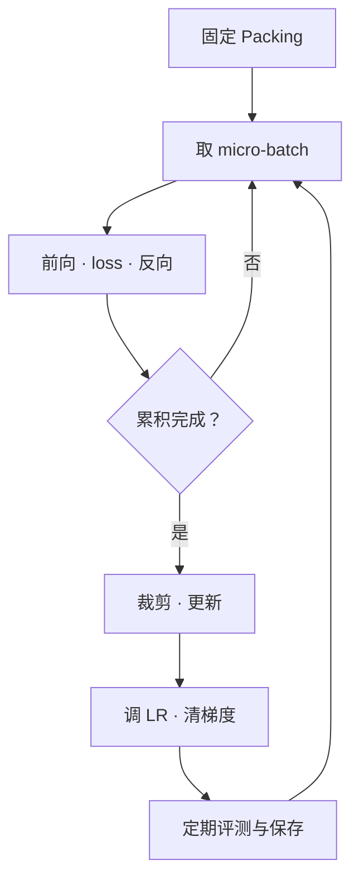

# 05 跑通一次预训练

[系列目录](./README.md) | [上一篇：搭建自己的小型 Transformer](./04-small-transformer.md)
| [下一篇：判断模型到底学到了什么](./06-evaluating-a-model.md)

前四篇已经准备好数据、Tokenizer、训练窗口和模型。
第一篇还让参数改变了一次。现在的问题是：
怎样把这一次更新重复执行，并知道自己究竟训练了多少？

设想两个实验都写着“训练 100 步”。一个每步只看一个窗口，
另一个每步累计 16 个窗口。它们显然不是相同的训练量。
训练命令能执行，不代表实验条件已经讲清。

**本篇把“重复更新参数”变成一条有明确输入、预算、日志与结果的流程。**
先运行不下载数据的微型实验，再衔接项目的双语 10M Smoke。
两者都只验证机制；60M 才是正式教学与效果研究的基线。

## 1. 预训练究竟在重复什么

本项目预训练的目标仍是预测下一个 token。
没有额外人工填写的“标准答案”：正文序列向后错一位就是标签，
但这是有明确目标的自监督学习，不是模型在没有任何监督信号的情况下自行理解。



模型只负责输出 logits。任务目标在
[stages/pretrain.py](../../src/llm_lifecycle_lab/training/stages/pretrain.py)，
循环在 [engine.py](../../src/llm_lifecycle_lab/training/engine.py)，
数据和产物的衔接在 [pretrain.py](../../src/llm_lifecycle_lab/training/pretrain.py)。

开始循环前，程序核对数据、Tokenizer、Packing 和模型是否配套，
并准备权重、优化器和数据流。它还在 **step 0** 用固定 dev 样本评测一次，
作为更新前的基线。没有这个基线，只看到最后一个 loss，很难判断变化来自哪里。

## 2. Batch、累积次数和 step 分别在数什么

一个 **micro-batch** 是一次 forward/backward 处理的窗口集合。
**梯度累积**是在参数不变时，连续处理多个 micro-batch，
把梯度相加后再执行一次 optimizer step。

例如 `micro_batch_size=2`、`gradient_accumulation_steps=3`：

```text
窗口 1、2 → forward/backward
窗口 3、4 → forward/backward
窗口 5、6 → forward/backward
裁剪合并的梯度 → 更新一次参数 → 清零梯度
```

这算 **3 个 micro-batch、1 个 optimizer step**，不是更新了三次。
项目日志中的 `step` 和 `max_steps` 都按 optimizer step 计数。
当前这条 Native 训练路径是单设备训练，不要在公式里凭空乘一个多卡数量。

若每个窗口长为 `L`，没有 PAD，micro-batch 大小为 `B`，累积次数为 `A`：

```math
\begin{aligned}
N_{\mathrm{windows/step}} &= BA \\
T_{\mathrm{targets/step}} &= BA(L-1)
\end{aligned}
```

第二行数的是监督目标，不是输入位置。第三篇已经解释过，
完整长度 `L` 的窗口只有 `L-1` 个 next-token 目标。
本篇微型实验使用 `B=2, A=2, L=16`，完整 step 有 `2×2×15=60` 个目标。

这个计算有条件：最后一个 batch 可能较小，窗口尾部也可能含 PAD。
实际训练量应读取 `tokens` 和 `tokens_seen`，不能永远用乘法估算替代。
一个 step 的累积还可能跨越数据流的 epoch 边界。

### 梯度累积不总是严格等于一个大 batch

当前实现对每个 micro-batch 的平均 loss 除以累积次数：

```python
scaled_loss = output.loss / self.config.gradient_accumulation_steps
scaled_loss.backward()
```

这是 float32 情况下的核心意思；实际循环通过 GradScaler 接口调用 backward。
在关闭 dropout 等随机扰动、前向条件相同、每个 micro-batch 的有效 token 数相同时，
这种平均与把它们放在一起求 token 平均在数学上对应，
浮点数归约顺序仍可能带来微小差异。

**有效 token 数不同时，两者不再相同。** 假设两个 micro-batch 分别有
15 和 5 个目标，平均 loss 为 2 和 4：

```text
当前反向目标：(2 + 4) / 2 = 3
全部 token 平均：(15×2 + 5×4) / 20 = 2.5
```

目前日志中的 `train_loss` 使用后一种 token 加权方式，
反向累积却平均 micro-batch loss。这是当前实现的边界，
不能因为日志采用 token 加权就声称梯度也一定完全等价。
比较 batch 设置时应特别关注尾批和 PAD，不能只改 `B/A` 后宣称对照完全一致。

累积通常能降低一次前向所需的激活内存，但不会缩小模型权重、
优化器状态，也不能让本来放不下的单个窗口自动放得下。

## 3. 训练预算为什么要先换算成更新次数

项目允许三种预算，**恰好选一种**：

| 配置 | 你固定了什么 |
| --- | --- |
| `max_steps` | optimizer 更新次数 |
| `max_train_tokens` | 目标监督 token 数，再估算成完整 step |
| `num_epochs` | 相对 train 监督 token 总量的目标轮数，再估算成 step |

设一个 epoch 有 `E` 个 packed 窗口、`S` 个监督目标：

```math
\begin{aligned}
M &= \left\lceil E/B \right\rceil \\
\widehat{T}_{\mathrm{step}} &= (S/M)A \\
K &= \left\lceil
T_{\mathrm{target}}/\widehat{T}_{\mathrm{step}}
\right\rceil
\end{aligned}
```

`M` 是每轮 micro-batch 数，帽子表示估计，`K` 是最终运行的 step 上限。
代码中的 `EngineConfig.resolve_budget()` 做的就是这件事。

例如设 `E=100, S=1000, B=2, A=5`，每步估计 100 个目标。
请求 550 个目标会换算成 6 步，估计实际训练 600 个目标。
**它不会在第 550 个 token 处截断一次反向传播。**

尾批、PAD 和样本顺序会使某一步与均值不同。
`num_epochs=1` 也不是在最后一篇文本后立即停住；
完整 step 向上取整可能让数据流进入下一轮。
日志中的 `epochs_seen` 定义为累计监督目标除以 train 总监督目标，
不等同于数据流内部整数 `epoch`。

<details>
<summary>动手：只计算预算，不训练模型</summary>

```bash
python - <<'PY'
from scripts._project_path import add_project_src_to_path
add_project_src_to_path()
from llm_lifecycle_lab.training import EngineConfig

for target in ({"max_steps": 7}, {"max_train_tokens": 550}, {"num_epochs": 1.0}):
    config = EngineConfig(
        sequence_length=16, micro_batch_size=2,
        gradient_accumulation_steps=5, **target,
    )
    _, budget = config.resolve_budget(
        examples_per_epoch=100, supervised_tokens_per_epoch=1000,
    )
    print(budget.mode, budget.max_steps,
          budget.target_train_tokens, budget.estimated_train_tokens)
PY
```

输出依次为“预算类型、步数、目标 token、估计 token”：

```text
max_steps 7 700 700
max_train_tokens 6 550 600
num_epochs 10 1000 1000
```

这里的窗口和目标数量是算术示意，不是 Smoke 语料的实测规模。

</details>

## 4. 一次更新为什么还需要学习率、裁剪和精度

AdamW 不只是把当前梯度乘学习率。它还跟踪梯度的一阶、二阶历史，
因此后面恢复训练时，仅保存模型权重不够。
项目对至少二维的参数使用 weight decay，一维参数不衰减，
所以 RMSNorm 的缩放和矩阵参数不是相同的衰减组。

**学习率调度**先可选 warmup，再使用余弦下降，
`min_lr_ratio` 表示最低比例。配置里写的 `learning_rate` 是基础值，
不保证每一步都用它。
本篇三步、无 warmup、基础 LR 为 0.001、最低比例 0.1 时，
实际用于更新的是：

| optimizer step | 本次使用的 LR |
| --- | ---: |
| 1 | 0.001 |
| 2 | 0.000775 |
| 3 | 0.000325 |

调度器在每次 optimizer step 后推进。
第三次更新结束后才到达最低比例，不能把更新后的“下一步 LR”误当成最后一次使用的 LR。
极短 Smoke 也无法展示长训练 warmup 的效果。

**梯度裁剪**在所有 micro-batch 反向完成后执行，限制全局范数。
日志 `gradient_norm` 是裁剪前的值，大于阈值不代表裁剪失效。
loss 或梯度出现 NaN/Inf 时，当前路径会报错，而不是把异常吞掉继续产生指标。

**精度**决定部分计算使用 float32、bfloat16 或 float16。
项目使用 autocast，不是直接把所有参数和状态永久转成低精度。
float16 仅支持 CUDA，并启用 GradScaler；本篇使用 CPU float32，
不把低精度速度或恢复一致性混进基础实验。

## 5. 离线跑通完整的微型预训练

前面几篇实验分别看过数据、编码和结构，
这次使用 [pretrain_experiment.py](../../scripts/pretrain_experiment.py) 连起真实流程：

```bash
python scripts/pretrain_experiment.py --mode train
```

它在临时目录中生成 40 对中英文算术模板句，按来源组切分，
仅用 train 训练请求大小为 320 的 BPE，生成 seq16 Packing，
最后训练 1 层、hidden 24 的微型模型。
数据切分 seed 为 42，模型与训练数据流 seed 为 11。

中英文同一例题共享 `source_id`，但各例题反复使用相同模板。
这种设计能检查链路，**不能充当独立的自然语言能力评测数据**。
真实模型仍使用前几篇的公共双语数据，不使用这份模板数据替代。

整个命令无需下载或 GPU，不读取已有 `data/`，也不在仓库 `runs/` 留新 run。
退出时临时产物自动清理；下一篇的 `evaluate` 和第七篇的 `resume` 模式
会各自重新建立同一套实验，不依赖这次命令留下文件。

一次实际输出如下：

```json
{
  "parameters": 12744,
  "steps": 3,
  "tokens_seen": 180,
  "learning_rates": [0.001, 0.000775, 0.000325],
  "tokens_per_step": [60, 60, 60],
  "train_losses": [5.739488, 5.71566, 5.692469],
  "baseline_dev_loss": 5.732777,
  "final_dev_loss": 5.68558,
  "status": "completed"
}
```

形状和计数应先解释清楚：3 次更新，每次 60 个监督目标，合计 180。
实际词表被用于构建模型，不是把请求大小盲目写进模型配置。

这次 train loss 和固定 dev loss 都下降了。
但 train 每步读的是不同窗口，它不是“同一批输入更新前后”的直接比较；
不同 CPU/PyTorch 后端也可能有细小数值差异。
本实验的通过条件是有限 loss、正确计数、完整 checkpoint 和完成状态，
**不会为了宣称有效而强制要求三步内 dev 必须下降。**

<details>
<summary>查阅：脚本怎样调用真实训练路径</summary>

脚本的 `prepare_experiment()` 创建数据、Tokenizer、Packing 与配套配置。
`main()` 直接调用项目入口：

```python
run = run_native_pretraining(
    config, run_id="baseline", workdir=PROJECT_ROOT,
)
```

`train_summary()` 读取实际 `metrics.jsonl`、run manifest 和最终 checkpoint，
检查训练步数与 token 加总，再整理输出。
它不是单独手写一个“看上去像训练”的循环。

生产路径每步先累积、裁剪、更新和调整 LR，再评测与记录，
最后在保存间隔或最终 step 发布 checkpoint。
训练前的 baseline 和训练后的 dev 用同一组确定性选出的窗口。
完整逻辑仍然在 `TrainingEngine.train()`。

</details>

## 6. 衔接真实的双语 Smoke

已经完成第二、三篇的数据准备后，使用仓库
[`native-smoke.yaml`](../../configs/pipelines/native-smoke.yaml)。
它与微型实验不同：10M 模型、16K 词表、seq128、每步一个窗口、总共两步。

先检查，再以未使用过的 run ID 启动：

```bash
python scripts/doctor.py --config configs/pipelines/native-smoke.yaml
python scripts/train_pretrain.py \
  --config configs/pipelines/native-smoke.yaml \
  --run-id tutorial-smoke-001
```

`device: auto` 会优先 CUDA，其次 MPS，最后 CPU。
同一个配置文件在不同机器上可能实际选择不同设备，
因此要查看 `runtime_environment.json`，不要只记录“我用了 auto”。
对照实验应在开始前明确设备和精度，而不是训练结束后修改配置文件。

Doctor 包含真实 batch 前向/反向检查，但不执行持久训练，
不能把它的通过当成完成两步 Smoke。
已有 `tutorial-smoke-001` 时不要覆盖；新试验换新 ID，未完成训练的恢复见第七篇。

### 成功结束后看哪些文件

```text
runs/tutorial-smoke-001/
  resolved_config.yaml
  training_budget.json
  runtime_environment.json
  metrics.jsonl
  training_result.json
  run_manifest.json
  latest_checkpoint.json
  checkpoints/step-00000002/
```

`run_manifest.json` 应为 `completed`，`training_result.json` 记录实际步数、
token 计数和最后 checkpoint。目录存在本身不是训练成功的证据。
`final_loss` 是最后一次训练 step 的日志 loss，
不是“最优模型的全量 dev loss”；`best_eval_loss` 也不意味着自动保存了独立 best checkpoint。

<details>
<summary>查阅：只读查看真实 run 的曲线</summary>

```bash
python - <<'PY'
import json
from pathlib import Path

root = Path("runs/tutorial-smoke-001")
result = json.loads((root / "training_result.json").read_text())
status = json.loads((root / "run_manifest.json").read_text())["status"]
print("status:", status, "steps:", result["global_step"])
for line in (root / "metrics.jsonl").read_text().splitlines():
    row = json.loads(line)
    print(row["step"], row.get("event", "train"),
          row.get("train_loss"), row.get("eval_loss"), row.get("tokens_seen"))
PY
```

它要求上面的真实 run 已完成；微型临时实验不会创建这个目录。
loss 不应照抄本篇微型模型数值，数据、规模和设备均不同。

</details>

## 7. 从跑通到正式实验，还差什么

两步 Smoke 能证明数据被读取、loss 和梯度可算、产物能够保存。
它不能证明语料足够、模型已收敛或具备通用双语能力。

60M 教学训练使用 [`native-v1.yaml`](../../configs/pipelines/native-v1.yaml)，
目标为 Linux + 单张 24GB NVIDIA GPU；正式冻结 Reference 则使用独立配置与规范，
不能把两者混称为同一个已验收实验。
完整 CUDA 参考实验目前尚未完成。

推进到效果研究之前，至少要固定：

1. 数据、Tokenizer、Packing 与模型配置。
2. 真正的监督 token 预算，以及设备、精度和优化器设置。
3. 训练前 baseline、固定评测范围和按语言观察的方法。
4. 可恢复的 checkpoint 与能够解释每次试验的日志。

下一篇首先处理第三项：同样是 loss 下降，
什么能说明学习发生了，什么只是指标的权重或覆盖范围变了？

[返回系列目录](./README.md) | [上一篇：搭建自己的小型 Transformer](./04-small-transformer.md)
| [下一篇：判断模型到底学到了什么](./06-evaluating-a-model.md)
