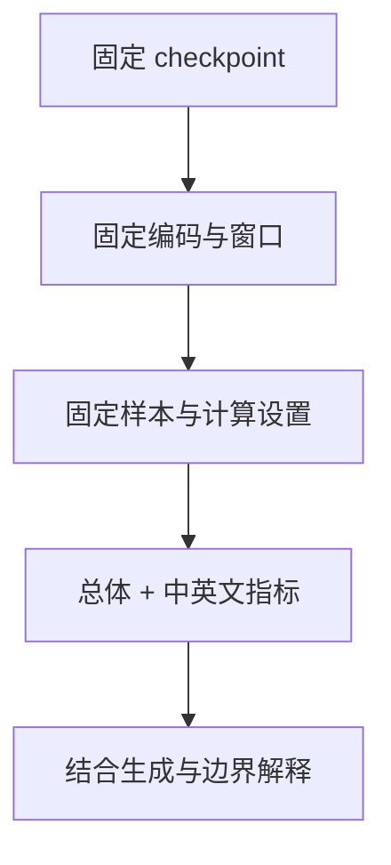
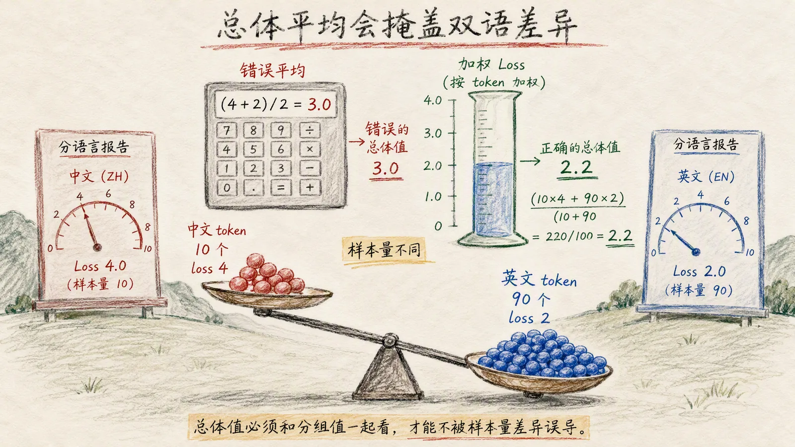
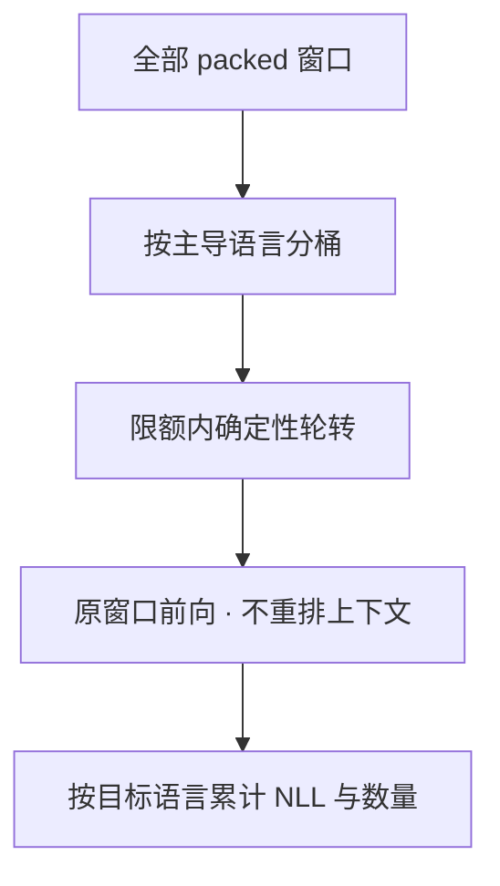

# 06 判断模型到底学到了什么

[系列目录](./README.md) | [上一篇：跑通一次预训练](./05-first-pretraining.md)
| [下一篇：让实验可以恢复和比较](./07-resume-and-compare.md)

第五篇看到 train loss 和 dev loss 都下降了。
但一个更低的数字，究竟说明模型更会预测、评测样本更容易，
还是总体指标里某种语言的权重变了？

先看一个**人为构造、不是项目实测**的例子：

| 固定评测集 | 英文 loss | 中文 loss | 英文/中文目标数 |
| --- | ---: | ---: | --- |
| 更新前 | 2.0 | 4.0 | 900 / 100 |
| 更新后 | 1.8 | 4.4 | 900 / 100 |

英文改善了，中文却变差。总体 loss 仍会从 2.2 降到 2.06。
所以“总体变好”与“两个语言都变好”不是一回事。
如果两次评测连语言占比都变了，解释就更困难。

**本篇先固定评测材料和计数口径，再讨论分数。**
我们会读取真实评测路径的结果，也会观察一个指标稍有改善、
但仍然只会重复片段的微型模型。

## 1. 先给每个数字补上比较条件

一个可解释的评测至少包含：



train loss 来自参与参数更新的窗口，且第五篇的日志对应当前 step，
不是整个 train 集的平均。
dev 用来观察和选择配置；test 留作方法固定后的检查。
如果每次看 test 后都修改训练方法，它实际上也就成了调参集。

先比较 **step 0 baseline 与后续 checkpoint 在同一批 dev 上的结果**，
再讨论相对变化。不要拿这次的 train loss 与另一次的 dev loss，
或两个不同 Tokenizer 的每 token loss 直接排名。

评测不更新参数。项目的 `evaluate_objective()` 临时切换 eval 模式，
在 `inference_mode()` 下计算，结束后恢复模型原来的 train/eval 状态。
这与“换了一份数据继续训练”完全不同。

## 2. Loss 为什么要按有效 token 加权

对于真实下一个 token 的预测概率 `p_i`，单个目标的负对数似然是 `-ln(p_i)`。
预测越有把握且越正确，这个值越小；给正确答案的概率很低，则惩罚更大。
所有有效目标的平均就是这里的因果语言模型 loss：

```math
\begin{aligned}
\mathrm{NLL} &= -\sum_{i=1}^{T}\ln p_i \\
\mathrm{loss} &= \mathrm{NLL}/T
\end{aligned}
```

这里 `T` 是**错位之后、排除 `-100` 的监督目标数**。
包括正常的 BOS/EOS 预测目标，不包括被忽略的 PAD 标签。
它不是原文字符数，也不是 batch 中整数张量的总元素数。

假设两个 batch 分别有 10 和 90 个有效目标，平均 loss 为 4 和 2。
直接平均 `(4+2)/2=3`，会给较小 batch 过高权重。
正确聚合是 `(10×4+90×2)/100=2.2`。

<figure class="tutorial-figure">



<figcaption>图 1｜总体指标是一种加权结果。多数语言可以掩盖少数语言的退化，因此总分与分语言指标必须一起报告。</figcaption>
</figure>

同一个原则也适用于不同语言、不同长度区间或不同数据来源：先累计每个目标的 NLL，
再除以对应有效目标总数。对组均值做简单平均，隐含的是“每组权重相同”，
而不是“每个监督目标权重相同”。

项目在 [engine.py](../../src/llm_lifecycle_lab/training/engine.py)
的 `evaluate_objective()` 中，先累计 `loss × supervised_tokens`，
再除以总 token 数。
语言桶同理：若全部有效目标都有 en/zh 标签，则总体 loss 可用两桶的 token 加权还原。
存在未标记 token 时，总体还包含它们，不能只用中英文两桶还原。

<details>
<summary>动手：总体改善为什么可能掩盖中文退步</summary>

```bash
python - <<'PY'
counts = {"en": 900, "zh": 100}
before = {"en": 2.0, "zh": 4.0}
after = {"en": 1.8, "zh": 4.4}

def weighted(losses):
    return sum(losses[k] * counts[k] for k in counts) / sum(counts.values())

print("aggregate:", round(weighted(before), 2), "->", round(weighted(after), 2))
print("zh_delta:", round(after["zh"] - before["zh"], 2))
print("batch_weighted:", (10 * 4 + 90 * 2) / 100)
print("batch_unweighted:", (4 + 2) / 2)
PY
```

```text
aggregate: 2.2 -> 2.06
zh_delta: 0.4
batch_weighted: 2.2
batch_unweighted: 3.0
```

这只是说明聚合口径，不是模型的实验结果。
不要通过随意改成中英文各占一半来掩盖数据分布；
可以另报等权平均，但必须明确它与 token 加权总体是两个不同指标。

</details>

## 3. Perplexity 和 bits-per-byte 各回答什么

### Perplexity 是 loss 的指数变换

困惑度 perplexity，简称 PPL，在没有数值截断时是：

```math
\mathrm{PPL}=\exp(\mathrm{loss})
```

它可以理解为预测分布的不确定程度的一种表达，
但不是准确率，更不能说“PPL=10 就是每个位置有 10 个同样可能的答案”。
均匀预测大小为 `V` 的词表时，loss 为 `ln(V)`，PPL 为 `V`；
这是一个参照，不是随机初始化模型必须精确达到的值。

当前实现返回 `exp(min(loss, 20))`，用上限防止指数过大，
**loss 本身不截断**。如果 loss 超过 20，多个很差结果可能显示相同 PPL，
此时更要看原始 loss。
PPL 与 token 切分强相关，不同 Tokenizer 下不能直接当作同尺度能力分数比较。

### BPB 把分母换成字节量

bits-per-byte，简称 BPB，将负对数似然转成 bit，再除以文本字节量：

```math
\mathrm{BPB}=
\frac{\mathrm{NLL}}{\ln(2)\,B_{\mathrm{text}}}
```

本项目的 `B_text` 不是随手读原文件大小。
第三篇的 Packing 将规范化后正文的 UTF-8 字节数均摊到内容 token，
BOS/EOS 字节权重为 0；这里累加的是**被评测目标对应的字节权重**。
它不是真实压缩文件的大小，也不是每个 token 的精确原文 byte offset。

分子仍包括被监督的 BOS/EOS NLL，分母没有给控制 token 虚构正文长度。
当只抽取文档的一部分窗口时，字节权重是这种均摊估计，
不能解读为已经逐字节精确计算了那段原文的编码成本。

BPB 让文本量口径比每 token loss 更容易讨论，
但不会自动消除语料、规范化、窗口上下文或语言领域的差异。
UTF-8 中文和英文的字节量也不同，BPB 不是“对语言完全公平”的万能指标。
本项目英文偏故事、中文偏百科，单看哪一桶更高，不能推出哪种语言本质更难学。

## 4. 当前评测究竟看了多少数据

运行 `eval_pretrain.py --split dev`，**不代表默认读完整个 dev 集计算指标**。
最多参与指标计算的窗口数为：

```math
N_{\mathrm{eval}}\leq
B_{\mathrm{micro}}K_{\mathrm{eval}}
```

其中 `K_eval` 是 `training.eval_batches`。
先扫描 packed 窗口，根据其中有效位置的主导语言分桶，
再在 en/zh 桶之间确定性轮转选取；不是每次重新随机抽样，
也不是简单读文件前 N 行。选样扫描本身仍可能遍历整个 split。



窗口可能跨文档、甚至混有两种语言。
**选窗口用主导语言，算指标用每个目标的语言标签**，不能把整个窗口的 loss
都强行算到主导语言头上。
标签来自数据记录，不是模型自动识别的语言。

<details>
<summary>查阅：选样与指标的实现细节</summary>

选样位于 [pretrain.py](../../src/llm_lifecycle_lab/training/pretrain.py)
的 `_stratified_evaluation_indices()`：
统计 `labels != -100` 位置的语言，按主导语言入桶；
平票时当前实现优先 en，取样时也从 en 桶开始轮转。
预算不足、语言桶缺失或语言标记不全时，不保证两种语言指标都存在。

计算语言指标则在
[stages/pretrain.py](../../src/llm_lifecycle_lab/training/stages/pretrain.py)
的 `_language_metrics()`：
先对 labels、language IDs 和 byte weights 作同样的 next-token 错位，
再以监督 mask 和语言 mask 的交集累计 NLL、目标数与字节权重。
不把同语言 token 重新拼成另一段输入。

保存报告中的 `sample_count` 是 packed 窗口数，不是文档数；
`eval_tokens` 是有效监督目标，语言桶计数不一定各占一半。
配置相同、产物不变时固定选样，才使不同 checkpoint 的比较有相同范围。

</details>

## 5. 离线评测：指标改善与重复生成同时存在

使用第五篇的同一套微型实验设置：

```bash
python scripts/pretrain_experiment.py --mode evaluate
```

命令会在新的临时目录中重新准备数据并训练三步，
再从保存的 checkpoint 运行独立 dev 评测。
它检查独立评测与最后一次训练中 dev 评测一致，
以及总体 loss 能否由中英文桶加权还原。
全部结果读取真实评测报告，不人为设置 loss。

一次实际输出如下：

```json
{
  "sample_count": 4,
  "eval_tokens": 60,
  "en_tokens": 41,
  "zh_tokens": 19,
  "eval_loss": 5.68558,
  "eval_en_loss": 5.676697,
  "eval_zh_loss": 5.704747,
  "eval_perplexity": 294.588591,
  "eval_bits_per_byte": 3.708006,
  "language_weighted_loss_matches": true,
  "standalone_eval_matches": true,
  "prompt": "Example",
  "generated_token_ids": [315, 315, 315, 315],
  "decoded_with_specials": "<|bos|>Examplepleplepleple"
}
```

两个评测 batch、每个两个窗口，共 4 个窗口和 60 个目标。
英文 41 个、中文 19 个，说明语言分桶选样并不等于 token 数精确均衡。
最后 loss 比第五篇 step 0 的约 5.733 更低，
但样本只有模板算术句的少量窗口，不能宣称具有独立算术或语言能力。

### 为什么还要看生成

脚本从 `Example` 开始，显式加 BOS，贪心生成四个 token，
不采样、不设 EOS 提前终止，并保留控制 token 解码。
生成仍在重复 `ple`，这是该次运行的真实结果，不是理想输出。
跨依赖或设备的细微变化可能影响生成，不应把这串字符写成所有环境的硬性断言。

这里显示的是 **teacher forcing 评测与自主生成的差别**：
评测每个位置都能看到真实前缀；生成后续位置则会看到自己刚生成的内容，
错误可以不断传播。一个分数变好，不保证任何提示都会得到流畅文本。

两者回答的问题不同：离线 loss 适合稳定比较条件一致的 checkpoint，生成样例则暴露重复、
跑题和长程一致性等行为。可信结论需要二者相互补充，而不是用其中一个替代另一个。

也不要走到另一个极端：抽一个提示生成得不好，不足以证明全部评测都无意义。
合适的做法是同时固定数值评测与一组事先选定的中英文提示，
保留所有结果，而不是只挑最像成功的几段。

<details>
<summary>查阅：微型脚本的生成设置</summary>

实现见 [pretrain_experiment.py](../../scripts/pretrain_experiment.py)
的 `evaluation_summary()`：

```python
model.load(Path(run.result.final_checkpoint) / "model")
tokenizer = NativeTokenizer.from_directory(config.model["tokenizer"])
prompt = "Example"
ids = torch.tensor([tokenizer.encode(prompt, add_bos=True)])
generation = model.generate(
    input_ids=ids,
    attention_mask=None,
    config=GenerationConfig(max_new_tokens=4),
)
```

`do_sample` 默认 false。输出显示保留控制 token 的解码，避免把特殊 token
静默跳过后误以为模型没有生成异常内容。
这只是机制示范的一条英文提示，不是双语生成评测套件。
真实模型的提示集还应覆盖中文、英文、不同长度与不同领域。

</details>

## 6. 对真实 Smoke checkpoint 做同条件评测

若第五篇的 `tutorial-smoke-001` 已完成：

```bash
python scripts/eval_pretrain.py \
  --config configs/pipelines/native-smoke.yaml \
  --checkpoint runs/tutorial-smoke-001/checkpoints/step-00000002 \
  --split dev --json
```

独立评测会验证 checkpoint 与原配置、模型路线、阶段和 Tokenizer 是否匹配，
加载模型权重，再读取配套 Packing。
报告通常保存到：

```text
runs/tutorial-smoke-001/evaluations/pretrain-dev-step-00000002.json
```

查看 step 0 与 step 2 的 dev 变化，再检查两种语言的计数和 loss。
Smoke 默认仅两个 eval batch，每 batch 一个窗口，
不是完整 dev，更不是足以支撑效果结论的大规模评测。

当前 CLI 没有独立的评测预算覆盖参数。
若想增大范围，应在新训练开始前设置 `eval_batches`，
不能训练后直接改原配置的 device、batch 或 eval 数量再假装仍是原协议。
同 checkpoint 重跑同 suite 会写同一报告路径，应注意保留需要对照的历史证据。

方法和选择固定后，才查看 test：

```bash
python scripts/eval_pretrain.py \
  --config configs/pipelines/native-smoke.yaml \
  --checkpoint runs/tutorial-smoke-001/checkpoints/step-00000002 \
  --split test --json
```

这条命令验证评测链路，不会让两步 Smoke 变成效果实验。
也不要为了凑出一条漂亮的 test 曲线，对很多 checkpoint 反复挑选。

## 7. 怎样组织一份可信的结论

先报告事实，再讨论可能原因：

| 层次 | 至少记录什么 |
| --- | --- |
| 条件 | 配置、数据/Tokenizer/Packing、checkpoint step、设备与精度 |
| 覆盖 | suite、sample_count、eval_tokens、中英文目标数 |
| 变化 | step 0 与最后一步的总体和各语言 loss、BPB |
| 成本 | 实际 tokens_seen、训练时间、显存，说明计时范围 |
| 行为 | 固定提示与解码参数下的全部生成结果 |
| 限制 | 样本量、领域差异、重复模板、单 seed、是否完整 CUDA 实验 |

微小改善不应自动解释为结构优势。正式比较宜采用多个 seed，
每组固定相同数据、预算和评测条件，再看变化是否稳定。
评测窗口也不是天然独立样本：相邻窗口可能来自同篇原文并重叠一个 token，
统计不确定性时要考虑来源相关性，不能把每个 token 都当独立试验。

本项目冻结 Reference 要求最终总体和中英文指标都改善，
并核对样本量、预算和输入版本，但**自动验收通过仍只支持规范覆盖的结论**。
当前尚无完成该规范的 CUDA 参考结果，不能借微型实验代替它。

下一篇处理最后一块：如何保留足够的状态，
让一次中断不改变实验路线，也让两次实验真的可比较。

[返回系列目录](./README.md) | [上一篇：跑通一次预训练](./05-first-pretraining.md)
| [下一篇：让实验可以恢复和比较](./07-resume-and-compare.md)
