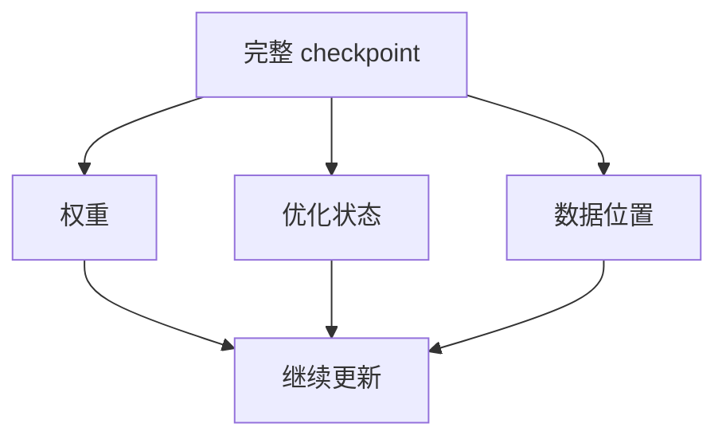
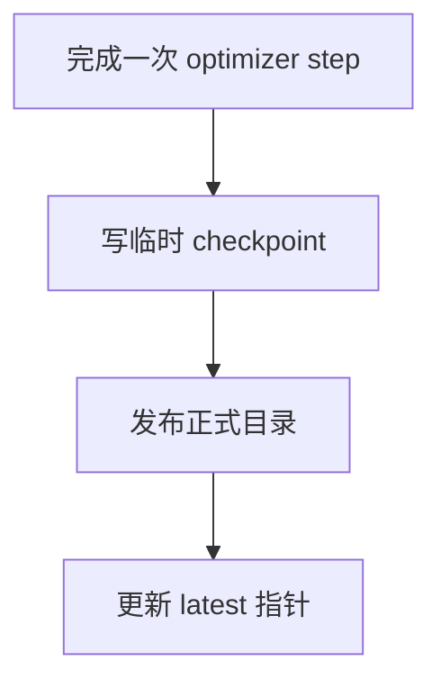

# 07 让实验可以恢复和比较

[系列目录](./README.md) | [上一篇：判断模型到底学到了什么](./06-evaluating-a-model.md)

训练运行到一半，进程中断了。重新加载模型权重，再设一次相同 seed，
是不是就能接着原来的实验继续？

先想三个问题：优化器记住了哪些历史梯度？学习率走到了哪里？
下一批应该读哪些窗口？即使模型参数完全恢复，这三件事改变也会改变后续路线。

**恢复不是“再跑一次相似的训练”，而是从某个完整保存点继续同一条训练过程。**
本篇用一个受控中断验证恢复，再讨论哪些条件必须固定，
以及代码目前没有保证哪些事情。

## 1. 模型文件与训练 checkpoint 不是一回事

第四篇的 `NativeTransformer.save()` 只保存模型配置和权重。
它足以重新得到相同前向结果，但不能独自恢复完整训练状态。

| 状态 | 为什么需要 |
| --- | --- |
| 模型参数 | 从哪里继续预测与反向 |
| AdamW 状态 | 一阶、二阶梯度历史和参数更新计数 |
| Scheduler 状态 | 下一次更新使用哪个学习率 |
| RNG 状态 | 从随机序列中的哪个位置继续 |
| 数据流 epoch/offset | 下一批窗口是什么 |
| global_step/tokens_seen | 已完成多少更新和监督目标 |
| best_eval_loss | 延续已有的最佳 dev 记录 |
| 配置与产物身份 | 确认状态属于当前实验 |

重新设置 seed 通常只会把随机序列拉回起点，
不等于回到中断时的随机状态。
而 optimizer 的动量也不可能从权重反推出唯一值。



实现见 [checkpoint.py](../../src/llm_lifecycle_lab/training/checkpoint.py)
的 `CheckpointManager.save/load()`。
图中的优化状态包含 optimizer、scheduler 与 RNG，数据位置还配合 step/token 计数。
它校验 run、路线、阶段、Tokenizer 和配置，再恢复上述状态。
文件能被读取，不代表它就可以用于任意 run。

## 2. 数据顺序也必须恢复

本项目不依赖隐藏的 DataLoader 游标，而是使用
[batching.py](../../src/llm_lifecycle_lab/training/batching.py)
中的 `DeterministicBatchStream`。

每轮用 `seed + epoch` 创建局部 Torch generator，生成窗口索引排列。
保存 `epoch` 与 `offset` 后，可以重建这一轮的排列，
从同一个偏移继续读取，不必保存整张排列。

```text
固定 dataset + seed + epoch → 同一张索引排列
同一张排列 + offset        → 同一个下一批
```

这依赖 **dataset 的长度、顺序、token 内容与 batch size 都不变**。
只保存 offset，却替换了 Packing，偏移指向的就是另一批内容。
因此数据产物的版本绑定与数据流恢复是一件事的两面。

流不会丢掉最后一个较小的 batch，也不会把它补齐成固定样本数。
下一次取样才进入新 epoch。第五篇的梯度累积可能跨越这个边界；
一个 optimizer step 完成后保存的数据位置，必须覆盖其中所有 micro-batch。

## 3. 保存点为什么只能恢复到已提交的状态

当前训练器只在 optimizer step 边界保存，
不会保存一个累积到一半的梯度。
保存顺序是先写临时 checkpoint 目录，再原子发布到正式目录，
最后更新 `latest_checkpoint.json`。



这样避免把半写完的目录当成正常 checkpoint，
但不意味着任意断电场景都完成了一次跨文件事务。
例如正式目录已发布、latest 指针尚未更新时，中断可能使指针落后；
需要确认目录完整，再显式指定，不能盲目删除目录重跑。
保存同名 checkpoint 会被拒绝，不覆盖历史。

当前循环在**写日志之后保存 checkpoint**。
因此一条 `step=2` 日志已经出现，checkpoint 2 仍可能尚未存在。
恢复依据完整 checkpoint，不依据“日志最后一行写了几”。

普通训练异常通常写 `failure.json` 并标记 failed。
强杀进程或某些中断不保证执行清理，所以没有 failure 文件也不证明训练成功。
应结合 run 状态、最终结果与完整 checkpoint 判断。

## 4. 离线实验：连续训练与中断恢复是否一致

先固定第五篇的全部条件：CPU float32、同一微型模型、
同一数据/Tokenizer/Packing、总预算三步。
实验只改变“是否中断”：

```text
基线：初始化 → step 1 → step 2 → step 3
对照：初始化 → step 1 已保存 → step 2 已记录但未保存 → 中断
恢复：加载 step 1 → 重做 step 2 → step 3
```

运行：

```bash
python scripts/pretrain_experiment.py --mode resume
```

脚本在一个新的临时目录准备一次数据，两个 run 共用它，
每次由同一 seed 初始化。对照组在 step 2 的 metric callback 中抛出受控异常；
该 callback 位于 checkpoint 保存之前，因此最后完整保存点是 step 1。

脚本先确认 failed 状态、latest 指针为 1、checkpoint 2 不存在，
再用正常的 `resume_run` 路径继续。
这不是通过手改 trainer state 或删 checkpoint 假造恢复。
实验故障和所有输出仅存在临时目录，不会中断用户已有训练。

一次实际输出如下：

```json
{
  "restored_checkpoint_step": 1,
  "final_step": 3,
  "tokens_seen": 180,
  "weights_equal": true,
  "optimizer_scheduler_rng_equal": true,
  "trainer_and_stream_equal": true,
  "logged_train_steps": [1, 2, 2, 3],
  "changed_budget_rejected": true,
  "completed_resume_rejected": true
}
```

检查的不只是最后一个 loss。脚本读取两个最终 checkpoint，
递归比较模型权重、optimizer/scheduler/RNG 张量与 trainer/data-stream 状态，
CPU 本次对照使用 `atol=0, rtol=0`。
相同 JSON 字段可以相等，但时间戳、run ID、运行时长和路径不应要求一致。
序列化文件的 hash 也不是这里的数值等价判据。

<details>
<summary>查阅：受控中断和实际恢复调用</summary>

[pretrain_experiment.py](../../scripts/pretrain_experiment.py)
只在指标达到指定条件时触发故障：

```python
def interrupt_after_second_update(metric):
    if metric.get("step") == 2 and "train_loss" in metric:
        raise PlannedInterruption("tutorial interruption before checkpoint 2")
```

正常训练通过 `metric_callback` 调用它。
捕获的只是这个预期异常；其它错误不当作实验成功。
恢复使用：

```python
resumed = run_native_pretraining(
    config,
    resume_run="interrupted",
    workdir=PROJECT_ROOT,
)
```

`assert_state_equal()` 逐项比对加载的张量和嵌套状态，
不是只检查文件名或 `global_step`。
脚本也分别验证了“修改预算后恢复”和“完成后再恢复”都会被拒绝。

</details>

### 日志里的两个 step 2 怎么解释

第一次 step 2 已更新内存中的参数并写日志，但没有保存。
恢复从 step 1 回退后，会再次执行 step 2，因此日志是 `[1, 2, 2, 3]`，
中间还有 `resume-baseline step=1` 标记。
旧失败记录和早先日志不会因为恢复成功而被自动抹掉。

`tokens_seen=180` 是最终恢复路线上的累计监督目标，
不包含丢失后重做的额外计算成本。
统计实际训练开销时，要另外考虑重放步骤；
不能把所有日志行的 `tokens` 无脑相加，当作最终模型经历的唯一轨迹。

画曲线时应按 `resume-baseline` 划分运行片段，明确回退点并标出重放，
不要把重复 step 直接平均，也不要删除原始日志来让图看上去连续。
恢复后的 `elapsed_seconds` 从新进程本次训练开始计时，不是自动累计全部历史耗时。

## 5. 在真实 run 上恢复的正确边界

恢复的是**原预算尚未完成、且已有完整 checkpoint** 的 run。
如果第五篇两步 Smoke 已成功结束，就没有剩余 step 可恢复。
第七篇的中断演示专门使用三步预算，不能靠修改已完成 Smoke 来代替它。

下面命令是 60M 教学 run 中断后的操作模板，
前提是它此前就使用该配置启动，run ID 为 `native-60m-001`：

```bash
python scripts/train_pretrain.py \
  --config configs/pipelines/native-v1.yaml \
  --resume-run native-60m-001
```

默认按 latest 指针恢复。确实要指定已有 checkpoint 时：

```bash
python scripts/train_pretrain.py \
  --config configs/pipelines/native-v1.yaml \
  --resume-run native-60m-001 \
  --resume-checkpoint checkpoints/step-00000500
```

第二条要求 step 500 是完整保存点，
且后面不会遇到已有同名 checkpoint 的覆盖冲突。
不要对一个已经跑到更后面的 run 随便回退再写。
当前没有从旧 checkpoint 分叉新 run 的 CLI；
换 `--run-id` 默认重新随机初始化，不等于接着旧权重训练。

恢复前应检查：

1. 原配置与产物未变，run ID 和 checkpoint 所属一致。
2. 保存点 step 小于原预算上限，恢复后不会覆盖已有 checkpoint。
3. 代码、设备和依赖一致，不能临时改 LR、dtype、batch 或 eval 设置。
4. 数据集和 Tokenizer/Packing 仍完整，不只保留了权重文件。

配置 hash 不相同会被拒绝；把 `max_steps` 改大也属于改变配置。
**恢复是完成原计划，不是延长预算的接口。**
计划改变时应另建实验方案，并明确哪些能力当前尚未支持。

## 6. 当前“精确恢复”保证到哪里

本篇证明的是同一环境下的 CPU float32 对照，不是所有训练条件逐位可复现。
目前保存了 Torch CPU/CUDA RNG，却没有保存 Python/NumPy RNG 或 MPS RNG；
FP16 GradScaler 状态也尚未纳入 checkpoint。
本实验使用的路径没有依赖这些遗漏状态，不应借此承诺其它路径等价。

CUDA 内核、PyTorch 版本、低精度归约和硬件变化都可能带来差异。
同 seed 不是跨环境数值一致的充分条件；
`device:auto` 更不能保证下次选择同一设备。

普通恢复还不能替代严格的来源审计：
配置 hash 记录配置值和路径，但同一个路径下的文件内容可能被改过。
模型加载会核对结构，Tokenizer/Packing 有自身 hash 校验，
这仍不意味着普通 resume 会重新强制比较整个源码和历史运行环境。

因此本篇要求恢复前保持原始输入、源码与环境，
而正式 Reference 需要更强的执行门控。不要把“记录了 provenance”
与“所有漂移都会被自动阻止”混成一回事。

## 7. 怎样让两次实验真的可比较

比较 A/B 时，先写下准备回答的具体问题，
再只改变需要验证的因素。其它条件至少固定：

| 类别 | 固定内容 |
| --- | --- |
| 输入 | 原始来源、prepared、Tokenizer、Packing 与它们的 hash |
| 模型 | 架构、初始化方式、词表映射、参数量 |
| 优化 | seed、LR、优化器、精度、batch、累积、裁剪 |
| 预算 | 实际监督 token、计划 step/epoch 与完成覆盖率 |
| 评测 | 样本范围、语言计数、指标口径、提示与采样参数 |
| 环境 | 源码版本、依赖、设备、是否有未提交修改 |

同 token 预算不等于同计算预算。宽浅与深窄模型即使参数量相近，
FLOPs、运行时间、激活内存也可能不同；
更换词表会同时改变参数与序列长度，不能继续称为只改变一个数字。

仓库的宽浅/深窄 × QK-Norm 四臂是一个结构化对照：
先比较同结构内的 QK-Norm 开关，再比较同开关下的结构差异。
深窄配置同时改变层数、hidden、MLP 和头的组合，
不能用结果声称只证明“层数更多更好”。
详见 [结构消融](../NATIVE_PRETRAIN_GUIDE.md#91-四臂结构实验)。

### 可记录、可复现、可验收是三个层次

`runtime_environment.json` 记录设备、依赖、Git commit/dirty 与源码摘要；
run 中的 snapshot 记录当时使用的产物信息。
这些文件帮助查明条件，不会把所有数据与环境完整复制到 run。
迁移时仍需成套保留 prepared、Tokenizer 和 packed 数组。

正式基线
[`native-60m-baseline-v1.yaml`](../../configs/reference/native-60m-baseline-v1.yaml)
进一步固定配置及有效默认值、`src/llm_lifecycle_lab/**/*.py` 源码摘要、
输入 hash、平台和依赖版本，并检查最终预算及双语评测。
文档与操作脚本不在这份源码摘要内，不等于没有版本管理要求。

<details>
<summary>查阅：Reference 的三个检查阶段</summary>

```bash
python scripts/verify_reference.py \
  --spec configs/reference/native-60m-baseline-v1.yaml --inputs-only

python scripts/verify_reference.py \
  --spec configs/reference/native-60m-baseline-v1.yaml --preflight
```

第一条核对输入与执行规范，第二条增加正式训练环境检查。
本机没有对应 CUDA 环境时，preflight 失败是门控生效，不应改 hash 或设备要求来放行。
这两条都要求相应真实数据存在，临时微型实验不满足该规范。

正式训练还应传 `--reference-spec`，让脚本在创建或恢复 run 前执行门控。
完成后使用 `verify_reference.py --run <路径>` 验收产物、预算与评测。
完整启动命令见 [固定 60M 基线](../NATIVE_PRETRAIN_GUIDE.md#92-固定-60m-基线)。

规范已冻结不代表已获得验收通过的权重。
当前完整 CUDA Reference 训练尚未完成，不使用本篇 CPU 恢复实验替代它。

</details>

## 8. 七篇主线之后

现在，我们已经把一条可验证的学习路线接起来：

1. 参数通过 forward、loss、backward 和 step 更新。
2. 数据明确来源、语言与分组隔离。
3. Tokenizer 与 Packing 将文本变成可计数的监督目标。
4. Transformer 的因果性、位置与缓存可以做结构检查。
5. 训练循环把预算落实到实际更新和产物。
6. 固定范围、分语言指标与生成共同支持有限的结论。
7. Checkpoint 与实验条件让过程能够恢复和比较。

这还不是一个训练完成的通用助手。下一阶段应先完成可靠的 60M 参考训练，
保留完整结果，再讨论结构消融或新增 SFT、DPO、GRPO 等阶段。
新增功能时延续同一标准：**实现、最小验证和解释对应起来，结论不超过证据。**

[返回系列目录](./README.md) | [上一篇：判断模型到底学到了什么](./06-evaluating-a-model.md)
