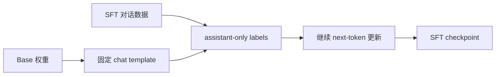
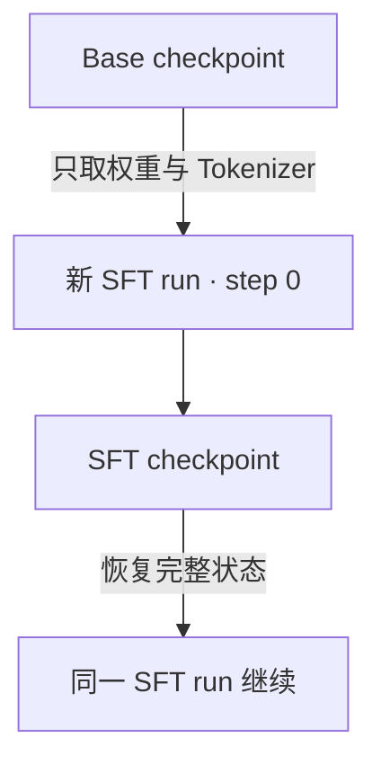

# 08 让 Base 模型学习回答

[系列目录](./README.md) | [上一篇：让实验可以恢复和比较](./07-resume-and-compare.md)
| [下一篇：用偏好对比较回答](./09-direct-preference-optimization.md)

预训练模型学习的是“给定前文，预测下一个 token”。如果把一段对话原样送进
同一个目标函数，它会同时学习模仿 system、user 和 assistant。这样做并没有表达
“读懂用户输入，只学习怎样回答”。

**SFT 没有替换语言模型目标，而是通过 chat template 和 label mask
重新规定哪些位置构成监督。** 本篇从一个对话的 token 边界开始，解释 Base 到
SFT 的阶段切换，再用 CPU 微型实验检查权重、评测协议和恢复状态。

## 1. Base 与 Instruct 的差别在哪里

Base 模型适合文本续写。它看到：

```text
Once upon a time
```

然后继续预测训练分布中可能出现的文本。对话模型则接收带角色的序列：

```text
<|im_start|>user
只输出数字：7<|im_end|>
<|im_start|>assistant
7<|im_end|>
```

角色标记让同一 Transformer 区分“条件”和“回答”，但标记本身不会自动产生
指令遵循能力。模型还需要在足够多、经过治理的示例上更新参数。



Tokenizer、词表与模型结构仍来自 Base。SFT 是新训练阶段，不是重新训练
Tokenizer，也不是给模型增加一套独立的“问答层”。

## 2. assistant-only 到底屏蔽了什么

对每个 token，训练输入仍保留整段对话；只有 labels 选择性设为真实 token：

| 区域 | 作为上下文 | 参与 loss |
| --- | --- | --- |
| system 正文 | 是 | 否 |
| user 正文 | 是 | 否 |
| 角色名称与起始控制 token | 是 | 否 |
| assistant 正文 | 是 | 是 |
| assistant `<\|im_end\|>` | 是 | 是 |
| padding | 否 | 否 |

不参与监督的位置设为 `-100`。它们仍在 `input_ids` 中，因此 assistant 的预测
能够条件化在 system 和 user 上；只是这些位置的预测误差不进入目标函数。

需要特别注意因果偏移。labels 先与完整序列对齐，公共 loss 再使用：

```python
shift_logits = logits[:, :-1]
shift_labels = labels[:, 1:]
```

因此不要在数据层再次把 assistant labels 左移一格，否则会监督错位的 token。
实现位于
[data/sft.py](../../src/llm_lifecycle_lab/data/sft.py) 的
`encode_sft_example()`。

它不是按字符数猜边界，而是先用真实 chat template 编码，再检查每段消息的
起止控制 token 和角色头。若前导空白导致 BPE 合并跨过头部边界，程序直接失败，
不会把一部分角色标记误当成答案。

<details>
<summary>动手：查看一条样本中哪些 token 受监督</summary>

准备好 Native Tokenizer 后运行：

```bash
python - <<'PY'
from scripts._project_path import add_project_src_to_path
add_project_src_to_path()
from llm_lifecycle_lab.data.sft import encode_sft_example
from llm_lifecycle_lab.tokenizer import NativeTokenizer

tokenizer = NativeTokenizer.from_directory(
    "build/modelscope/native-60m-base-v1/tokenizer"
)
example = encode_sft_example(
    [
        {"role": "user", "content": "只输出数字：7"},
        {"role": "assistant", "content": "7"},
    ],
    tokenizer=tokenizer,
    sequence_length=128,
    language="zh",
)
for token_id, label in zip(
    example["input_ids"].tolist(),
    example["labels"].tolist(),
    strict=True,
):
    print(repr(tokenizer.decode([token_id], skip_special_tokens=False)), label)
PY
```

输出中的 `-100` 是忽略标记，不是词表 token。不同 BPE 可能把正文切成不同数量
的 token，因此应检查实际编码，不能把示意图中的字符数当作监督 token 数。

</details>

## 3. 为什么按有效回答 token 计权

假设一个 batch 有两个回答，分别包含 2 和 20 个受监督 token。
若先算每条回答平均 loss，再把两条等权平均，短回答会获得过高权重。

本项目沿用第五篇的做法：

```math
L_{\mathrm{SFT}} =
\frac{\sum_i \sum_{t \in A_i} -\log p(y_{i,t})}
{\sum_i |A_i|}
```

其中 \(A_i\) 是第 \(i\) 条对话中 assistant 正文和结束标记的位置。
训练预算、梯度累积和 dev loss 都按这些有效 token 统计。

这不表示长回答的数据质量一定更高，只表示目标函数对每个被声明为监督的 token
采用相同权重。若需要样本级或任务级重加权，应作为另一项显式实验设计，
不能通过错误聚合悄悄实现。

## 4. 数据隔离先于训练

一条格式正确的 JSONL 不等于可用于评测。SFT 数据至少要区分：

- `source_id`：同一来源实例；
- `template_id`：同一种问题模板；
- `language`：当前只接受 `en` 或 `zh`；
- `messages`：可选开头 system，之后 user/assistant 严格交替。

翻译、改写和同模板样本应归入同组。若只按 `source_id` 切分，
train 和 test 仍可能共享模板，此时不能声称测试了新模板泛化。

加载器还会将 SFT 数据与固定能力评测套件比较，拒绝命中的 group、template、
精确 user prompt 和较长评测文本。这个门禁能拦住确定性重合，
不能识别所有语义改写，人工来源审查和数据卡仍不可省略。

超长对话同样 fail-fast。当前实现不会静默截掉前半段 system/user，
也不会把多个独立对话拼在同一训练样本中。上游应按完整回合重新整理，
再生成新的 Data Manifest。

## 5. 初始化新阶段不等于恢复旧阶段

Base → SFT 只继承：

- 模型结构和权重；
- 完全相同的 Tokenizer；
- 父 checkpoint 的 provenance 身份。

新建 SFT run 时，optimizer、scheduler、step、RNG、数据位置和预算全部重置。
这些状态属于新目标函数，不能从 Pretrain 直接继承。

同一次 SFT 中断恢复则相反：权重、optimizer、scheduler、RNG、数据位置和
计数必须一起恢复。修改数据、父权重、评测 suite、学习率或预算都会被拒绝。



`initialization.json` 将父权重、配置、Tokenizer、数据和评测 hash 绑定在一起。
父 Base 的 dirty-Git provenance 例外不会因为进入 SFT 而消失或被改写。

## 6. CPU 实验：机制是否闭合

运行：

```bash
python scripts/sft_experiment.py --mode train
python scripts/sft_experiment.py --mode resume
```

每条命令都在临时目录中创建双语微型 Base、固定能力基线、SFT 数据和三步训练，
退出后自动清理。验收关注：

```text
base_steps == 3
sft_steps == 3
sft_supervised_tokens > 0
parent_weights_preserved == true
sft_weights_updated == true
same_evaluation_protocol == true
resume_weights_optimizer_scheduler_rng_equal == true
```

`same_evaluation_protocol` 只说明阶段前后使用同一把尺子，
不保证三步微型 SFT 的所有指标都会改善。
fixture 反复使用数字复写模板，目标是让 mask、阶段初始化、报告和恢复经过真实路径。
它不是独立自然语言数据，不能发布为 60M Instruct 能力证据。

## 7. SFT 后怎样判断“会回答”

训练 loss 下降只能说明模型更适合当前回答 token。
还要用同一版本的能力套件比较：

1. 指令和严格格式成功率是否改善；
2. 简单问答和多轮一致性是否改善；
3. 中英文变化是否方向一致；
4. Base BPB、续写和重复率是否退化；
5. 评测协议、Tokenizer 和分母是否完全一致。

如果 Base 使用 `plain-v1`，SFT 使用 `native-chat-v1`，不能直接把两个分数相减。
应先用 SFT 的 chat 协议重新评测 Base，形成真正的阶段前基线。

当前代码已经证明 assistant-only SFT、阶段绑定和 CPU 精确恢复可运行。
正式双语 SFT 数据治理、60M GPU 训练、能力保持报告和 Instruct 权重仍未完成。

下一篇在 SFT 的“标准答案”之外加入偏好对：
同一个 prompt 有两个可接受程度不同的回答时，怎样让模型更偏向 chosen？

[返回系列目录](./README.md) | [上一篇：让实验可以恢复和比较](./07-resume-and-compare.md)
| [下一篇：用偏好对比较回答](./09-direct-preference-optimization.md)
