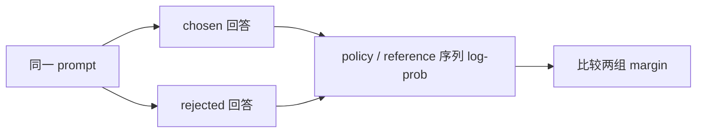

# 09 用偏好对比较回答

[系列目录](./README.md) | [上一篇：让 Base 模型学习回答](./08-supervised-fine-tuning.md)
| [下一篇：用可验证奖励改进采样](./10-verifiable-reward-grpo.md)

SFT 告诉模型“这个回答应该出现”，但很多任务没有唯一标准答案。
对于同一个 prompt，我们可能只知道回答 A 比回答 B 更好：

```text
prompt:   2 + 3 等于多少？只回答数字。
chosen:   5
rejected: 9
```

只继续对 chosen 做 SFT 会忽略“它优于哪个回答、优多少”。
DPO 将这种成对比较直接变成分类式目标，同时用冻结 reference 限制策略相对
父 SFT 模型的变化。

**本篇关注三件事：回答概率怎样计算、reference 为什么不能漂移、
以及为什么 loss 按偏好对而不是 token 数平均。**

## 1. 一个偏好对包含什么

DPO 样本由 prompt、chosen 和 rejected 组成。两条回答共享完全相同的 prompt
和 chat template：



训练数据必须表达真实比较关系。chosen 与 rejected 相同、只靠随机交换标签、
或者把模型自己的任意输出标成 rejected，都会制造错误监督。

同一问题的翻译、改写和多组偏好应归到同一个 split group。
项目还拒绝规范化后的重复偏好对，以及与固定能力评测 prompt/group/template
重合的数据。语义重合仍需人工审核。

## 2. 只计算回答部分的序列概率

给定 prompt \(x\) 和回答 token \(y_1,\ldots,y_T\)，条件序列 log-prob 为：

```math
\log \pi(y|x)=\sum_{t=1}^{T}\log \pi(y_t|x,y_{<t})
```

本项目的 \(T\) 包括 assistant 正文和回答结束标记，不包括：

- system 与 user 内容；
- 角色头和 assistant 起始标记；
- padding。

实现复用 SFT 的 label mask。`response_logps()` 对 logits 做一次 causal shift，
只 gather `labels != -100` 的位置，然后沿序列求和。

这里刻意使用**总和**而不是平均 token log-prob。
标准 DPO 比较的是整个回答序列的条件概率；先除以回答长度会把目标改成另一种
长度归一化偏好。长度偏差本身值得研究，但不能在实现中不声明就修改公式。

## 3. policy 与 reference 各自提供什么

记：

```math
\begin{aligned}
m_\theta &=
\log \pi_\theta(y_w|x)-\log \pi_\theta(y_l|x) \\
m_{\mathrm{ref}} &=
\log \pi_{\mathrm{ref}}(y_w|x)-\log \pi_{\mathrm{ref}}(y_l|x)
\end{aligned}
```

DPO 使用：

```math
L_{\mathrm{DPO}}=
-\log \sigma\left(\beta(m_\theta-m_{\mathrm{ref}})\right)
```

其中 \(y_w\) 是 chosen，\(y_l\) 是 rejected，当前 `beta` 必须位于 `(0, 1]`。

如果 policy 与 reference 初始完全相同，则两个 margin 相等，括号内为 0，
单个偏好对的初始 loss 为：

```math
-\log \sigma(0)=\log 2
```

这并不表示模型认为 chosen 与 rejected 概率相同。
它表示 policy 尚未**相对于 reference** 改变这组偏好差。

reference 必须是父 SFT checkpoint 的冻结副本。若它与 policy 一起更新，
比较基线会不断移动，目标函数不再表示相对固定父模型的偏移。

## 4. 为什么预计算 reference 分数

reference 不参与反向，也不会在 DPO 中变化。项目在新 run 开始时一次性计算
train/dev/test 全部偏好对的 chosen/rejected log-prob，写入：

```text
reference_scores.json
```

每条记录绑定 pair ID，初始化记录再绑定文件 digest、父权重、Tokenizer、
数据 Manifest、评测套件和 `beta`。

这样做有两个作用：

1. 每个训练 step 不需要重复运行 reference；
2. 恢复时继续使用完全相同的比较基线。

预计算不是把 reference “近似掉”。只要父模型、模板、Tokenizer 和数据未变，
冻结分数就是同一个确定量。任一绑定变化都必须新建 run，不能在恢复时重算后
覆盖旧分数。

## 5. pair loss 与 token 计数为何分开

chosen 和 rejected 的长度可以不同。目标函数先为每个 pair 得到一个 DPO loss，
再对 batch 中 pair 平均：

```math
L_{\mathrm{batch}}=\frac{1}{N}\sum_{i=1}^{N}L_i
```

因此每个偏好判断权重相同，不会因某条回答包含更多 token 就获得更大的 pair 权重。
共享训练引擎通过 `normalization_count=N` 完成梯度累积归一化。

另一方面，算力和数据覆盖仍取决于实际处理的回答 token，所以日志中的
`tokens_seen` 继续累计 chosen 与 rejected 的有效回答 token。

这两个分母回答不同问题：

| 计数 | 用途 |
| --- | --- |
| preference pairs | DPO loss 与梯度的统计单位 |
| response tokens | 实际处理量、吞吐和预算记录 |

把两者混在一起会导致实验指标稀释：长回答数据既改变计算量，又暗中改变优化权重。

## 6. CPU 实验：冻结 reference 与恢复

运行：

```bash
python scripts/dpo_experiment.py --mode train
python scripts/dpo_experiment.py --mode resume
```

脚本在临时目录中实际执行微型 Pretrain → SFT → 三步 DPO。
验收字段包括：

```text
dpo_steps == 3
response_tokens_seen > 0
sft_parent_unchanged == true
frozen_reference_scores == true
pair_weighted_loss == true
resume_weights_optimizer_scheduler_rng_equal == true
```

实验不是仅调用公式函数。它构建 Data Manifest、加载父 SFT、预计算 reference、
运行共享训练引擎、保存 checkpoint，并在 resume 模式注入受控中断。

合成数据让数字本身作为 chosen，另一个数字作为 rejected。
这只验证偏好链路和恢复，不代表偏好来源真实，也不能说明模型在帮助性、
安全性或一般问答上更好。

## 7. 训练日志怎样读

DPO 记录：

- `report_pair_accuracy`：policy margin 大于 0 的偏好对比例；
- `report_reference_accuracy`：冻结 reference 的同一比例；
- `report_reward_margin`：`beta * (policy_margin - reference_margin)` 均值；
- DPO loss、回答 token、吞吐和梯度范数。

训练集 pair accuracy 上升可能只是记住偏好对。
正式结论还要使用训练外的统一评测：

1. 固定 chosen/rejected 探针是否改善；
2. SFT 指令、格式、问答和多轮能力是否保持；
3. Base BPB 与文本续写是否退化；
4. 中英文结果是否分别可靠；
5. 与父 SFT 使用的协议和分母是否一致。

四个固定偏好探针只能做诊断，不能代表完整对齐质量。

## 8. DPO 能证明什么，不能证明什么

当前实现已经证明：

- response-only 序列 log-prob 与 DPO 公式连通；
- reference 冻结且分数可审计；
- pair 归一化和 token 计数明确分开；
- Native CPU 中断恢复与连续训练一致。

尚未证明：

- 偏好数据足够真实、无偏且覆盖双语目标；
- Native-60M 在正式训练后偏好能力提升；
- 改善没有以基础能力退化为代价；
- DPO 等同于安全对齐。

下一篇处理另一种信号：答案可以由程序直接验证时，
怎样从同一个 prompt 采样一组回答，用组内相对奖励更新策略。

[返回系列目录](./README.md) | [上一篇：让 Base 模型学习回答](./08-supervised-fine-tuning.md)
| [下一篇：用可验证奖励改进采样](./10-verifiable-reward-grpo.md)
