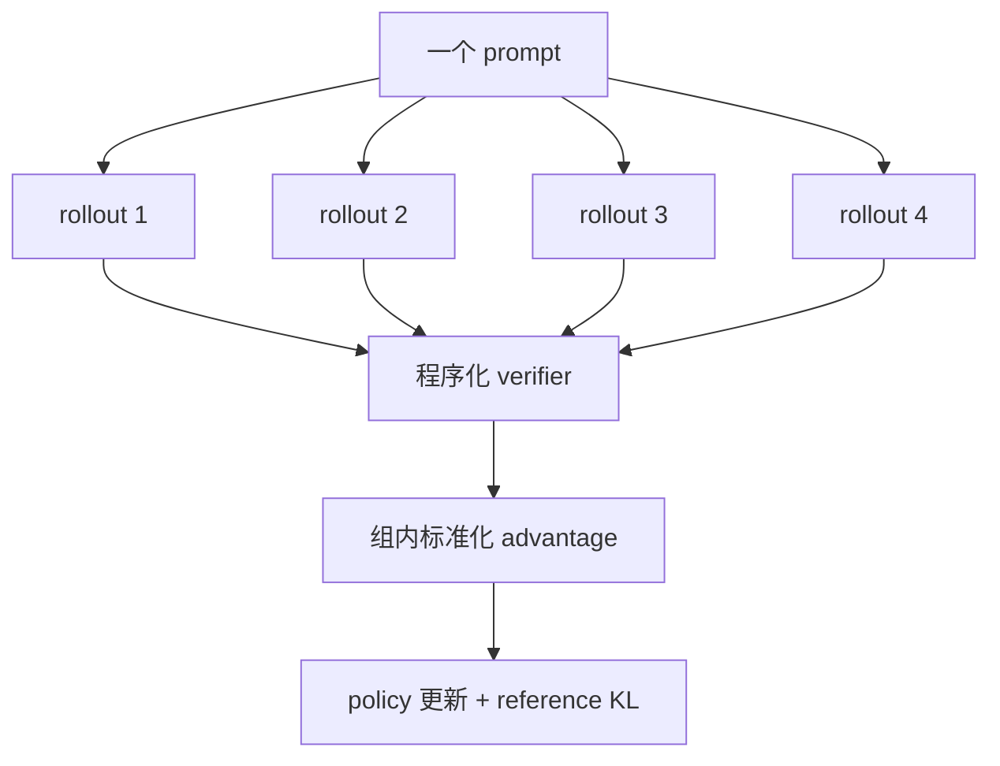

# 10 用可验证奖励改进采样

[系列目录](./README.md) | [上一篇：用偏好对比较回答](./09-direct-preference-optimization.md)

DPO 的监督来自预先写好的 chosen/rejected。对于整数答案、严格 JSON 或精确字符串，
我们还可以先让模型采样，再用程序判断每个输出是否正确。

这类奖励的价值在于边界清楚：同一输出交给同一 verifier，结果应完全一致。
它的局限也同样清楚：程序只能奖励被编码进规则的部分。

**本篇只讨论可程序验证奖励 RLVR。**
不使用 LLM Judge，不把模糊的格式启发式包装成人类偏好。

## 1. 从一个答案变成一组 rollout

对于一个 prompt，GRPO 不只生成一个回答，而是从当前 policy 采样 \(G\) 个：



当前默认 `group_size=4`。每个回答由 `(example_id, group_index)` 派生的固定 seed
采样，使相同输入和配置能够重建同一组随机路径。

固定 seed 不是把 rollout 变成贪心生成。组内不同 index 仍对应不同随机流；
它只是避免恢复时从另一个随机位置重新采样。

## 2. verifier 必须先定义失败行为

当前只允许：

| verifier | 成功条件 |
| --- | --- |
| `exact` | 去掉首尾空白后与答案完全一致 |
| `integer` | 整个输出是整数，解析后的整数值相同 |
| `json` | 严格 JSON 解析后类型和值完全一致 |

JSON verifier 拒绝重复 key、`NaN` 和 `Infinity`。integer 不从一段解释中
抽取第一个数字；输出 `答案是 19` 会失败，因为任务声明要求完整输出为整数。

这些严格规则防止 reward parser 悄悄放宽任务。项目不会执行模型输出中的
Python、shell 或网络操作，也不会调用另一个模型评分。

新增 verifier 时至少要回答：

1. 输入域是什么；
2. 哪些解析失败返回 0；
3. 是否存在多种等价表示；
4. 是否会执行不可信内容；
5. 对重复 key、非有限数和超长输入怎样处理。

一个可靠 verifier 不代表数据本身可靠。prompt、答案、来源许可、模板分组与
固定评测集隔离仍需在 Data Manifest 和人工数据卡中确认。

## 3. 组内 advantage 在比较什么

对同一 prompt 的奖励 \(r_1,\ldots,r_G\)，计算：

```math
A_i=\frac{r_i-\mu_r}{\sigma_r+\epsilon}
```

例如四个 0/1 奖励为 `[1, 0, 0, 0]`：

```text
mean = 0.25
std  ≈ 0.433
advantages ≈ [1.732, -0.577, -0.577, -0.577]
```

正确回答相对同组其它回答得到正 advantage，失败回答得到负 advantage。
这种归一化消除了不同 prompt 奖励绝对难度的一部分影响，
但也意味着只看全局 reward mean 不能还原每个组的训练信号。

如果一组奖励全为 0 或全为 1，标准差为 0，所有 advantage 都是 0。
当前实现通过 `advantage_epsilon` 安全处理，并记录
`report_zero_variance_groups`。它不会伪造细小噪声强迫模型更新。

零方差组多可能表示任务过难、过易、采样缺乏多样性，或 verifier/答案有问题。
这些原因要分别排查，不能只调大学习率。

## 4. old policy、current policy 与 reference

每批 fresh rollout 来自更新前的当前 policy。生成后记录 old-policy 的 token
log-prob，再用当前可训练 policy 计算：

```math
\rho_t =
\exp\left(
\log\pi_\theta(y_t)-\log\pi_{\mathrm{old}}(y_t)
\right)
```

裁剪 surrogate：

```math
\min\left(
\rho_t A,\;
\mathrm{clip}(\rho_t,1-\varepsilon,1+\varepsilon)A
\right)
```

冻结父 checkpoint 提供 reference。当前实现使用：

```math
\mathrm{KL}_t =
\exp(\log\pi_{\mathrm{ref}}-\log\pi_\theta)
-(\log\pi_{\mathrm{ref}}-\log\pi_\theta)-1
```

最终 token 目标是 clipped surrogate 减去 `kl_beta * KL`。
prompt 与 padding 不参与 loss；先在每条回答内部按有效 token 平均，
再在 rollout sequence 之间平均。

```math
L_{\mathrm{GRPO}}=
-\frac{1}{N}\sum_i
\frac{1}{|A_i|}
\sum_{t\in A_i}
\left[
\min(\rho_{i,t}A_i,\mathrm{clip}(\rho_{i,t})A_i)
-\beta_{\mathrm{KL}}\mathrm{KL}_{i,t}
\right]
```

这样长回答不会仅因 token 更多获得更大的 sequence 权重，
但 `tokens_seen` 仍记录实际 rollout token 作为计算量证据。

当前每批 rollout 只更新一次，不进行多 epoch reuse。
第一次 current log-prob 与 old log-prob 来自同一参数，因此 ratio 起点为 1，
clipping 主要是明确数值边界。这不是大规模 PPO 服务，也没有独立 rollout worker。

## 5. 为什么 attention dropout 必须为 0

若同一参数、同一输入的 old/current 前向因 dropout mask 不同而产生随机差异，
ratio 会混入与参数更新无关的噪声。

当前 GRPO 路线要求 attention dropout 为 0，并在 rollout 时临时切到 eval，
随后恢复 policy 的训练状态。reference 始终冻结并处于 eval。
这是一项确定性门禁，不依赖模型“自己学会忽略”随机扰动。

采样仍然需要随机性，但它被显式放在 generation seed 中；
前向 log-prob 的比较不再额外混入 dropout 随机源。

## 6. CPU 实验：怎样得到非零奖励差

随机微型模型很可能无法回答人为指定的算术题，所有 reward 都为 0，
那只能验证零方差路径。为了同时覆盖正负 advantage，机制实验先从初始 SFT
模型采样，再选择组内较少见的一个输出作为合成 exact answer。

运行：

```bash
python scripts/grpo_experiment.py --mode train
python scripts/grpo_experiment.py --mode resume
```

验收字段：

```text
grpo_steps == 3
rollout_tokens_seen > 0
synthetic_variable_reward_groups > 0
parent_unchanged == true
programmatic_rewards_recorded == true
latest_rollouts_recorded == true
resume_weights_optimizer_scheduler_rng_equal == true
```

`latest_rollouts.json` 保留最近一批 example ID、group index、语言、原始输出、
reward 和停止原因，便于检查 verifier 到底奖励了什么。

fixture 的答案来自模型自己的初始采样，刻意让机制测试产生可区分奖励。
它不是独立训练目标，更不是“模型学会真实任务”的证据。

## 7. 恢复为什么还要绑定 rollout 配置

新 GRPO run 绑定：

- 父 SFT 或 DPO checkpoint 及其权重；
- Tokenizer、Data Manifest 和评测 suite；
- group size、生成 token 上限、temperature、top-p；
- clip、KL 系数和 advantage epsilon。

恢复还需要完整权重、optimizer、scheduler、RNG、数据位置和计数。
修改任何绑定项都可能产生另一组 rollout 或另一种目标函数，因此必须新建实验。

训练预算中的 token/epoch 是
`prompts × group_size × max_new_tokens` 的上界估算。
实际回答可能提前 EOS，最终覆盖应读取 `tokens_seen`，不能拿上界冒充实测。

## 8. 奖励上升之后还要检查什么

训练日志包含 reward mean、success rate、零方差组比例、近似 KL、clip fraction、
token 吞吐和梯度范数。它们能诊断训练过程，但不能单独证明能力提升。

正式报告至少还要比较：

1. 训练外可验证任务的 reward；
2. chosen/rejected 排序；
3. SFT 指令、格式、问答和多轮能力保持；
4. Base BPB、续写和重复退化；
5. 中英文分层；
6. reward 是否存在可被钻空子的格式漏洞。

一个模型可能通过输出最短可接受字符串获得高 reward，却牺牲解释质量；
也可能过度适配 integer/JSON 格式，损害其它任务。能力保持评测不是附加装饰，
而是判断优化目标是否造成非定向扰动的必要对照。

## 9. 到这里完成了怎样的生命周期

十篇主线已经连起：

```text
数据 → Tokenizer → Transformer → Pretrain → 评测/恢复
     → SFT → DPO → 可验证奖励 GRPO
```

CPU 实验已经覆盖每一阶段的契约、目标函数和精确恢复。
它们证明机制可运行，不证明 Native-60M 已完成正式 SFT、DPO 或 GRPO。

后续正式实验应继续沿用同一原则：先固定资格门槛与阶段前基线，
再训练，最后用同协议报告定向改善和能力保持。没有 GPU 结果时，
最准确的状态仍是“实现已验证，效果待验证”。

[返回系列目录](./README.md) | [上一篇：用偏好对比较回答](./09-direct-preference-optimization.md)
